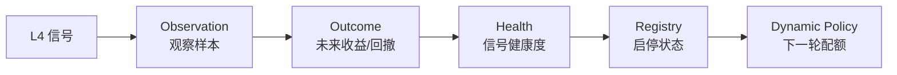

# 金融术语与策略概念速查手册

本文档汇总了 Wyckoff-Analysis 项目中涉及的所有金融术语、量化指标和策略概念，帮助新同学快速理解系统逻辑。

### 午间独立研究扫描

工作日 11:30 运行的全 A 股只读研究任务，与盘后 Wyckoff 漏斗相互独立。一次运行内按“有效横截面 → 可成交池 → 六通道实时注意力池 → 深度证据池 → 六视角60只短名单 → 10—20只公告终审”逐层收敛，并记录每层数量、淘汰原因和真实耗时。六个研究视角为质量成长、合理估值、盈利变化、稳定相对强度、行业扩散和逆向修复；任何单一技术形态或综合分都不能直接生成买入结论。

---

## 1. 回测指标

| 名词 | 英文 | 含义 |
|------|------|------|
| **胜率** | Win Rate | 所有交易中盈利笔数占比。如 35.7% 表示 100 笔交易里约 36 笔赚钱 |
| **平均收益** | Average Return | 每笔交易的平均盈亏百分比。-0.65% 表示平均每笔亏 0.65% |
| **中位收益** | Median Return | 所有交易收益排序后的中间值。比平均值更抗极端值干扰，能反映"典型一笔"的表现 |
| **最大回撤** | Max Drawdown | 从净值最高点到最低点的最大跌幅。衡量策略中途"最痛苦"的时刻 |
| **夏普比率** | Sharpe Ratio | **(收益率 - 无风险利率) / 收益率波动率**。衡量每承担一单位风险能获得多少超额回报。> 1 优秀，0~1 一般，< 0 表示亏损 |
| **VaR95** | Value at Risk (95%) | 在 95% 置信水平下，单笔交易可能发生的最大损失。给出"平时最坏会坏到哪"的快速下界 |
| **CVaR95** | Conditional VaR (95%) | 当亏损击穿 VaR 阈值后，那些最糟糕情况下的平均损失幅度。是对黑天鹅尾部风险的终极度量 |
| **最长连亏** | Max Consecutive Losses | 连续亏损的最大笔数。用于评估实盘心理压力和资金使用节奏 |
| **持有天数** | Hold Days | 买入后固定持有的交易日数，到期无条件卖出。项目里常测 5/6/7/8/10/15 天 |
| **止损线** | Stop Loss | 持有期间如果亏损达到该阈值（如 -7%），立即卖出止损，不再等到期 |
| **止盈线** | Take Profit | 持有期间如果盈利达到该阈值，立即卖出锁定利润。设为 0 表示不止盈 |

---

## 2. Wyckoff 方法论

**Wyckoff（威科夫）** 是 1930 年代华尔街传奇交易员 Richard Wyckoff 提出的量价分析框架，核心思想：**跟踪主力资金（Composite Man / 庄家）的行为**。

### 市场四阶段

| 阶段 | 含义 |
|------|------|
| **吸筹 (Accumulation)** | 主力在低位悄悄买入，成交量温和放大但股价不涨。散户看到"横盘无聊"选择离场，主力正在收集筹码 |
| **上涨 (Markup)** | 吸筹完成后，主力推动股价上升。特征是均线多头排列、成交量健康放大 |
| **派发 (Distribution)** | 主力在高位悄悄卖出，股价看似还在创新高但量能衰减。散户看到"还在涨"跟风追入，主力正在出货 |
| **下跌 (Markdown)** | 派发完成后，股价自由落体。筹码已从主力手中转移到散户手中 |

### 核心触发信号（本项目 L4 层检测目标）

| 信号 | 含义 |
|------|------|
| **Spring（弹簧效应）** | 吸筹末期，股价突然跌破支撑位引发恐慌卖盘，随即快速拉回。正式检测优先使用近期 swing low 中位数作为抗噪支撑，摆动点不足时回退窗口最低收盘价 |
| **SOS (Sign of Strength)** | 放量突破，确认吸筹结束、上涨开始的信号。需要伴随成交量大幅放大（>= 2 倍）和显著涨幅（>= 4.5%） |
| **LPS (Last Point of Support)** | SOS 越过 Creek 后的缩量回踩。生产检测要求守住 Creek/MA20，并以近期量能中位数相对前 60 日中位数判断供应收缩；普通均线回踩归入 Trend Pullback，不再冒充 LPS |
| **EVR (Effort vs Result)** | 放量抗跌。成交量巨幅放大（巨大 Effort），但股价没有相应大跌（Result 不差），意味着主力在底部大量承接 |
| **Compression（压缩蓄势）** | 连续多日 ATR 收窄 + 成交量萎缩，表明供应枯竭、多空平衡即将被打破。对应 Wyckoff Phase B→C 的能量压缩状态，常出现在 Spring/SOS 之前 |
| **UTAD (Upthrust After Distribution)** | 派发末期，股价放量突破近期阻力后迅速收回并留下长上影。系统以 `upthrust_warning` 作为 L5 风险信号阻断新候选 |
| **Creek/LPS confirmation** | 用前序 swing high 构造可外推的 Creek 阻力线；只有先越过 Creek、随后缩量回踩仍守在线上，才把 LPS 视为结构命中。该约束已在生产启用，跨日需求确认仍是独立状态 |
| **Strategy ablation A-E** | 同一数据与执行参数下的规则消融：A 基线，B=UTAD，C=regime 阈值，D=Creek/LPS+时序，E=全部组合；用于区分单项贡献和组合交互 |
| **A股实证消融 A/M/P** | 已完成的 confirmed-only 实验：A 基线，M=弱水温信号缩仓，P=M + 将 NEUTRAL Spring 仓位由 50% 再降至 25%。三组只改变入场权重，手动复跑时每个窗口共享一次信号台账、分别重放现金组合；默认 Backtest Grid 已关闭该任务，仅 `run_strategy_compare=true` 时复现。Q/N/O 与后续 Q/R/S/T 门控均未晋级生产 |
| **confirmed 分数校准** | 不再把不同 Wyckoff 触发器的原始分数直接横比；研究组 I 用信号族历史先验与封顶后的形态强度合成可比分数，避免极高原始分主导 Top1 |
| **Treatment exposure** | 消融组相对参照组实际改变的交易键，包括 `(signal_date, code)`、仓位倍率和退出日期；零暴露表示规则没有改变真实成交，不能据此评价收益贡献 |
| **实际成交亏损归因** | 只统计现金组合真正成交的记录，按信号、水温和退出原因汇总成交数、胜率、平均单笔、总盈亏与资本盈亏率；不把未成交信号的纸面收益混进策略结论 |
| **结果上下文切片** | Outcome Context Slices | 推荐事件优先与同日 observation 对齐，缺失时使用 recommendation tracking 自带的水温、信号、行业和轨道；同时输出单维度及“水温 × 信号/行业”成熟样本。多信号候选可进入多个切片，只用于归因，不直接放行交易 |
| **上下文覆盖率** | Context Coverage | 推荐事件成功取得 observation 或 tracking 上下文的比例；报告区分 observation 命中、tracking fallback、当日有 observation 但候选不在观察宇宙、查询失败，并单列水温、信号、行业、轨道和交叉切片的全量/成熟样本覆盖率 |
| **SOW (Sign of Weakness)** | 放量下跌，确认派发结束、下跌开始的信号 |

---

## 3. 漏斗管线 (Funnel Pipeline)

项目的选股流程像漏斗一样层层过滤，从全市场 5000+ 只股票中筛选出少数高确定性标的：

| 层 | 名称 | 做什么 | 典型淘汰率 |
|----|------|--------|-----------|
| **L1** | 基础过滤 | A 股：剔除 ST 股、非目标板块、低价股（收盘 < 2 元）、微盘股（市值 < 25 亿）、流动性不足（20 日均成交额 < 4000 万，另查成交额偏度防脉冲放量）。美股：不设价格/市值/成交额门槛，低价股与仙股一律放行，流动性交由报价层预筛（收盘 ≥ $0.5、日成交额 ≥ 30 万美元、按成交额取前 3500 名）；ST 属 A 股风险警示制度，不对美股/港股判定 | ~60%（美股 ~0%） |
| **L2** | 八通道强度 | 主升、潜伏、吸筹、地量、暗中护盘、趋势延续、加速突破、点火破局分别评估，只保留结构上有资金行为的股票 | ~80% |
| **主线引擎** | Mainline Engine | L1 后并联的主题候选源，基于概念热度、概念映射、主题雷达、财务质量和量价 timing 发现 A 股主线票 | 取 TopN |
| **候选车道** | Candidate Lane | L1 通过但传统 L2/L4 尚未完全成形的趋势回踩、强承接、平台突破观察样本 | 观察池 |
| **L3** | 板块/概念共振 | 使用行业和概念强度过滤噪音，同时允许强个股和主线主题绕过固定 Top-N 行业限制 | ~50% |
| **L4** | Wyckoff 触发 | 检测 Spring / SOS / LPS / EVR / Compression / Trend Pullback 等量价信号 | ~90% |
| **Structure Shadow** | 动态区间观察对照 | 在 L3 候选上比较正式 L4 与动态交易区间的 Spring/LPS/SOS/EVR 命中；区间质量使用测试次数、ATR 归一化宽度和漂移，只写诊断 metrics，不进入正式候选或 BUY |
| **L5** | 退出信号 | 持有期间监控是否出现派发信号（SOW / UTAD），决定是否提前退出。持仓诊断只喂入建仓日之后的价格路径；`buy_dt` 缺失或切不出建仓后 K 线时 fail-closed，不发结构退出，建仓前的高点与暴跌不参与破位判定。新多头 `add` 必须写入合法建仓日；`update` 与成交回填都不得在空账本新建无日期持仓 | — |
| **评分排名** | watch_score | 对通过 L4 的候选股综合打分排序，选 TopN 输出给 AI 研报 | 取 Top3~15 |
| **强势股复盘可交易样本** | Executable Review Cohort | 完整复盘样本中，前一日已通过 L1、次日开盘涨幅不超过 4% 且非一字板的子集；只用于评价候选捕获能力，不改变“当日 >7%、前日 <3%”原始复盘池 | — |

### L2 八通道详解

| 通道 | 英文 | 寻找什么样的股票 |
|------|------|----------------|
| **主升浪** | Markup | 均线多头排列（MA50 > MA200），RPS 动量达标；年线乖离上限已放宽（动量通道约 55%，趋势 L4 约 60%），鱼尾仍拦截 |
| **点火破局** | SOS Bypass | 单日放量突破，要求 RPS120 达到底线，用来捕捉低位突然点火但过滤纯消息异动 |
| **潜伏** | Ambush | 长期强（RPS120 高）但短期弱（RPS50 低），回调到年线附近，专做主升后的首次回踩 |
| **吸筹** | Accumulation | 接近年内低点，振幅收窄，均线胶着，量能萎缩——典型的主力默默收集筹码形态 |
| **地量蓄势** | Dry Volume | 近期出现极端缩量（量能降至 60 日的 5% 分位），说明卖压已被完全消化 |
| **暗中护盘** | RS Divergence | 大盘暴跌时该股拒绝创新低且缩量，说明有主力在暗中托底 |
| **趋势延续** | Trend Continuation | 已进入强趋势且 RPS/量能达标的主线股；60日最大回撤不再一票否决，20%–30%标「60日高波动」、30%以上标「60日深回撤」并轻度降低候选排序（复算 `scripts/ablate_trend_drawdown_gate.py`：20% 分离的是波动不是方向，30% 分离的是下行不是波动） |
| **加速突破** | Breakout Acceleration | 站上 MA50 后短期 RPS、涨幅和量能同步爆发，捕捉题材从底部刚扩散的阶段 |

### 主线引擎术语

| 名词 | 含义 |
|------|------|
| **Mainline Engine** | L1 后并联的主线发现模块，解决传统 L2 确认太慢、错过 A 股主线扩散的问题 |
| **主线回踩 MA5/MA10/MA20** | 主升段优先认短均线回踩，再认 MA20；不再只等年线附近 |
| **主线趋势书** | 实盘主仓：主题连续 + 高 RPS + 确认买点 |
| **结构观察书** | Spring/LPS/Compression 等轻仓或观察，默认 5 日兑现 |
| **mainline_active** | 交易模式：允许主题晋级与正式推荐，旁路仍关。生产 env 已把 NEUTRAL 加进禁买名单，故该档实际走 `execution_blocked` |
| **execution_blocked** | 交易模式：水温在 `STEP4_BUY_BLOCK_REGIMES` 里 → 不写正式推荐、不执行新买入，保留 AI/shadow 对照。写入闸门与下单闸门同源，避免「报告说可买、实际买不到」 |
| **执行纪律卡** | 报告顶部固定文案（`execution_playbook`）：闸门/主线优先/时间管理/灾难地板 |
| **时间管理** | 非主线约 5 日时间止盈；主线约 15 日 + 破 MA20 再减 |
| **灾难止损地板** | 新开仓约 -12%，防黑天鹅，**不是**日常洗盘止损 |
| **theme_score** | 概念热度、连续性和主题雷达强度得分 |
| **rotation_watch** | 主题雷达的短周期 Shadow 观察：按 5/10/20 日相对动量、5 日上涨宽度和热度做横截面排序，只进入报告提示，不进入正式候选、推荐或 OMS |
| **主题确认 vs 轮动提示** | `themes` 表示中长线持续性确认，可供主线引擎使用；`rotation_watch` 只表示短周期正在升温，两者不能互相替代 |
| **stock_role_score** | 股票在主题内的核心程度、相对强度和趋势位置得分 |
| **quality_score** | 财务质量软评分，优先使用 TickFlow 可取到的 ROE、负债率、营收和利润趋势等字段 |
| **timing_score** | 买点时机评分，检查 MA20/MA50、回踩不破、平台突破、缩量承接等 |
| **主线买点候选** | 主线分、个股角色、质量和 timing 都过关，可进入 AI 复核；是否可买仍由市场总闸和跨日 confirmed 确认决定 |
| **主线观察** | 主题和个股不错，但 timing 尚未满足，只跟踪不买 |
| **过热不追** | 主题很强但短线离均线太远、放量长上影或冲高回落，禁止追高 |
| **一眼结论** | 漏斗和回测报告的首屏摘要，优先展示系统结论、下一步动作及证据是否过关；详细指标后置，视觉强调不改变任何策略语义 |

---

## 4. 板块轮动

### 基本概念

| 名词 | 含义 |
|------|------|
| **申万一级行业** | 申银万国证券制定的行业分类标准，把 A 股分成 31 个一级行业（银行、电子、医药生物、食品饮料等），是 A 股最常用的行业分类体系 |
| **板块轮动** | 资金在不同行业间快速切换的现象。今天资金涌入新能源，明天转向银行，后天又去了半导体 |
| **板块一日游** | A 股特有的极端轮动现象——某个行业今天涨停潮，明天就哑火，换下一个行业表演。实测数据显示 Top3 板块次日重合率仅 14.8%，即 85% 的概率"今天的热门明天就不热了" |

### 板块轮动状态分类

系统根据当日各行业涨跌分布，将市场板块状态归类为 5 种：

| 状态 | 英文 | 含义 | 评分加减分 |
|------|------|------|-----------|
| **共识高潮** | CONSENSUS_CLIMAX | 多个板块同时暴涨，市场亢奋见顶。数据显示 3 日后跌 > 2% 的概率 29.8% | **-0.08**（惩罚追高） |
| **分歧回调** | DISAGREEMENT_PULLBACK | 板块涨跌严重分化，领涨板块开始回调。看似"低吸机会"但实测 3 日胜率仅 50% | **+0.01**（几乎中性） |
| **健康主线** | HEALTHY_MAINLINE | 有一条明确的主线板块持续领涨，其余板块温和跟随。市场最健康的赚钱效应状态 | **+0.03**（鼓励跟随） |
| **派发风险** | DISTRIBUTION_RISK | 领涨板块出现高位放量滞涨特征，主力可能正在派发 | **-0.10**（最大惩罚） |
| **中性混沌** | NEUTRAL_MIXED | 没有明显板块主线，各行业涨跌互现，无序状态 | **0.00**（不加不减） |

---

## 5. 大盘水温 (Market Regime)

通过上证指数的技术指标（MA50/MA200 交叉、均线斜率、单边涨跌幅、市场广度等）判断当前市场整体状态，用于控制仓位大小：

| 状态 | 英文 | 含义 | 新开仓策略 |
|------|------|------|---------|
| **中性** | NEUTRAL | 正常市况，主战场 | **主线/趋势主导**（配额约 5+1） |
| **谨慎** | CAUTION | 市场广度或盘前情绪转弱，但尚未进入硬防守 | **最多一只二次确认后的 PROBE，禁止 ATTACK** |
| **过热** | RISK_ON | 短线过热，追新负期望 | **0% 禁止新仓**（只管理旧仓） |
| **恐慌修复候选** | PANIC_REPAIR | 恐慌日后出现价格反弹且当日广度明显修复，但尚未经过次日验证 | **仅观察/修复复核，禁止新仓** |
| **恐慌修复成立** | PANIC_REPAIR_CONFIRMED | 修复候选次日同时通过指数价格与全市场广度确认 | **小额试探准备 (PROBE_READY)，仓位上限5%** |
| **盘中恐慌修复** | PANIC_REPAIR_INTRADAY | 盘中满足暴跌日后强烈反弹且成交量/广度快速回升 | **小额试探准备 (PROBE_READY)，仓位上限5%** |
| **转弱** | RISK_OFF | 均线空头，下行确认 | **禁止新仓** |
| **结构周期** | BULL / TRANSITION / BEAR | 由指数相对 MA50/MA200 与 MA50 斜率定义的中期方向，独立于近 3 日反弹；BEAR 默认映射为 RISK_OFF | **结构熊市禁止普通新仓** |
| **崩盘** | CRASH | 暴跌/广度断崖 | **禁止新仓，只影子观察**（抗跌观察车道 crash_resilience_watch 已因大样本负期望下线） |

### 实测验证

| 水温 | 2025-10 ~ 2026-04 平均收益 | 结论 |
|------|--------------------------|------|
| NEUTRAL | **+1.17%** | 唯一正收益的市场状态 → 主战场 |
| RISK_ON | **-1.54%** | 过热追高亏钱 → **正式禁止新开仓** |
| CRASH | **-3.2%** | 崩盘日普遍开仓负期望；只保留严格黄金坑 Top1 小仓试错 |

水温仓控的核心逻辑：**只在 NEUTRAL 做主线确认；RISK_ON 不追新，比“半仓硬做”更重要**。

---

## 6. watch_score 评分公式

传统 Wyckoff 候选通过 L4 后按以下公式综合评分。主线候选使用 `mainline_score`，再和候选车道统一合并排序：

```
watch_score = 0.25 × q20 + 0.20 × q5 + 0.05 × q3
            + 0.20 × dry_q + 0.30 × trigger_q
            + hot_bonus + sector_bonus
```

| 因子 | 含义 | 权重 | 说明 |
|------|------|------|------|
| **q20** | 20 日涨幅在全市场的百分位排名（0~1） | 25% | 中期动量，筛选趋势向上的股票 |
| **q5** | 5 日涨幅排名 | 20% | 短期动量，确认近期在加速 |
| **q3** | 3 日涨幅排名 | 5% | 超短期动量，适应 A 股快速轮动特性 |
| **dry_q** | "缩量程度"排名（量越缩排名越高） | 20% | 缩量说明洗盘充分、卖压枯竭 |
| **trigger_q** | Wyckoff 信号强度排名 | **30%** | **最高权重**，信号质量是选股第一要素 |
| **hot_bonus** | 处于当日热门板块的额外加分 | +0.02 | 板块风口的顺势加成 |
| **sector_bonus** | 板块轮动状态的加/减分 | -0.10 ~ +0.03 | 见上方板块轮动状态表 |

**设计哲学**：传统候选仍以 trigger_q 为核心，主线候选则以主题强度、个股角色、财务质量和 timing 确认为核心。两条路径最终都必须服从大盘水温和跨日 confirmed 二次确认。

---

## 7. 相对强弱指标

| 名词 | 英文 | 含义 |
|------|------|------|
| **RPS** | Relative Price Strength | 欧奈尔 CANSLIM 法则核心指标。一只股票在一段时间内的涨幅超越全市场所有股票的百分位（0~100）。RPS50=90 说明近 50 天收益率秒杀全场 90% 的股票 |
| **RS** | Relative Strength | 个股涨跌幅减去同期大盘涨跌幅，衡量股票相对大盘是领涨还是跟跌 |
| **MA** | Moving Average | 移动平均线。MA50 为 50 日均线，MA200 为 200 日均线（年线）。MA50 > MA200 为**多头排列**（趋势向上） |
| **ATR** | Average True Range | 平均真实波动率。不同股票波动率不同（银行股日均 1%，妖股日均 8%），ATR 用于设定自适应止损线 |
| **乖离率** | Bias | 股价距离长期均线（如 MA200）的百分比距离。偏离过大说明被过度炒作，面临均值回归风险 |

---

## 8. 回测偏差

在理解回测结果时，必须意识到以下两种系统性偏差：

| 偏差 | 英文 | 含义 |
|------|------|------|
| **前视偏差** | Look-ahead Bias | 在历史回测中如果不小心用到了"当时那一刻尚未发生的数据"（比如用今天的市值去过滤 2024 年的股票），就叫"偷看答案"。回测结果会虚高 |
| **幸存者偏差** | Survivorship Bias | 股票池只包含当前仍在上市的公司，那些已退市的"暴雷股"不在回测样本中，会高估策略的安全性 |
| **滚动前推验证** | Walk-forward Validation | 在较早训练窗口选择参数，再把同一参数原样放到后续窗口测试；测试窗口不能重新选参 |
| **交易成本口径** | Trade Cost Model | 现金账户按 A 股实际收费建模：双边佣金（含每笔最低 5 元）+ 双边过户费，卖出侧另征印花税，之外还有买卖两端的滑点摩擦 |
| **涨跌停成交约束** | Limit-move Fill Constraint | 回测按板块涨跌幅判定能否成交：开盘即封涨停（含盘中被砸开的 T 字板）买不到，一字跌停日卖不掉，到期平仓顺延至第一个可成交日 |

**因此**：本项目的回测用于"参数方向验证"是有效的，用于"实盘绝对收益承诺"是不充分的。

---

## 9. OMS 风控相关

| 名词 | 英文 | 含义 |
|------|------|------|
| **OMS** | Order Management System | 订单管理系统。AI 建议不直接下单，执行权在 OMS 的风控引擎手中 |
| **SLTP** | Stop Loss & Take Profit | 止损与止盈的组合退出机制 |
| **NAV** | Net Asset Value | 账户净资产价值。OMS 根据 NAV 分配单次交易预算 |
| **总权益缓存** | Total Equity Cache | `portfolios.total_equity`。持仓/现金写入后按 TickFlow 最新报价重新估值，港美股以 ECB 参考汇率折算人民币；行情不完整时保留旧值并显式告警，不以成本价冒充市值 |
| **盈亏比** | Risk/Reward Ratio | 预期收益与预期风险的比值。如止损 -7% / 止盈 +18% 的盈亏比为 2.57:1 |
| **熔断** | Circuit Breaker | 当市场进入 CRASH 或盘前检测到极端风险（RISK_OFF / BLACK_SWAN）时，OMS 直接冻结买入权限 |
| **Springboard ABC** | 右侧信号三项确认 | 对 SOS / EVR 和趋势候选的成交量、价格与支撑确认。普通弱确认至少 2/3，纯 SOS 正式候选要求 3/3 |
| **DETECTED / SURVIVED / VALIDATED / OMS_APPROVED** | 候选状态链 | 依次表示当日结构命中、跨日未失效、需求已经确认、OMS 最终核准。库内 `confirmed` 是 `VALIDATED` 的兼容值；前两层不可下单 |
| **ATR 止损放宽** | ATR Stop Relaxation | 持仓诊断中，根据波动率在上限内降低固定止损线，避免正常洗盘误杀；它只放宽、不收紧，也不取消硬止损 |
| **可卖股数** | Sellable Shares | A 股 T+1 下当日实际能卖出的股数。持仓无分笔明细，买入日期等于当前交易日时整个仓位记为 0，EXIT/TRIM 与强制止损离场都会被拒并顺延到下一交易日。港股 / 美股为 T+0，同日买入仍可卖，不得套用 A 股冻结 |
| **持仓代码** | Portfolio Symbol | 持仓账本 `portfolio_positions.code`：A 股 6 位数字、港股 `NNNNN.HK`、美股 `TICKER.US`（TickFlow 标准）。CLI/Web 写入前规范化；漏斗 OMS 买入空间仍以 A 股为主 |
| **OMS 整手** | OMS Lot Size | Step4 下单取整单位：A 股 100 股，港美 1 股。港美持仓进入 OMS 后不得再套用 A 股 100 股门槛，否则小仓位止损强制 EXIT 与止损落库会失效 |
| **OMS 人民币口径** | OMS CNY Cash Path | Step4 的 `total_equity` / `free_cash` / 工单 `amount` 按人民币计；港美报价与止损间距先乘汇率再定仓与回笼，避免把美元/港元裸加进人民币预算 |
| **成交回填汇率** | Trade Fill FX | `record_trade_fill` / `portfolio fill` 对港美成交按报价币→CNY 汇率改 `free_cash`，成本价仍记本币；缺汇率 fail-closed，禁止把外币名义金额写入人民币现金 |
| **LLM 决策注释** | LLM Decision Note | `llmdoc/` 中经过版本控制、按工作流/股票代码/有效期选择的咨询性上下文；只能提醒模型复核遗漏风险，不得覆盖实时数据、硬止损、市场闸门、候选准入或 OMS |
| **Step3 研报模型** | Step3 LLM | 漏斗研报主通道默认 Efficiency（低成本兼容通道），失败再试 Gemini（谷歌大模型）；可用 `STEP3_LLM_PROVIDER` / `STEP3_LLM_FALLBACK_PROVIDERS` 覆盖。研报分类不是买入许可 |

---

## 10. 技术/数据源相关

| 名词 | 含义 |
|------|------|
| **tushare** | 国内主流金融数据接口，提供 A 股日线行情、财务数据、指数数据等。有频率限制（500 次/分钟）和 IP 限制（最多 2 个） |
| **申万指数 (SW Index)** | 由申万宏源编制的行业指数，tushare 中通过 `sw_daily` 接口获取（注意不是 `index_daily`） |
| **快照 (Snapshot)** | 将一次性拉取的全量股票数据序列化到本地文件（csv.gz），后续回测直接读快照而非再次请求网络，提升速度并避免 API 限制 |
| **前复权 (qfq)** | 以最新价格为基准向前调整历史价格，消除分红送股导致的价格跳空。回测默认使用前复权数据 |
| **外部资金佐证** | 正式候选的 observation 特征：龙虎榜及机构/沪深股通席位、融资融券、大宗交易、个股资金流和沪深股通十大成交。只用于解释与 outcome 复盘，不直接改变漏斗、推荐或 OMS。`north_money` 当前按发布金额保存，不解释为北向净买入。 |
| **应交易覆盖率** | OHLCV 质量门的分母为股票池减去当日确认停牌标的；停牌缺 K 线单列为非交易排除，不再记作接口失败。原始全池缺口仍保留为 `raw_ohlcv` / `fetch_raw_missing` 供审计；换手率、行业和概念映射另有覆盖门槛。 |
| **脏 K 线守卫** | 入口层处理结构不可能的 bar：`high<low`、最高价低于实体、最低价高于实体、价格非正、成交量为负。分析入口留行并把脏值置空；漏斗批量拉取才丢 bar。默认 `OHLCV_DIRTY_BAR_GUARD=1`。不改漏斗阈值。 |
| **时点裁切 (as-of / PIT)** | 显式回放（`END_CALENDAR_DAY`）时，A 股漏斗只保留截止日及以前的日线和已公告财务；当天无 bar 的票整只丢掉，无日期财务直接丢弃。周日定时不算回放，不裁 K 线/财务；市值/概念热度仍可按「截止日早于今天」走历史接口。网格回测本身按日切片，不走这条。 |

## 11. 信号反馈闭环



| 名词 | 含义 |
|------|------|
| **Observation** | 某日某股票触发某个 L4 信号的原始样本，落在 `signal_observations`。 |
| **Outcome** | Observation 之后 1/3/5/10/20 日的收益和最大回撤，落在 `signal_outcomes`。 |
| **Health** | 按信号类型聚合后的胜率、均值收益、样本数和权重，落在 `signal_health_daily`。 |
| **动态影子晋级** | 将当日候选的基础影子分与同信号、同水温的历史健康度合成动态分；通过结构、样本和风险清单后，只获得 Step3 复核席位，不等于正式推荐、跨日确认或 OMS 买入许可。 |
| **影子账本 (paper shadow ledger)** | 漏斗成功后的纸面对照账户，账户号 `USER_SHADOW:<uuid>`。盘后按 Step4 同口径买许可写下夜 `next_open` 计划，次日开盘价成交，遵守 T+1 / 整手 / 涨跌停 / 费用。只写 `shadow_*` 表，绝不写 `USER_LIVE` 的 `portfolios` / `portfolio_positions` / `trade_orders` / `daily_nav`。飞书卡标题必须带「影子账本 / paper」，与 `ic_shadow`、动态影子分不是同一概念。 |
| **Registry** | 信号生命周期表，控制信号是 `ACTIVE`、`WATCH`、`EXPERIMENTAL` 还是 `RETIRED`。信号级 `status` 以全局行（`regime=""` / `ALL`）为准；regime 拆分行只承载精确权重并跟随全局生命周期。 |
| **Shadow Run** | 动态策略旁路演练：真实推荐不变，只记录动态策略会新增或移除哪些候选。 |
| **Dynamic Policy** | 根据信号健康度、registry 和市场广度，动态调整 Trend / Accum 候选配额。 |
| **推荐价 / initial_price** | `recommendation_tracking` 中展示用的入场价：按股票 code 粘住首次 `recommend_date` 收盘价；再次推荐只增加 `recommend_count` 与新事件行，不改推荐价。涨跌幅相对该价；MFE/MAE 仍按事件日独立计算。performance 刷新的 `max_dates` 只裁剪待更新行，不算改锚点历史。 |
| **复盘窗口入选次数** | Web `/tracking` 窗口内唯一 `(code, recommend_date)` 的数量；同股同日的 tracking 与 pending 数据源不重复计数。覆盖股票数另按 `code` 去重，两者不应混用。 |
| **形态入表观察** | 当日 L4 中 Springboard A/B/C 至少满足 2 项、并写入 `recommendation_tracking` 的跟踪样本。同一股票有多个达标信号时按代码合并为“双/多 Wyckoff 形态共振”，`signal_types` 保留全部信号。飞书卡列出全部名称（旁路/主线同样不写「另 N 只略」）；超长由 `split_lark_md` 拆多卡，不静默截断。它用于后续复盘，不等于 Step3 送审、`VALIDATED` 或 OMS 买入核准。 |

---

## 12. 盘中分析指标 (IntradayProfile)

系统通过 1m/5m/15m 分钟线，在盘中对标的做实时结构化评估。日线负责"买什么"，分钟线负责"这一刻该不该动手"。

### 位置类（此刻价格在哪）

| 名词 | 英文 | 含义 |
|------|------|------|
| **VWAP** | Volume Weighted Average Price | 成交量加权平均价。代表今天所有参与者的平均持仓成本。价格在 VWAP 上方 = 今天的买方整体盈利、主力不急出；在下方 = 买方被套，存在抛压 |
| **VWAP 偏离** | vwap_pos | 当前价相对 VWAP 的偏离百分比。正值 = 在 VWAP 上方，负值 = 下方 |
| **日内位置** | close_pos | 当前价在今天最高-最低之间的位置（0=日低, 1=日高）。收盘靠近日高 = 买方控局；靠近日低 = 卖方压制 |

### 方向类（往哪走、走多快）

| 名词 | 英文 | 含义 |
|------|------|------|
| **短周期趋势** | trend_short | 5m 级别的价格方向（up/flat/down）。用最近 8 根 5m bar 收盘价的线性回归斜率判断 |
| **中周期趋势** | trend_mid | 15m 级别的价格方向。同上逻辑，窗口更长 |
| **30 分钟动量** | momentum_30m | 最近 30 分钟的价格涨跌幅%。衡量瞬时力量 |
| **15 分钟动量** | momentum_15m | 最近 15 分钟的价格涨跌幅%。更短窗口，对尾盘突变敏感 |

> **趋势 vs 动量**：趋势看"一段时间整体方向"（平滑），动量看"最近这一截涨跌幅"（尖锐）。趋势向上 + 动量为负 = 正常回踩；趋势向下 + 动量为正 = 反弹但未转势。

### 成交行为类（钱往哪流）

| 名词 | 英文 | 含义 |
|------|------|------|
| **量能分布** | volume_concentration | 今天的成交量堆积在高位还是低位。`high` = 大部分成交发生在价格上半区（买方愿意追高），`low` = 成交堆在低位（高位无人接盘） |

### 威科夫验证类

| 名词 | 英文 | 含义 |
|------|------|------|
| **Spring 质量** | spring_quality | 日线检测到 Spring（跌破支撑后收回）时，分钟线验证收回速度。5 分钟内收回 = 90 分（假跌破/主力洗盘）；30 分钟才爬回 = 30 分（可能真跌破） |

### 综合评分

| 名词 | 英文 | 含义 |
|------|------|------|
| **盘中强度** | strength_score | 将上述所有特征加权汇总为 0-100 分。VWAP 位置权重最高（±12），其次是日内位置（±10）和动量（±8）。基准分 50，>70 偏强，<30 偏弱 |

## 13. 研究假设（Research Hypothesis）

对策略规则为什么可能有效、适用范围、信号定义和失效条件的可追踪声明。通过
`research_hypothesis` 关联回测、归因和 shadow 证据；`validated` 表示研究证据通过，
不等于自动获得正式交易权限。研究状态只能通过受控 `transition` 改变；从 `testing` 晋级
`validated` 必须同时具备跨周期回测和参数稳定性通过证据。

**参数孤岛（Parameter Island）**：只有某一个精确参数组合表现好，而相邻的持有期、止损、止盈或
移动止盈组合明显失效。系统要求稳健锚点附近至少覆盖两个单参数邻居，并让至少一半邻居同样跨周期
为正，避免把偶然拟合当成稳定策略。

## 14. Conversation Turn / Resume

| 名词 | 含义 |
|------|------|
| **Turn / ActiveTurn** | 一次用户提交触发的对话轮次，含 `user_text`、`TurnPhase`、失败信息与可选 checkpoint。安卓对标：带生命周期的 Job + SavedState。 |
| **TurnPhase** | `idle` → `submitted` → `running` → `streaming` / `tool_running` / `awaiting_user` → `completed`；或 `cancelling` → `cancelled`；或 `failed`。 |
| **ConversationSession** | CLI 会话控制器（≈ ViewModel）：拥有 `ActiveTurn`、`input_queue`、`steering_queue`，把用户文本仲裁为意图，并把 Runtime 事件映射为 phase。 |
| **ResumeTurn** | 在 `failed`/`cancelled` 后输入短「继续」：重试**同一句用户问题**（可带 soft/hard checkpoint），不是续 workflow。 |
| **ResumeWorkflow** | 短「继续」且无 Failed turn handle、存在可续 workflow 时，展开为 `继续 workflow wf_…`。显式 `继续 workflow wf_xxx` 始终走 workflow。 |
| **Soft checkpoint** | 失败前已完成工具的摘要，Resume 时注入 `<turn-resume-context>`，减少重复只读调用，**不是**断点续跑。 |
| **Hard mid-tool resume** | `TurnCheckpoint`（messages 切片 + `completed_tool_call_ids`）；`AgentRuntime.run_stream(resume_from=...)` 跳过已完成 tool_call。写操作需重新确认，不可盲目 skip。 |
| **TurnOutcome** | Runtime 终态事件：`done` / `turn_cancelled` / `turn_failed`（含 `failure.kind`）。Session 只认这些终态，不再靠 generator 静默结束。 |
| **prepareToolCall** | 工具执行前的统一预检（存在 / schema / scope / 过早提问）；失败以结构化 `code` 回灌模型，不进入 handler。安卓对标：`PackageManager` resolve + permission 检查后再 `startService`。 |
| **Steering** | 忙时注入本轮新指令（`!…` / `/steer`），经 `steering_queue` 在下一跳 model 调用前写入 messages；与排队到下一 turn 的 `input_queue` 不同。安卓对标：改正在跑 Job 的参数，而不是再 enqueue 一个新 Work。 |
| **follow-ups（TUI）** | Agent 忙碌时普通输入进入 `input_queue`，输入框上方列出待发跟进。边框与标题用 `_UI_PALETTES.brand`（品牌主色：transparent 为 ANSI yellow / 终端标准黄，暗色主题琥珀金 `#e6b450`，浅色主题深金 `#9a6700`）。`enter` 立即排队；↑ 把最近一条用户跟进拉回编辑；esc 清空草稿或丢掉队尾跟进。与 Steering 分层。 |
| **Auto-continuation** | 模型停了但工作未完时由 `decide_agent_loop` 自动注入续跑 prompt（截断 / 轮次上限 / 未完成必需工具），最多 2 次；与用户「继续」ResumeTurn 分层。 |
| **FallbackProvider** | Provider 层自动切换备用模型；TUI 状态栏显示实际活跃模型，无效备用配置不会掩盖默认模型的原始可恢复错误。与用户主动 ResumeTurn **分层**，不混为一个概念。 |
| **output tok/s** | 输出生成速率：`output_tokens / generation_seconds`。`generation_seconds` 只累计模型生成窗口（首个 text/thinking delta → 该段 stream/step 结束），多步 tool 循环**不含**工具执行时间。Web 用量横幅末尾标为 `Xs gen`（模型窗口）；CLI footer 末尾 `elapsed` 仍是整轮墙钟。 |
| **cache hit rate** | 提示缓存命中率：`cache_read_tokens / input_tokens`。仅当 provider/网关实际回报了 cache 字段时展示（含 0%）。Anthropic 原始 `input_tokens` 不含 cache，CLI 先归一化为 `input + cache_read + cache_write`。DeepSeek 优先用 `prompt_cache_hit_tokens`。与沙箱 CPU/网络 `usage` 无关。 |
| **stream_chunk_timeout_seconds** | CLI 模型流式空闲超时（秒，默认 120，范围 10–600）：相邻 chunk 间隔（含 TTFT）超限则中断。写入 `~/.wyckoff/wyckoff.json`，控制面板可改。 |
| **tool_timeout_seconds** | CLI 单工具执行超时（秒，默认 60，范围 5–300）。写入 `wyckoff.json`，控制面板可改。与模型空闲超时独立。 |

## 15. Web 运行边界

| 名词 | 含义 |
|------|------|
| **Hono Middleware** | Cloudflare Worker API 的请求处理链。公共链负责请求 ID、安全响应头、CORS 和请求体限制，路由链再执行 JWT 鉴权、限流和业务校验。 |
| **Redis 临时协调状态** | 使用 Upstash Redis REST 保存可过期的用户请求额度、每日沙箱 CPU 用量和短期 Agent Run 结果，使不同 Worker 实例看到一致状态；Redis 不保存持仓、订单、交易信号或长期审计真相。 |
| **本地软限流** | 未配置 Redis 或 Redis 临时故障时，单个 Worker 实例内的保护计数。实例回收或扩容后不保证全局一致，响应头通过 `local` / `local-fallback` 明确标识。 |
| **Workers Logs** | Cloudflare Worker 免费日志：未捕获异常和 `console.error` 进控制台，约保留 3 天。不写 Supabase。 |
| **Web Analytics** | Cloudflare 免费网站统计：匿名 PV/UV 和页面访问。可在 Pages 项目里打开，或用公开构建变量 `VITE_CF_WEB_ANALYTICS_TOKEN` 注入 beacon。不做按钮点击率。 |
| **星球会员（Planet Member）** | 已在 `planet_members` 表绑定且未过期的登录账号。会员可使用形态跟踪、策略归因、云端持仓、隔离研究计算和手机遥控等共享云端能力；会员身份不会自动写入用户的私人模型或数据源 Key。 |
| **Clarity（星球会员）** | Microsoft Clarity 点击热力图/录屏。只对有效星球会员加载，默认项目 `y6albpfin1`，可用 `VITE_CLARITY_PROJECT_ID` 覆盖。事件进 Clarity，不写业务库。 |
| **新闻打点 / News chart overlay** | 单股分析页和 `analyze_stock` 诊断上的读盘叠加层：用规则过滤东方财富个股新闻，把业绩/监管/股东/交易事件对齐到交易日并标在 K 线上。不进漏斗、不改候选、不构成买卖依据。 |
| **web_search（读盘室）** | DeepSeek Responses API 的服务端联网搜索工具；在读盘室使用官方 `deepseek-v4-flash` 或 `deepseek-v4-pro` 时注入。用于公开网页/舆情检索，不替代行情与持仓工具；搜索证据仅当轮有效。与 CLI 本机 CDP `browser_research` 不同路径。 |
| **DeepSeek V4 思考策略** | 仅官方 DeepSeek V4 端点启用 `thinking` / `reasoning_effort`。读盘室主 Agent 使用 `high`，网页专项报告和后台结构化任务使用 `low`，读盘室嵌套 Chat 调用使用 `off`；TUI/桌面可在 `off/low/high/max` 中配置。无工具报告不会回传会被官方忽略的 `reasoning_content`：纯推理截断时提高预算重试，有正文时只按正文续写；工具型 Agent 才完整回传推理。 |
| **browser_research（CLI）** | TUI/CLI 专用公开网页检索：Playwright 附着本机 Chrome CDP。CDP 未就绪时弹窗授权，同意后自动拉起独立调试 Chrome（`~/.wyckoff/chrome-cdp`），授权本会话有效；可用 `/browser start|status`。 |
| **观察篮临时行情** | 读盘室按当前问题选取观察篮标的后拉取的 TickFlow 快照；浏览器缓存有效期为 45 秒，只作本轮模型上下文，不写入 Redis、持仓或信号表。 |
| **Agent Run** | 一个按 Supabase 用户隔离的短期执行记录。当前只支持 `python_research`：提交后先返回 `queued`，由 Cloudflare Queue 消费并转为 `running`、`completed`、`failed` 或 `cancelled`；结果在 Redis 中自动过期。读盘室工具与 REST 端点复用同一记录。 |
| **Agent Run 队列** | `wyckoff-agent-runs` 是单并发、单消息批次的 Cloudflare Queue 消费者。瞬时基础设施故障最多自动重试三次，之后转入 `wyckoff-agent-runs-dlq` 并把对应记录标为失败；Python 脚本非零退出是业务失败，不自动重跑。 |
| **执行沙箱** | 执行 Agent 生成代码的临时 Vercel Sandbox。当前固定禁用外网与持久化，不注入业务密钥，结束后永久删除；读盘室仅在用户确认后执行，并再次校验星球会员身份、创建次数及累计 CPU 额度；Cloudflare Worker 只承担鉴权、编排和结果返回。 |

## 16. 定时调度与写操作审批

| 名词 | 含义 |
|------|------|
| **调度 daemon** | `wyckoff daemon --foreground` 常驻进程，由 macOS launchd 保活（`com.wyckoff.daemon`）。读 `~/.wyckoff/schedules.json`，每分钟检查 cron 是否到期。UI 关闭后定时任务仍会跑；这是它与 TUI 内 60 秒定时器的根本区别。 |
| **单例锁** | `~/.wyckoff/daemon.lock` 上的 `fcntl.flock`。用 flock 而非 PID 文件，因为 PID 会被系统回收从而误判进程存活。daemon 持锁期间 TUI 检测到后**让出调度权**，只做展示，避免重复触发和 `last_fired` 互相覆盖。 |
| **补跑（catch-up）** | 定时器被长任务拖延时，`pending_check_minutes` 回溯最多 15 分钟内被跳过的 cron 分钟并补触发。上次已检查的那一分钟不再重算，避免同一任务触发两次。 |
| **auto（自动放行）** | 写操作风险分级最低档，按**工具身份**而非参数字段判定：目前仅 `set_stop_loss`。安全性来自该工具签名只接受 `code` / `stop_loss` / `items`，根本不能改股数、成本或现金；靠「检查参数里没有别的字段」防不住批量 `items` 把动作藏在数组里。`update_portfolio` 永远不是 auto。 |
| **review（待审）** | 需要人看一眼的写操作：小额买入成交回填、常规持仓更新、`exec_command`、`write_file`。入待批准队列，不阻塞对话继续。 |
| **confirm（二次确认）** | 最高档：卖出成交回填、不可逆动作（`sell` / `remove` / `delete` / `clear` / `delete_records`），或名义金额超过净值 5%。批量 `items` 逐项判定并取最高档，合计金额也参与阈值比较。 |
| **待批准队列** | `~/.wyckoff/approvals.db`（SQLite，权限 0600）。daemon 无人时保存 review / confirm 调用的精确参数，并记录入队时的 `user_id`。`approve list` 展示脱敏参数；`approve ok/no` 要求当前登录账户与该项一致，再经正常工具注册表执行并记录结果；失败不自动重试，避免重复成交或跨账户误写。 |
| **审批过期** | 待批项 12 小时后自动转 `expired` 且不可批准。这不是清理策略而是安全要求：隔夜批准的调仓会按旧价成交。 |
| **queued（入队回执）** | 工具闸门的第四种回执，与 `deny`（用户明确拒绝）和 `timeout`（弹窗无人应答）分开。措辞必须明确「已提交审批、不是拒绝」，否则模型会把用户从未做过的决定写进回复。 |
| **set_stop_loss** | 只写 `stop_loss` 列的窄工具。`update_portfolio` 没有 `stop_loss` 参数（止损另由 `update_position_stops` 在 `server_job` 上下文写入，供 Step4 用），所以补录缺失止损必须用这个。云端走用户 JWT，本地镜像到 SQLite，只 UPDATE 不新建持仓。daemon / `wyckoff run` 必须先恢复 CLI 登录态，否则会落到 `USER_LIVE:local` 而不是云端持仓。 |
| **WYCKOFF_MCP_ALLOW_WRITES** | MCP 入口写操作开关，默认关闭。MCP 没有任何人机确认环节，放行等于让任意 MCP 客户端绕过审批直接改持仓，因此默认拒绝而非默认允许。显式设为 `1` 才承担风险。 |
| **CHAT_TOOL_APPROVAL_SECRET** | Web 端审批签名专用密钥，建议独立配置。迁移期缺失时对 `SUPABASE_SERVICE_ROLE_KEY` 做单向、域分离的 SHA-256 派生，只把派生值用于审批签名，不直接复用或传播能绕过 RLS 的原值。两者都缺失时拒绝启动聊天。 |

## 17. 外部 MCP 接入（客户端方向）

| 名词 | 含义 |
|------|------|
| **两个方向** | `mcp_server.py` 是本项目**作为 server** 被 Claude Desktop / Cursor 连接；`cli/mcp_client.py` 是本项目**作为客户端**去连第三方 server。两者工具集不同、审批路径不同，不要混谈。 |
| **配置即信任边界** | 接入一个外部 server 等于允许在本机 spawn 它的命令。因此 `~/.wyckoff/mcp_servers.json` 只由用户手写，模型不能新增 server，新增条目默认 `enabled: false`；文件权限固定为 0600。 |
| **工具前缀** | 外部工具统一命名 `mcp__<server>__<tool>`，避免与原生工具撞名。前缀在读写判定时会被剥掉，所以 server 名叫 `deploy` 不会让它的只读工具被误判为写。 |
| **写工具启发式** | MCP 的 `annotations` 是可选的，server 不保证声明副作用。判定顺序：`readOnlyHint=True` → 读；`destructiveHint=True` → 写；工具名含 create/delete/update/send/deploy 等动词 → 写；**其余一律按写**。判错代价不对称：把读当写只多一次确认，把写当读是静默执行了副作用。 |
| **外部工具永不 auto** | 外部写工具映射到 `review` 档，进待批准队列。`AUTO_TOOLS` 只含 `set_stop_loss`，daemon 无人监督时不会执行任何第三方写入。 |
| **失败隔离** | 某个 server 连不上（命令不存在、进程立刻退出、协议超时）只把它自己标为不可用，不影响原生工具和其他 server。SDK 的失败以 `ExceptionGroup` / `FileNotFoundError` 形式抛出，不总是 `McpError`，所以捕获必须宽。 |
| **stderr 重定向** | `stdio_client` 默认把 server 的 stderr 灌到本进程 stderr，会搅乱 Textual 画面。统一重定向到 `~/.wyckoff/logs/mcp-<server>.log`。 |
| **同步桥接** | MCP SDK 只有 async API，而 `ToolRegistry.execute` 是同步的。唯一可行写法是 anyio `start_blocking_portal()` + `portal.wrap_async_context_manager()`；手工 `AsyncExitStack` 配 `portal.call` 会抛 "Attempted to exit a cancel scope that isn't the current task's"，因为 cancel scope 必须在创建它的 task 里退出。 |
| **env 白名单** | `stdio_client` 只继承 `HOME/LOGNAME/PATH/SHELL/USER`，server 需要的 API key 必须在配置的 `env` 里显式给出。 |
| **描述截断** | 外部工具描述会进 system prompt，等于第三方能往模型上下文里写字。描述截断到 600 字符并加 `[外部 MCP: <server>]` 前缀标明来源。 |
