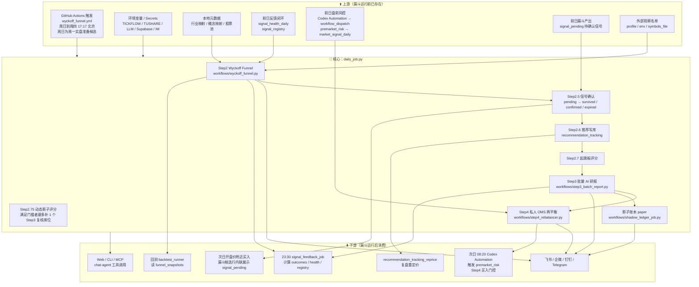
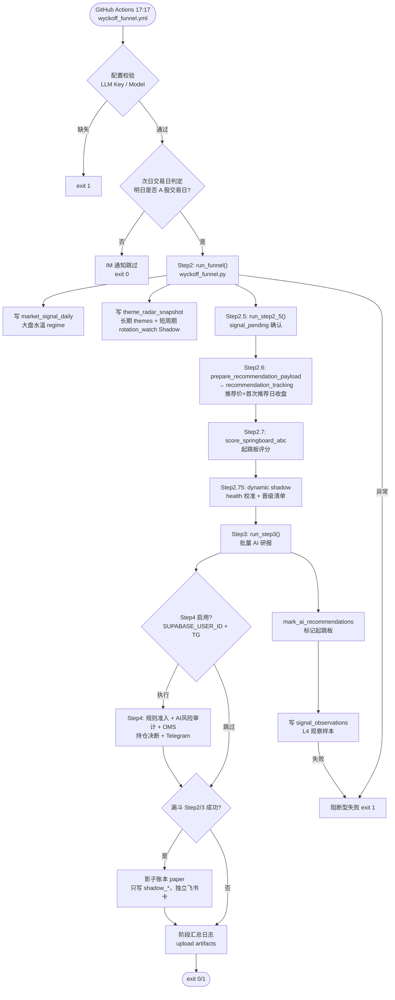
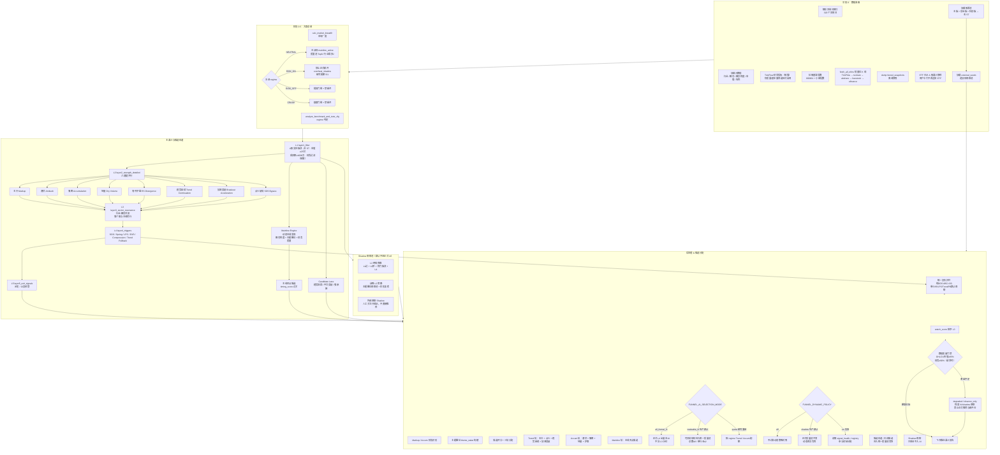
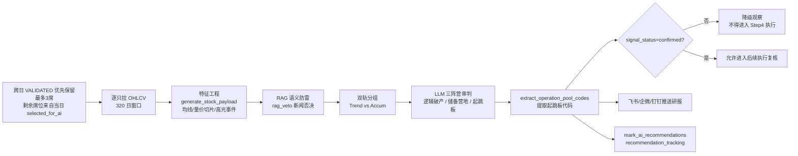
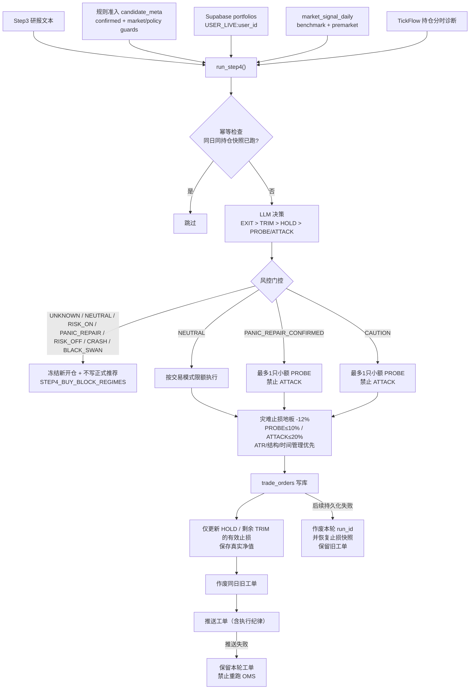
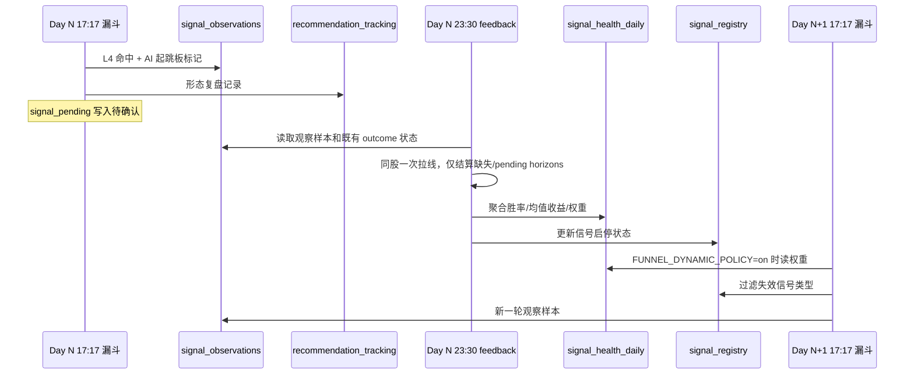
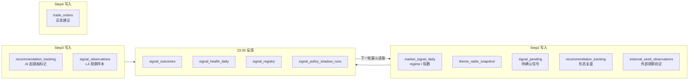

# A 股主漏斗执行流程

> 本文描述 A 股 Wyckoff 主漏斗从 GitHub Actions 触发到 Supabase 写库、跨日反馈闭环的完整执行链路。
> **实盘操作口径**见 [`OPERATOR_PLAYBOOK.md`](OPERATOR_PLAYBOOK.md)。策略逻辑见 [`../README_STRATEGY.md`](../README_STRATEGY.md)，架构见 [`ARCHITECTURE.md`](ARCHITECTURE.md)。

**主入口**：`.github/workflows/wyckoff_funnel.yml` → `scripts/daily_job.py`（周日到周四 **17:17** 北京时间；周日正常为周一实盘准备候选，仅在次日不是 A 股交易日时跳过）

---

## 一、系统全景：上下游关系



---

K 线/财务的时点裁切与周末元数据是两件事。仅当显式设置 `END_CALENDAR_DAY` 时，才按 `as_of` 裁切日线（必须有当日 bar）以及带 `filed_date` / `announce_date` 的财务记录；无日期的财务在回放中直接丢弃。周日定时漏斗的截止日是上周五，不算回放，不走这条裁切，但市值/概念热度仍按「截止日早于今天」走历史接口。这不改变当日实盘漏斗阈值。

---

## 二、主入口：`daily_job.py` 完整执行链

**触发**：`.github/workflows/wyckoff_funnel.yml` → `python scripts/daily_job.py`



### 阶段与代码映射

| 阶段 | 入口 | 核心模块 |
|------|------|----------|
| 调度 | `wyckoff_funnel.yml` | GitHub Actions |
| 编排 | `scripts/daily_job.py` | 主流程 |
| Step2 | `workflows/wyckoff_funnel.py` | `core/wyckoff_engine.py` |
| Step2.6 | `integrations/recommendation_payload.py` | `recommendation_tracking` 写库；`initial_price` 按 code 粘住首次推荐日收盘 |
| Step3 | `workflows/step3_batch_report.py` | `tools/report_builder.py` |
| Step4 | `workflows/step4_rebalancer.py` | `core/holding_diagnostic.py` / `core/wyckoff_engine.py` |
| 影子账本 | `workflows/shadow_ledger_job.py` | `core/shadow_ledger.py`；只写 `shadow_*`，失败不阻断漏斗 |

**影子账本启用步骤**（默认关，`SHADOW_LEDGER_ENABLED=0`）：

1. `python scripts/print_shadow_ledger_ddl.py`，把输出贴到 Supabase SQL Editor 执行一次。
   DDL 由 `core/shadow_ledger_schema.py` 生成——本仓库禁止 `.sql` 文件（`quality_gate` 会拦），
   schema 以 Python 常量版本化，与 `core/factor_ic_schema.py` 同一套做法。
2. 确认 `shadow_account` / `shadow_positions` / `shadow_events` / `shadow_nav_daily` /
   `shadow_trade_plans` 五张表已建、seed 账户 `USER_SHADOW:*` 存在。
3. 置 `SHADOW_LEDGER_ENABLED=1`。

未建表就开启只会每天在 summary 里留一行 `failed_soft`（异常被吞，不阻断漏斗），所以默认关，
让"建表"成为显式的启用动作。买许可复用 `step4_candidate_meta` 的规则准入，与实盘同一套口径；
写入侧另有 `USER_SHADOW:` 前缀断言，拒绝任何非影子账户。

**推荐价语义**：`recommendation_tracking.initial_price` = 该股票首次 `recommend_date` 的收盘价；同股再次推荐、同日重跑、晚间 reprice/performance 都不得改成新日价。`change_pct` 相对该粘住价；MFE/MAE 仍按该行事件日计算。performance 的 `max_dates` 只限制刷新哪些行，首次推荐日锚点仍按该 code 全量历史计算。存量纠偏入口为 `workflows.recommendation_tracking_reprice.correct_tracking_initial_prices`。

**强势股复盘证据**：生产漏斗在同轮 L1-L4 计算结束后，将逐股阶段、淘汰原因、候选车道、配置摘要和代码版本写入压缩 `review_trace_YYYYMMDD.json.gz`。该文件不含 OHLCV，随现有 Daily Job artifact 上传；19:25 Review 按前一交易日精确匹配成功运行的 trace，因此归因反映当时真实代码与配置，不依赖 Supabase，也不会被后来改动的策略重写历史。

trace 同时记录买点标签、风险信号和观察型影子归因车道。`near_l2`、`rotation_setup`、`pre_breakout` 不改变正式候选、AI 配额和 OMS；Review 只在当日强势样本内标出这些规则的事后召回，并与次日开盘/盘中可交易性并列展示，不把全量影子池当作买入清单。`scripts/review_shadow_backtest.py` 按 trace 日期逐日生成候选，再用后续行情计算 T+1/T+3/T+5、MFE/MAE，未来数据仅作结果标签。

---

## 三、Step2 漏斗内部：主线发现 + 多车道详细流程

**核心函数**：`run_funnel_job()` → `core/wyckoff_engine.py`



A 股漏斗已不再注入 ETF 增强上下文。漏斗卡片 `name_map` 只走 A 股 `load_stock_name_map()`，
不再 `update(load_etf_name_map())`。名称搜索仍用 `search_market_meta` / `load_etf_name_map`。
用户面向飞书卡、简报和推荐名单不新增或刷新 ETF 名称；历史库行保留，但旧快照里的黄金ETF/粮食ETF 等主题行不再渲染。

### 正式候选来源

| 来源 | 进入条件 | 是否可直接买 |
|------|----------|--------------|
| 传统 Wyckoff | L1/L2/L3 后出现 L4 信号 | 不直接买，先进入 AI/二次确认 |
| 主线候选 | `mainline_score` 达标，且 timing gate 过关 | 不直接买，仍需 AI/跨日确认 |
| 候选车道 | 趋势回踩、平台突破、强承接等结构接近 | 默认观察，形成可交易结构后进入统一质量池 |
| Shadow 旁路 | L2 未过但有复盘价值，或外部观察名单 | 不进入正式 AI，除非显式打开开关 |

报告把状态拆成 `DETECTED → SURVIVED → VALIDATED → OMS_APPROVED`：Spring/LPS/SOS/EVR 与 A/B/C 只表示当日结构命中；`SURVIVED` 只表示跨日未失效；守住信号位并出现高收、缩量或转强需求后才记 `VALIDATED`（库内兼容值 `confirmed`）；最后仍需 OMS 核准。四层不能互相替代。

正式候选在送入 Step3 前还会经过 `core/candidate_policy.py` 的统一损失护栏。单 SOS、单 EVR、单 LPS 与单 Trend Pullback 默认仅观察。状态已是可交易的主线候选可跳过这三类“仅观察”限制，但仍必须通过最低分、市场环境、弱确认、过热、高位追涨和结构止损距离检查；结构止损上限适用于全部市场状态，弱市与主线身份都不豁免。“主线观察”与“过热不追”不享受豁免。主题雷达候选还必须由当日概念或行业元数据再次证明其主题归属，旧快照标签不能单独形成主线种子。L2 的八通道原始命中数会写入诊断日志，但不参与评分。

结构止损上限是**风险敞口约束，不是收益筛选**。2026-08-07 直接调用 `_structure_stop_reason` 与 `compute_support_level` 验证：被拦候选的止损距离中位数 19.42%，放行候选 6.14%；按风险归一化后每承担 1% 止损距离换得的 10 日收益为放行 +0.150% vs 被拦 +0.051%，相差约 3 倍。收益维度本身不显著（Welch t 均 < 2，10 日方向反转），所以不要把它当作 alpha 来源；它的作用是阻止在任何市况下买入需要下跌约 20% 才触及结构止损的标的。

主题归属复检同日验证：全市场 34,440 个真实主题归属零误杀，抽样 3000 只中 2720 只只能靠 `sector_map` 兜底自证，因此 `sector_map` 必须与 `concept_map` 一并传入，否则会误杀这批标的。

**单 SOS 降级为仅观察的依据。** 2026-08-07 走 `scripts/backtest_snapshot_fetch.py` + `core/backtest_replay.build_signal_ledger()` 标准路径回放 2025-11-03..2026-07-20 共 162 个交易日，并额外跑一次 `pure_sos_min_abc=0` 的对照 ledger 拿到未被门槛筛掉的全集，两次去重后共 493 条纯 SOS：

| 口径 | 纯 SOS | 非纯 SOS |
|---|---|---|
| 10 日中位 | -3.20% | -1.27% |
| 10 日胜率 | 40.0% | 44.3% |
| 5 日中位 | -1.68% | -0.44% |

均值受少数极端日主导（剔除最差 5 日即由负转正），但该脆弱性是 A 股共性、保留组同样存在，因此以中位数与胜率两个抗尾部口径为准；两者在 5/10 日、两次独立 ledger 上方向一致。提高 `score` 门槛无法改善（score≥75 时 10 日中位反而降到 -4.18%）。

ABC 门槛松紧不是问题所在：met=2 与 met=3 的差异在 1/3/5/10 日全部 |t|<0.5，无显著差异。原注释声称 met=2 负期望（-1.46%）、met=3 正期望（+3.98%/胜率 53.8%），标准回放中方向相反且无法复现，已作废。`FUNNEL_LOSS_GUARD_PURE_SOS_MIN_ABC` 保留为 3 只是 `pure_sos_observe_only=False` 时的保守回退值。

所有 Welch t 均在 ±1.4 以内，未达显著；结论强度仅支持"单 SOS 不足以单独支撑买入决策"，不支持"SOS 信号无效"——SOS 与其他形态共振时不受此限，主线候选亦豁免。若后续样本改变结论，可用 `FUNNEL_LOSS_GUARD_PURE_SOS_OBSERVE_ONLY=0` 一键放开。

### 数据质量与诊断口径

- 生产漏斗默认开启交易日新鲜度硬断路器：股票 OHLCV 至少 95% 必须对齐目标交易日，两个基准指数也必须对齐；否则任务直接失败并报警，不生成基于旧行情的报告。`FUNNEL_DATA_FRESHNESS_HARD_FAIL=0` 只用于显式研究/故障诊断。
- OHLCV 和市值覆盖率均不得低于 95%。每日量价漏斗不请求全市场财务指标，财务覆盖率显示为“未纳入量价漏斗”；仅显式启用质量/基本面筛选时，财务覆盖率不得低于 90%。Step3 仍为最终少量候选补充财务快照。
- 任一必需覆盖率不足，运行状态标记为 `degraded`，交易就绪度强制为 `observe_only`。候选仍可进入 AI/shadow 对照，但报告、结构化详情和候选行都会禁止正式推荐、写入执行清单或新开仓。
- 报告展示三个覆盖率、OHLCV 数据源数量与占比、RPS universe 数量，以及 L1 到 L4 的输入、通过、淘汰数量和该层筛选原因。
- 主题诊断把中长线 `themes` 与短周期 `rotation_watch` 分开：后者按 5/10/20 日相对动量、5 日上涨宽度和热度识别升温主题，只在报告中作为 Shadow 提示，不能改变 `selected_for_ai`、正式推荐、市场总闸或 OMS。
- 报告按“一眼结论 → 主线与轮动 → 候选 → 详细市场证据”排序，并把轮动发现与交易许可分行展示；视觉层级不参与策略计算。
- L2 保留多标签；没有通道命中时返回空标签，不再兜底伪装成“点火破局”。概念聚合按股票稳定去重，同一股票不会对同一概念重复计数。
- CLI/MCP 的 `get_market_overview` 支持 `trade_date` 历史截面；设置 `include_breadth=true` 后，同时返回该交易日全市上涨、下跌、平盘家数、涨跌占比和均值/中位数。指数涨跌与个股宽度必须使用同一交易日截面解释，不得用指数方向代替涨跌家数。
- 大盘先独立输出结构周期 BULL / TRANSITION / BEAR，再叠加中期宽度（站上 MA20 的股票占比）和当日宽度（上涨家数占比及涨跌幅中位数）。结构 BEAR 不再要求近 3 日继续大跌才判 RISK_OFF；短反弹仍禁止普通新仓，全市场广度达到风险偏好阈值时只进入 `BEAR_REBOUND` 观察。恐慌修复按三日状态机处理：恐慌日为 `CRASH`；恐慌次日只有在指数反弹且上涨家数占比不低于 60%、涨跌幅中位数为正时才进入 `PANIC_REPAIR` 修复候选，此时只复核、禁止新仓；再下一交易日指数收益不低于 0%、上涨家数占比不低于 50%且涨跌幅中位数不为负，才进入 `PANIC_REPAIR_CONFIRMED`。

### L4 触发信号

候选合并后，未确认 Alpha `launchpad` 在 CAUTION 只保留影子观察；其它可交易水温最多占一个候选席位，
避免固定类型优先级把 Spring/LPS/SOS、主线和其它确认结构全部挤出 TopN。

| 信号 | 含义 | 典型轨道 |
|------|------|----------|
| SOS | 放量突破 | Trend |
| Spring | 假跌破收回 | Accum |
| LPS | 缩量回踩 | Accum |
| EVR | 放量不跌 | Trend |
| Compression | 压缩蓄势 | 通用 |
| Trend Pullback | 趋势回踩 | Trend / Mainline |

生产 LPS 只识别“先越过 Creek、后缩量回踩守住 Creek/MA20”的序列，量能比较使用近期与前 60 日的中位数，默认阈值 65%。没有 Creek 前序的普通均线回踩归入 Trend Pullback。观察与待确认记录按 `(code, signal_type)` 绑定候选元数据，禁止把趋势回踩车道误写到 LPS 行。

`core/wyckoff_structure.py` 会在同一批 L3 股票上额外识别动态交易区间，并对 Spring、LPS、SOS、EVR
生成 `structure_shadow` 对照。该结果只记录区间覆盖率、正式/结构共同命中和各自独有命中，固定为
`observation_only`，不合并进正式 `triggers`，不参与候选评分、二次确认、回测成交或 OMS。
结构区间质量按测试次数、ATR 归一化宽度和漂移评分；结构诊断异常时只把 shadow 标记为 `unavailable`，
正式 L4 继续运行。正式 Spring 使用近期 swing low 中位支撑并在样本不足时回退最低收盘价；SOS 同时校验
均量倍数和历史量能分位。

### 外部观察名单

`external_seeds` 用于把人工关注、社区反馈或其它系统给出的股票加入同一套漏斗观察，而不是作为正式候选来源：

- 配置来源：`config/profiles/a_share_prod.yml`、`FUNNEL_EXTERNAL_SEED_SYMBOLS`、`FUNNEL_EXTRA_SYMBOLS` 或 `symbols_file`
- 默认只做 shadow 观察：记录是否通过 L1/L2、是否在 L2 后触发 L4、是否过期
- 外部观察名单固定为 shadow-only，不进入 `selected_for_ai`
- 通过 L4 的外部观察对象会额外写入 `signal_observations`，`selection_mode=external_seed_shadow`

---

## 四、Step3 AI 研报流程



**LLM 配置**（workflow 默认）：

- Step3：`STEP3_LLM_PROVIDER=efficiency`，fallback `gemini`
- 输入不是原始 K 线，而是压缩后的结构特征
- Step3 总输入默认最多 5 只：跨日 `VALIDATED` 候选优先保留最多 3 席，其余席位按漏斗顺序从当日 `selected_for_ai` 填充；当日不足时，未使用的保留席不会浪费。市场修复模式不再从另一条“起跳板补位”路径私自换名单
- 合规版市场观察简报默认发送；只有显式设置 `STEP3_SEND_COMPLIANCE_BRIEF=0` 才关闭
- 精简形态观察按股票聚合；两种及以上 A/B/C≥2 的正式 L4 信号显示为“双/多 Wyckoff 形态共振”，入表时保留完整 `signal_types`
- `STEP3_SKIP_LLM=1` 的输入预演在空候选时静默返回，不发送空研报或合规简报
- 模型审判不等于执行放行，`confirmed` 仍是 Step4 硬门槛
- 用户报告保留执行摘要、实际送审清单，以及 A/B/C≥2 且当日写入 `recommendation_tracking` 的全部形态观察；旁路与主线名单同样全部列出，不再写「另 N 只已入表 / 另 N 只略」。名单超长时飞书走 `send_feishu_notification` → `split_lark_md` 多卡（约 2800 字/卡），不为本气泡静默再截断。完整 L4/主线池、逐层计数和证据仍保留在结构化运行数据中。空候选仍发送空集报告并明确区分上游空输入、RAG 全剔除和数据门槛过滤。用户面向卡片与推荐名单不再新增或刷新 ETF 名称（含黄金ETF/粮食ETF 与 159/51/56 基金号段）；历史库行不删。

---

## 五、Step4 OMS 持仓决断

Step4 不再默认把“Step3 起跳板”当成唯一入口。生产默认 `STEP4_AI_CANDIDATE_POLICY=veto_only`：程序先收集全部跨日确认、市场与候选护栏均允许的新仓候选，再剔除 Step3 明确归入“逻辑破产”的代码。AI不能把未确认、只读、观察或市场阻断候选升级成买入；对外部新仓给出的 `ATTACK` 也会被降为 `PROBE`。

候选审计只保留两种模式：`veto_only` 应用 Step3 的明确否决，`shadow` 仅记录分类用于实验对照。两种模式都不绕过跨日价格确认和 OMS。



Step4 以 `trade_orders` 作为幂等事实源。Telegram 超时具有“可能已送达”的歧义，因此推送失败会让任务显式失败，但不会作废订单或重跑 LLM/OMS；否则可能重复发送或生成相互冲突的工单。只有订单已写入、后续数据库持久化失败时才精确作废本次 `run_id`，并按写入前快照恢复已改动的持仓止损；回滚自身失败会升级为独立错误。同日旧工单在本轮持久化全部成功后才作废。LLM 若对同一代码输出多条决策，解析阶段按 `EXIT > TRIM > HOLD > PROBE > ATTACK` 折叠为一条；OMS 卖单通过后同步扣减内存持仓，避免重复 EXIT/TRIM 超卖。持仓结构退出只看建仓后的价格路径，`buy_dt` 缺失时 fail-closed 不发结构退出；新仓保护期内（以及建仓日缺失时），当轮模型给出的、同时高于成本和现价的倒挂止损会被拒绝，但已持久化的跟踪止损继续作为权威防线，未成交 `EXIT` 不再反写并污染持仓止损。新多头 `add` 必须带合法 `buy_dt`（YYYYMMDD 或 YYYY-MM-DD），未给或非法时报错，须询问用户真实建仓日，禁止默认今天；`update` 只更新已有持仓，不得在空账本新建。

### 回放与确认安全边界

- 显式设置 `END_CALENDAR_DAY` 即进入历史回放模式。Step2/Step3 可以按目标日重放，但任务会在读取实盘持仓、订单或 Step4 Supabase 状态前跳过 Step4，历史结果不会改写当前 OMS；影子账本同步跳过，避免回放写 paper 成交。

### 影子账本（paper）

漏斗 Step2/3 成功后，`workflows/shadow_ledger_job.py` 另跑一套纸面账本：买许可与 Step4 规则准入相同，但只写 `shadow_*`。盘后定计划、次日官方开盘价成交，遵守 T+1 / 整手 / 涨跌停 / 费用；失败只记日志，不阻断漏斗。独立飞书卡标题为「影子账本 / paper」，不是实盘，也不是 `ic_shadow`。
- Step4 新开仓确认采用字段级白名单：接受明确的 `confirmed` 状态、`signal_confirmed` 来源和受控确认标签；只要载荷含 `unconfirmed`、`pending`、`未确认`、`待确认` 或 `观察` 等否定状态，就先行拦截，不再用字符串包含关系推断确认。

### 报告执行纪律

日漏斗、Step3、OMS 推送正文顶部固定附带 `core/execution_playbook.py` 的 **「🧭 执行纪律」**（闸门、主线优先、5 日持有、-12% 灾难地板）。操作解读见 [`OPERATOR_PLAYBOOK.md`](OPERATOR_PLAYBOOK.md)。

---

## 六、次日开盘执行与持仓诊断（与日漏斗串联）

`entry_price_mode=open` 是当前生产候选默认口径；信号确认口径 `pending_mode=only`（仅用跨日 confirmed 信号）与实盘 Step4 `STEP4_REQUIRE_CONFIRMED_BUY_CANDIDATE` 严格对齐。`off`/`both` 仅作为跳过或放宽确认门槛的研究对照，不代表实盘可执行表现；`open`、`close` 和 `tail_1455` 也必须在相同 confirmed-only 门槛下完成对照后，才能宣称某种入场口径更优。最终 OMS 将 AI 结构区间、涨幅和 ATR 防追高约束收敛成唯一允许买入区间；区间缺失或无交集直接拒单，次日开盘价不在区间内也不执行。

Backtest Grid 的默认策略消融为 `A/M/P`。M 相对 A 缩小弱水温下指定 confirmed 信号的研究仓位；
P 相对 M 仅将 NEUTRAL Spring 仓位由 50% 降至 25%。默认 `all_defined` 除近期、牛市和熊市外，增加 2023 震荡与 2024
剧烈波动窗口；报告必须收齐五个窗口的 A/M/P 单元才标记完整。Q 的广度确认在五窗口相对 P 仅 1/5 胜、平均收益差 −3.85pp，实验实现已删除；N（过滤后重排）与 O（拦截后不补位）也已被证伪。
每个窗口的 A/M/P 共享一次信号台账，再分别应用仓位权重并重放现金组合；只有权重以外的策略配置完全
一致时才允许复用，避免把真正改变选股或信号的实验误当成轻量仓位对照。
候选组还必须五个窗口现金收益全部为正且最大绝对回撤不超过 20%，不能只凭相对基线少亏获得 `pass`。
策略报告还会对 P 组实际现金成交按信号、水温和退出原因汇总亏损贡献，避免用未成交信号的纸面均收指导下一轮。
这些能力只作用于回放，不改变生产漏斗、Step3 或 OMS。F-I 与经典 B-E 仍可手动复验，但已退出默认矩阵。

| 项 | 说明 |
|----|------|
| 入口 | 漏斗候选行内联展示（`workflows/funnel_render.py`） |
| 候选 | 读 `signal_pending`；**confirmed 才可执行** |
| 排序 | 生产仍使用 confirmed → 主线/趋势 → 信号分；A/M/P 不改变生产排序 |
| 主线语义 | `candidate_theme / candidate_phase / candidate_role` 从推荐、信号贯穿到执行记录；LLM 只解释不重判 |
| 禁新开 | `RISK_ON` 与弱市/修复期与 Step4 对齐，新票不买 |
| 持仓诊断 | `workflows/holding_diagnosis_core.py` + `core/holding_diagnostic.py`（日线为准），硬止损约 12%；非主线满 5 日建议时间止盈 |
| 读法 | **confirmed** 候选只在次日开盘价位于 OMS 唯一区间时买入；未确认候选只观察 |

**日漏斗 = 候选池；confirmed + OMS 唯一区间 = 今天买不买。缺一不可。**

---

## 七、跨日反馈闭环

漏斗与 feedback 是**错峰运行**的反馈系统：漏斗先产出观察样本，feedback 盘后验收，下一轮漏斗再读取新的策略状态。详见 [`SIGNAL_FEEDBACK_LOOP.md`](SIGNAL_FEEDBACK_LOOP.md)。



`signal_pending` 的幂等键按 `signal_date + code + signal_type` 判断。当天已有任意状态的同一信号时，重复执行
漏斗不会再写 pending；历史交易日仍为 pending 的同类信号则不会吞掉当天的新观察，跨日确认链因此保留
完整日期语义。

本页只保留 feedback 在 A 股执行链中的先后关系。`FUNNEL_DYNAMIC_POLICY` 的三种模式、表字段、归因展示和
正式晋级条件统一见 [`SIGNAL_FEEDBACK_LOOP.md`](SIGNAL_FEEDBACK_LOOP.md)，不在流程图文档重复维护。

---

## 八、上下游相对顺序

盘前风险是 Step4 的上游门控；次日开盘价附近买入消费已确认候选；盘后漏斗产出下一交易日观察池；重定价与 feedback
在漏斗之后更新复盘数据；maintenance 最后清理滑动窗口。具体北京时间、cron 和完整工作流清单只在
[`ARCHITECTURE.md`](ARCHITECTURE.md#github-actions-主要工作流) 与 `.github/workflows/` 维护。

---

## 九、Supabase 数据流



---

## 十、数据源降级链（OHLCV）

```
TickFlow (优先, qfq 前复权)
  ↓ 批量结果仅部分缺失：先剔除当日停牌，仅对其余缺口回补
  ↓ 失败
Tushare
  ↓ 失败
AkShare
  ↓ 失败
Baostock
  ↓ 失败
efinance
```

- A 股漏斗不再拉取或展示 ETF/LOF 旁路；L1 已用 `is_supported_cn_board` 丢掉 51/159/56/513/588。漏斗卡片 `name_map` 不再合并 ETF 名称。用户卡片与推荐名单不刷新 ETF 名称。
- 上证/创业板基准使用 Tushare → AkShare → Baostock，Baostock 是不依赖东方财富网页链的第三层备源。
- 数据质量同时报告原始全池覆盖与“应交易覆盖”；当日确认停牌不算数据源失败。换手率、行业映射和概念映射也有独立覆盖率门槛，避免元数据降级为空后静默改变 L1/L3。
- 概念连续性读取 Supabase `concept_heat_history` 的最近交易日历史，并报告历史天数、最新日期和连续主题数；历史充足但连续主题为 0 表示题材轮动未形成连续线，不等于数据为空。

- 批量大小、并发和超时由工作流环境变量控制；生产当前按批拉取约 320 个交易日窗口。
- 快照：`data/funnel_snapshots/`（供回测离线使用）

---

## 十一、当前生产配置要点

来源：`.github/workflows/wyckoff_funnel.yml`

| 变量 | 当前值 | 作用 |
|------|--------|------|
| `FUNNEL_AI_SELECTION_MODE` | `tradeable_l4` | 只把可交易 L4 结构送入 Step3，减少裸 SOS/EVR 追高噪声 |
| `FUNNEL_AI_TOTAL_CAP` | `8` | 质量达标候选的最终统一硬上限；主线、战略和主题补位共同竞争 |
| `FUNNEL_AI_MAX_PER_SECTOR` | `2` | 最终送审清单的单行业上限，避免同一板块占满上下文 |
| `FUNNEL_DYNAMIC_POLICY` | `shadow` | 正式输出仍用 `tradeable_l4` 统一质量池，同时记录动态配额与信号权重的对照差异 |
| `FUNNEL_DAILY_BREADTH_REPAIR_PCT` / `FUNNEL_DAILY_BREADTH_WEAK_PCT` | `60` / `35` | 修复候选日上涨家数占比阈值 / 强结构转弱阈值 |
| `FUNNEL_PANIC_REPAIR_CONFIRM_MAIN_PCT` / `FUNNEL_PANIC_REPAIR_CONFIRM_BREADTH_PCT` | `0` / `50` | 修复候选次日的指数价格与上涨家数占比确认阈值 |
| `FUNNEL_AI_NEUTRAL_TREND` / `FUNNEL_AI_NEUTRAL_ACCUM` | `5` / `1` | dynamic shadow 与 quota 兼容模式的研究基线；不截断生产质量池 |
| `FUNNEL_AI_RISK_ON_TREND` / `FUNNEL_AI_RISK_ON_ACCUM` | `5` / `1` | AI/shadow 研究基线；正式推荐与新开仓由市场闸门禁止 |
| `FUNNEL_EXTERNAL_SEED_SYMBOLS` / `FUNNEL_EXTRA_SYMBOLS` | 空 | 临时追加外部观察名单；存在时自动启用 external seed shadow |
| `STEP4_BUY_HARD_STOP_PCT` | `12.0` | 新开仓灾难止损地板；ATR/结构/时间管理优先 |
| `FUNNEL_MAX_STRUCTURE_STOP_PCT` | `12.0` | 漏斗送审前的结构止损距离上限；与 OMS 灾难地板独立配置 |
| `FUNNEL_LOSS_GUARD_PURE_SOS_OBSERVE_ONLY` | `1` | 单 SOS 仅观察；设为 `0` 放开后由 `PURE_SOS_MIN_ABC` 兜底 |
| `STEP3_SEND_COMPLIANCE_BRIEF` | `1` | 默认发送脱敏市场观察简报；设为 `0` 才显式关闭 |
| `STEP4_BLOCK_BUY_ON_STALE_EXIT` | `1` | 持仓已跌破止损却连续多日未离场时禁止 `ATTACK` 重仓；小额 `PROBE` 与离场减仓不受影响，一字跌停日不计入拖延 |
| `STEP4_NEW_POSITION_STOP_GUARD_DAYS` | `4` | 新仓倒挂止损保护期（自然日）；保护期内或 `buy_dt` 缺失时，同时高于成本和现价的止损不得触发 EXIT/TRIM |
| `STEP4_REPAIR_PROBE_BUDGET_LIMIT` | `0.05` | `PANIC_REPAIR_CONFIRMED` 单票试探仓上限；同时最多只开放一只 |
| `STEP4_REQUIRE_CONFIRMED_BUY_CANDIDATE` | `1` | Step4 新开仓只允许显式跨日确认候选；否定/观察状态优先拦截，不做模糊字符串匹配 |
| `STEP4_AI_CANDIDATE_POLICY` | `veto_only` | `veto_only` 只剔除逻辑破产；`shadow` 仅记录分类用于实验对照 |
| `STEP4_BUY_BLOCK_REGIMES` | `UNKNOWN,NEUTRAL,PANIC_REPAIR,RISK_OFF,CRASH,BLACK_SWAN`（生产值；代码默认不含 NEUTRAL 但含 RISK_ON/BEAR_REBOUND） | 市场数据未就绪、过热与弱市均冻结新开仓。**同时决定正式推荐是否写入**：`resolve_market_trade_mode` 读同一份名单，禁买档返回 `execution_blocked`，不再出现「报告说可买、OMS 买不到」 |

### 数据缺失导致的禁买要能被认出来

生效状态 = 收盘态与盘前态取严，任何一边缺失都会落到 `UNKNOWN`，而 `UNKNOWN` 属于禁止开仓。
这是有意的 fail-closed，但缺失和「行情确实不明」在状态上无法区分：生产 47 天样本里有 10 天
是因为上游任务没产出而禁买，与真正放行的天数（10 天）持平。

`build_market_guardrail` 因此额外做一次归因：只有在**补齐缺失项后本可放行**时，才在风控段和
`trade_orders.market_view` 里写明「禁买源自数据缺失」，并给出缺失项。收盘态自身已经是 CRASH
这类禁买态时不会这么标注——那时补数据也不会放行，误报只会让运维白跑一趟。风控语义不变，
缺的只是可见性。

排查顺序：看到 `⛑️ 禁买源自数据缺失` 就手动补跑 `premarket_risk`（或检查 `market_signal_daily`
当日行的 `benchmark_regime`），再重跑 Step4。

盘前那一半另有 `schedule` 兜底（UTC 02:20 工作日，带 `--backstop` 幂等短路）：外部
`workflow_dispatch` 触发器实测连续 4 个周一周二未触发，而周一周二恰是 Step4 出单最多的两天。
兜底只在当日盘前态缺失且当天是交易日时才干活，触发正常的日子秒退，不会多推一条飞书。

---

## 相关文档

| 文档 | 内容 |
|------|------|
| [`OPERATOR_PLAYBOOK.md`](OPERATOR_PLAYBOOK.md) | **实盘怎么用**：日漏斗 × 次日开盘执行纪律 |
| [`README_STRATEGY.md`](../README_STRATEGY.md) | 策略逻辑、L1–L5、配额、次日开盘执行与 OMS |
| [`ARCHITECTURE.md`](ARCHITECTURE.md) | 架构、Actions 全表、Supabase 表结构 |
| [`SIGNAL_FEEDBACK_LOOP.md`](SIGNAL_FEEDBACK_LOOP.md) | 信号反馈闭环详解 |
| [`GLOSSARY.md`](../GLOSSARY.md) | 术语速查 |
