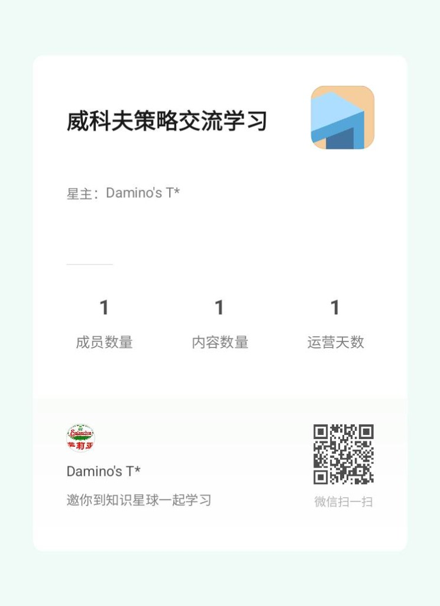

# WyckoffAgent 运行成本与共享生态

感谢开源社区对 WyckoffAgent 项目的认可与支持。

> [!NOTE]
> **💡 项目核心原则：始终开源，欢迎自由参与**
> WyckoffAgent **将始终保持开源**。我们由衷欢迎并鼓励每一位用户 **fork 本项目自行部署**，或者通过提交 **Issue 与 Pull Request (PR)** 来共同完善和优化这个工具。
>
> 本文档公开的运行成本仅作为云端共享生态的服务参考，旨在说明云端自动化运行的硬性开销。我们不强制任何人付费，任何有兴趣和动手能力的用户完全可以根据开源指南自行搭建和运维属于您的独立系统。

随着系统功能（如全市场形态复盘、持仓诊断、次日开盘买入等）被高频使用，项目基础设施（如多市场行情源、Supabase 数据库、Render 云服务器、AI API）的开销呈指数级增长。日线行情不再长期写入 Supabase 行情缓存，Supabase 主要承载用户配置、持仓、推荐记录、信号反馈和策略观察表。

目前项目由开发者个人全额资助运行，每月固定硬性开销达 **CNY 1,638/月**（折合每年约 **19,656元**）。

---

## 基础设施月度开销明细

| 基础设施 | 当前选择 | 成本 (估算) | 作用 |
| :--- | :--- | ---: | :--- |
| **A 股行情数据** | TickFlow 接口 | CNY 199/月 | 驱动 A 股漏斗筛选、形态回测、跨日确认买入决策的核心行情源。|
| **美股行情数据** | 美股数据服务 | CNY 99/月 | 支持美股、美股 ETF 和跨市场大盘温度研判。 |
| **港股行情数据** | 港股数据服务 | CNY 69/月 | 支持港股标的自动筛选和强弱比较。 |
| **云端数据库** | Supabase Pro | USD 25/月 (约 CNY 175/月) | 用于存储用户多端持仓、推荐记录、历史信号、反馈结果、任务状态和策略观察表；不作为长期 OHLCV 行情缓存。 |
| **在线分析服务** | Render Web Service | USD 25/月 (约 CNY 175/月) | 承载 Web App 与 Agent 的在线服务，保障实时诊断、漏斗和回测的高并发。 |
| **AI 推理** | 多模型中转 API | USD 30/月 (约 CNY 210/月) | 驱动 AI 3 阵营研报、复盘摘要、盘前情绪分析和决策推理。 |
| **开发与算力** | Codex 专用服务器 | USD 100/月 (约 CNY 700/月) | 用于日常代码迭代、云端多任务并行校验、多线程历史补价回刷等。 |
| **域名与入口** | Wyckoff 相关域名 | USD 20/年 (约 CNY 12/月) | 承载 Web App 前端路由、项目主页以及后续统一的 API 入口。 |

*注：汇率按 1 USD = 7 CNY 粗略折算，目前硬性总成本约 **CNY 1,638/月**。*

---

## 为什么设置「知识星球」共享入口？

为了保障项目能长期、良性地持续迭代，我们正式推出了 **「威科夫策略交流学习」知识星球**。年费定价为 **CNY 518/年**：一方面 518 取“我要发”的好彩头；另一方面，这笔费用的核心目的，是让愿意使用云端共享服务的朋友共同平摊数据源、数据库、云服务器、AI API、自动化任务和社区维护等硬性运行成本。

这不是投资顾问费，也不是收益分成，更不代表任何涨跌判断或收益结果的承诺。系统提供的是数据整理、自动化扫描、形态复盘、AI 辅助分析和社区交流能力；最终交易决策、仓位管理和风险后果均由用户自行承担。

我们可以将**“个人独立部署运行”**与**“加入知识星球（共享服务）”**的成本和体验做一个简单的账本对比：

### 💰 账本对比

| 评估维度 | 个人独立部署 / 运行整套系统 | 加入知识星球 (共享生态) |
| :--- | :--- | :--- |
| **资金成本** | **20,000+ 元/年** • 须自己购买 TickFlow 接口账号 • 须承载个人的数据库、服务器与大模型 API 调用费 | **518 元/年** （折合每天仅约 **1.4 元**，用于平摊云端共享系统运维成本） |
| **运维门槛** | 需自行维护 Docker、GitHub Actions、PostgreSQL RLS、行情异常重试和定时任务。 | 会员能力由共享云端维护；个人单股分析使用的模型和数据源 Key 仍需在设置页自行配置。 |
| **数据与复盘** | 自己运行漏斗、保存候选、回刷价格并维护统计口径。 | 直接查看共享漏斗沉淀的最近 30 个复盘交易日、MFE/MAE 和策略归因；临时分析的数据源仍按个人配置使用。 |
| **学习与迭代** | 单打独斗，遇到策略失效或系统异常只能自行排查，难以和同道交流。 | 拥有专属的威科夫量化交流圈，实时获取研发路线与最新策略逻辑。 |

---

## 星球会员专属权益

加入 **「威科夫策略交流学习」知识星球**（CNY 518/年），您将获得以下专属服务：

1. **形态跟踪与策略归因**：查看最近 30 个复盘交易日的入选记录、推荐次数、初始价、现价、MFE/MAE、信号分层和策略归因报告。
2. **云端持仓**：在 Web 编辑并保存自己的持仓，跨端读取同一份用户隔离数据，再结合实时行情发起诊断。
3. **高级 Agent 能力**：经用户确认后使用无网络、无业务密钥、执行后销毁的隔离 Python 研究计算；用手机遥控已登录的桌面读盘室。
4. **共享漏斗与交流**：共享系统每日维护 A 股完整漏斗与港股/美股独立扫描产物，并在知识星球交流策略和系统迭代。个人飞书/Telegram 通知需要单独配置通知地址，并不是开通会员后自动发送。
5. **普通能力不被锁住**：非会员仍可自配模型和数据源使用读盘室、单股、多股、手动持仓诊断、数据导出和浏览器本地历史。

会员身份不会自动写入个人模型 Key、TickFlow Key 或通知地址。完整产品与数据边界见 [PLANET_MEMBERSHIP.md](PLANET_MEMBERSHIP.md)。

---

## 微信扫码加入知识星球

欢迎扫描下方二维码加入我们，共同构建威科夫量化交易的良性共享生态：

  
  
<b>威科夫策略交流学习 知识星球</b>

