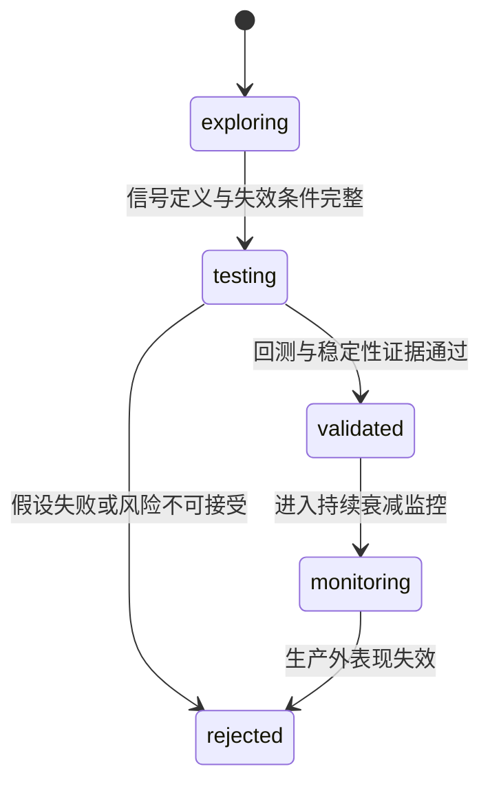

# Wyckoff 系统迭代与研究治理

> 本页只回答“下一步研究什么、证据达到什么标准才能晋级”。反馈表、动态策略字段和 Shadow 查询口径统一见
> [`SIGNAL_FEEDBACK_LOOP.md`](SIGNAL_FEEDBACK_LOOP.md)；Agent Runtime 的实现边界统一见
> [`ARCHITECTURE.md`](ARCHITECTURE.md#agent-架构)。

## 当前阶段

系统已经具备信号 outcome、健康度、生命周期、候选影子评分、入场质量和动态策略 Shadow。当前重点不是继续
增加规则，而是积累跨市场状态样本，证明新增信息能稳定提高收益/回撤比，并拒绝只在单一窗口有效的参数。

2026-07-28 的四层归因把这条要求变成了硬约束：现有 OHLCV 形态信号的 alpha 已量化为零，触发阈值、排序和
退出三层也逐一排除（见[下文结论](#l4-形态信号四层归因结论2026-07-28)）。因此新提案要先证明信息本身有
alpha，再谈怎么接。

| 研究方向 | 已有观测面 | 当前决策 |
|----------|------------|----------|
| 信号衰减 | SOS / Spring / LPS / EVR / Compression 的 outcomes 与 health | 继续积累多周期、分 regime 样本 |
| 动态分配 | 静态与动态候选的 `diff_added` / `diff_removed` | 保持 Shadow，未获正式晋级许可 |
| 信号生命周期 | `ACTIVE / WATCH / EXPERIMENTAL / RETIRED` | 保守处理冷启动，阈值待样本校准 |
| 外部观察 | L1/L2/L4 位置与后续 outcome | 仅作旁路验证，不晋级正式候选 |
| 候选影子评分 | S/A/B/C/D 档位与后续收益、回撤 | 仅作归因，不直接改排序 |
| 入场质量 | 相近上游优先级内的质量档位 | 仅允许窄 tie-breaker，继续验证 |
| 短线事件 | 未来 5 日命中、MFE、MAE 与 Top-K lift | 只读评估，不回写生产推荐 |
| 主题轮动 | `rotation_watch` 的短周期动量和宽度 | Shadow 提示，不改变主线确认或 OMS |
| 基本面质量 Overlay | 公告日前可见财报的 point-in-time 历史回放 | 0/3 周期通过，回测脚本已下线；仅作为读盘室按需查询工具（`analyze_stock mode=fundamental`），不接入 A股漏斗/Shadow/生产排序 |
| A股实证入场 | 弱水温仓位与 NEUTRAL Spring 缩仓 | A/M/P 及 Q/R/S/T 均未晋级；默认网格不再复跑，只有 `run_strategy_compare=true` 时手动复现 |
| L4 形态信号边际 | 五窗口约 9000 笔的无障碍毛漂移与日期配对 alpha | alpha≈0，四层已排除；停止形态参数迭代 |
| 产业基本面召回通道 | AI 算力链五只票的逐层召回归因 | `premise_not_supported`：五只全过 L1、四只倒在 L2 回撤门槛、买点全空；不新建通道，仅修数据契约 bug |
| 跟踪止损锚定 | 同子总体内「挂止损 vs 未挂止损」的日期配对超额 | `rejected`：挂止损组 10 日超额 −1.03pct（t=−3.76），锚定是有效信号而非误伤，60 日高点口径保留 |
| `priority_score` 排序键 | 配额绑定日的 Top-K 超额，对比替代键与随机负控制 | `keep_research_only`：三个持有期全部落在 30 种子随机带宽内，无判别力；不砍、不改 `_exit_penalty` |
| 快照 PIT 股票池 | 五窗口 PIT 重跑后的胜率与平均收益 | 退市已补齐并重跑：五窗口平均收益全负、胜率 24%–39%，「无 alpha」结论未被推翻；PIT 名称随后实现（bull_2020 再补回 174 只），待重跑复核 |
| 美股漏斗 | 对 SPY.US 同期同持有期超额 | `rejected`：2,098 条可配对样本超额 −1.63%，按日聚合 t=−4.39、5/31 天为正，`funnel_score` 秩相关 −0.066 且四分位单调递减 |
| 港美 OMS 独立参数 | 港美 `mae_pct` 分布与 12% 止损触发率 | `keep_research_only`：12% 在港股触发 5.1%、美股 11.7%，均属合理地板；港股基准修复前无可信超额数据，不配独立参数 |
| Step3 财务字段 | 送审池内财务档位与后续超额（固定 `met_count`/`signal_type`） | `exploring`：约需 90 个交易日；送审率下降源自 `pure_sos_min_abc=3`，属设计生效，不得为凑样本放宽 |

### 基本面质量 Overlay 本地结论（2026-07-18）

本轮用固定随机种子的 300 只当前在市股票，在 2020 暴跌、2021 牛段、2022 熊段、2024 小盘弱势、
2025 反弹和 2026 近期六个窗口回放 884 笔交易。财报只允许使用 `announce_date < signal_date` 的记录，
测试动作固定为“剔除 `grade=weak`，未知样本保留”，持有期为 5/10/20 交易日。

- 三个持有期均未达到预注册晋级门槛；平均收益分别变化 -0.049pp、-0.335pp、-0.451pp。
- P10 分别恶化 -0.706pp、-0.536pp、-0.728pp，大亏率分别增加 1.269pp、1.113pp、3.633pp。
- 每个持有期都只有 3/6 窗口改善，未达到 60% 的跨窗口一致性门槛。
- `weak` 档 212 笔的均收为 -1.518%，反而好于 `strong` 的 -1.793% 和 `neutral` 的 -3.528%，
  说明这套通用质量阈值不能当作 Wyckoff 短中期信号的否决器。

结论为 `keep_research_only`：不改 confirmed、市场闸门、候选排序、Step3 或 OMS。回放仍有当前在市股票池的
幸存者偏差，且供应商历史财务可能含修订回填；这些限制只会降低晋级可信度，不构成放宽门槛的理由。

该回放脚本（`workflows/fundamental_overlay_backtest.py`）与其 CLI 入口已下线，结论存档于此。核心评分逻辑
（`core/fundamental_overlay.py`）保留，仅通过 `analyze_stock(mode="fundamental")` 暴露为 CLI/MCP/Web
Agent 读盘室的单股按需查询工具，不参与任何自动化排序或漏斗决策。

Web 端单股分析、多股对抗、持仓诊断页面（`web/packages/shared/src/agent-value.ts`）维护一套独立但核心逻辑对齐
的规则库：数据新鲜度阈值（550 天）、`veto` 级严重风险判定（多指标同时恶化或高杠杆叠加亏损）与背离信号
（利润/ROE 为正但经营现金流为负）在两端保持一致；输出结构因消费场景不同而分别面向 UI 展示
（`ValueScore`/`severe`）与 Agent 决策字段（`grade`/`action`/`position_cap`），不做强行统一。

## 研究对象与证据台账

每个策略增量先登记为研究假设，而不是直接变成生产开关：

`research_hypothesis` 记录 thesis、信号定义和失效条件；`research_evidence` 用稳定 `artifact_ref` 关联
`backtest`、`stability`、`attribution`、`shadow`、`report` 或 `observation`。状态只能通过
`research_transition` 合法迁移，普通字段更新不能绕过审计改变 status。

## 晋级证据门槛

`testing → validated` 至少需要最近的 `backtest=pass` 和 `stability=pass`，但这仍不等于生产交易许可。
晋级评审按以下顺序检查：

1. **处理暴露真实存在**：规则必须实际改变 `(signal_date, code)` 交易集合；零暴露只能记为 `no_effect`。
2. **跨周期有效**：近期、牛市、熊市都要覆盖，不能用单段行情代替稳健性。
3. **参数不孤立**：锚点附近至少有两个可比较邻居，且稳定邻居比例达到门槛。
4. **样本外不失效**：训练窗口选出的持有/退出参数在后续窗口原样测试，测试期不得重新选参。
5. **收益与风险同时改善**：不只看命中率，还看现金收益、最大回撤、MFE/MAE、赔率和尾部亏损。
6. **Shadow 贡献可解释**：`diff_added` 应持续优于 `diff_removed`，且不是由单一信号、单一行情或少数右尾交易驱动。
7. **人工复核通过**：数据口径、前视偏差、执行成本和回滚路径均明确后，才讨论生产开关。

Backtest Grid 输出跨周期确认、`parameter_stability.json` 和 `walk_forward_validation.json`，其
walk-forward 只验证持有期与退出参数：这类参数不改变信号集合，可以复用同一份信号台账。SOS、Spring、
LPS 等触发阈值改变的是"有哪些信号"，每个取值都要完整重跑漏斗，因此走独立的 Backtest Trigger
Calibration 流水线（见下节），其 `trigger_calibration_report.json` 才是触发器样本外验证的证据。
经典形态 B/C/D/E 在 2026-07-18 的三周期消融中未达到晋级要求：B 无真实暴露，
C/E 降低近期与牛市收益，D 没有经济改善。因此默认算力不再重复运行 B-E，只保留手动复验能力。

已完成的 `A/M/P` 消融保留手动复现能力：A 是生产口径基线；M 在 NEUTRAL 与恐慌修复阶段缩小指定
confirmed 信号仓位；P 在 M 上仅将 NEUTRAL Spring 仓位由 50% 降至 25%。三组不改变候选集合、排序和
退出规则，因此手动复跑时每个窗口只建立一次信号台账，再分别重放权重与现金组合。由于五窗口结论已经
稳定为不晋级，Backtest Grid 默认关闭该任务；只有显式设置 `run_strategy_compare=true` 才复现历史证据，
避免每次参数网格额外运行五个全市场漏斗。Q 的广度确认在完整五窗口中相对 P 仅 1/5 胜、平均收益差
−3.85pp、最大回撤最多恶化 6.52pp，故实验实现已删除。
此前 N 版本采用“过滤后重排”，在 2026-07-25 的五窗口结果中只在 2/5 个窗口改善、平均收益相对 M 下降 3.12pp；
O 采用“拦截后不补位”，在 run #85 中仅 2/5 个窗口优于 M、平均收益相对 M 下降 4.95pp，故两者均已拒绝且不作生产候选。策略只有在
五个窗口现金收益全部为正、最大绝对回撤不超过 20%，并继续满足处理暴露、相对收益和回撤恶化门槛时才可
标记 `pass`。A/M/P 都是回测研究策略，不会因单次胜出自动改写
生产漏斗、Step3 或 OMS。

run #88 的五窗口结果中，M 相对 A 五窗全胜但只有 1 个窗口自身盈利；P 相对 M 为 4/5 胜、3/5 自身盈利，
仍在 2023 震荡和 2024 剧烈波动窗口分别亏损 12.71% 与 10.81%，因此只能保持 `review`。按 P 的实际现金
成交归因后，跨五窗口最大的环境亏损来自 NEUTRAL（178 笔、总盈亏约 −1.31 万）；信号侧亏损集中在
LPS（7 笔、约 −4900）与 SOS（60 笔、约 −4863）。Spring 缩至四分之一仓后不再是最大净亏损来源，
所以下一轮先验证 NEUTRAL 下的信号/退出组合，不继续围绕 Spring 叠加过滤器。策略对比报告现已把这套
实际成交归因写入 JSON，并在 Markdown 仅展示每个维度亏损贡献最大的三组。

run [30704303455](https://github.com/YoungCan-Wang/WyckoffTradingAgent/actions/runs/30704303455) 进一步固定 P 的
Top-N，用不补位方式分别禁止 NEUTRAL Spring、LPS、NEUTRAL EVR 和 CAUTION SOS。四组均未达到晋级门槛：
Q/S/T 跨窗口不稳；R 虽在 4/5 窗口改善、平均相对 P 增益 +2.82pp 且未恶化最大回撤，但 P 组直接成交的
LPS 只有 8 笔。修复 observation 分页与 tracking fallback 后，最近 90 个推荐日事件中成熟 LPS 扩为 67 条，
5 日平均收盘收益 −2.79%，但仍好于全样本 −4.92%；NEUTRAL × LPS 的 40 条成熟样本为 −1.52%。因此证据
仍不支持生产全局禁用 LPS，也不继续组合这些形态门控；实验 PR 关闭，证据保留在 Actions。

同一批推荐事件共 703 条、492 条标签成熟。候选影子排序相对原漏斗分在 Top1/3/5 的命中率均无提升，
平均收盘收益与 MAE 也未改善；AI 优先排序同样不增益。当前实现保持 `score_only`，后续 evaluator 改为从
同日 observation 带回水温、信号、行业和轨道，并用 tracking 字段补缺。分页修复后总上下文覆盖率为
654/703（93.03%），成熟样本覆盖率为 443/492（90.04%）。当前可评价的组合中 NEUTRAL × SOS 为 −4.40%、
NEUTRAL × EVR 为 −4.45%、CRASH × crash_resilience_watch 为 −5.19%，都没有形成可晋级的正收益规则；
NEUTRAL × wyckoff_structure 虽为 +1.29%，只有 12 条成熟样本，保持 watch，不新开生产消融。

`pending_mode=only` 的报告必须把成交触发器显示为实际 confirmed 信号族；同一股票当日还命中更高分的
未确认形态时，可以保留更高数值供归因，但不能把标签降级成裸 `spring` / `sos`。`both` 研究模式仍按
更强来源展示，避免把合流实验误报为 confirmed-only。

## 触发阈值标定

`backtest_trigger_calibration.yml` 用 `--trigger-grid <param>=<v1,v2,...>` 逐取值完整重跑全市场漏斗，
再由 `scripts/build_backtest_trigger_report.py` 汇总成跨周期 walk-forward 结论。全量股票池下单次重跑
实测 80-95 分钟，因此流水线按"周期 × 取值"扇出成独立 job（四个取值串行会逼近 GitHub 的 6 小时 job
上限），快照则按周期拉取一次供该周期各取值复用。汇总脚本按 `(param, period, value)` 去重合并，扇出
产生的多份单行 `trigger_matrix_<param>.json` 会自动并成完整矩阵。以下三条口径针对触发阈值，必须保持，
否则结论不成立（扫 `top_n` 时口径不同，见下一节）：

- **不复用信号台账**：阈值改变的是信号集合本身，只有整轮重跑才能得到对应的候选与成交。
- **看目标触发器而非组合**：只改一个触发器的阈值时，组合收益会被其它触发器稀释；因此按
  `stratified.by_trigger` 取该触发器的合并笔数与均收作为选值依据。
- **放开每日候选上限**：标定用 `top_n=0`。生产网格的 `top_n=1` 会把大部分受影响候选截断在成交之外，
  阈值改动看起来"无效"其实只是没被选中。

选值规则是训练期内该触发器均收最大，但先剔除样本低于 `MIN_TRIGGER_TRADES` 以及笔数不足同周期最高
笔数 `TRADE_COLLAPSE_FLOOR` 的取值——放大阈值总能靠减少交易抬高均收，笔数约束就是防这一手。训练期
选出的取值原样拿到下一周期检验，只有在样本外仍不劣于该周期最优取值时窗口才算通过；未过半的结论按
`fail` 处理，窗口不足两个记 `review`，都不足以改写生产阈值。

## 选择层增益

同一条流水线传 `--trigger-grid top_n=0,1` 时扫的不是检测阈值而是每日候选上限，衡量的是排序/选择层
相对原始 L4 信号池的增益。它和阈值标定共用扇出与汇总，但读数口径完全不同，不能混：

- **看全样本而非单触发器**：`top_n` 不属于任何一个触发器，比较的是两次运行各自台账的全样本均收。
- **不做 walk-forward 选值，也不套笔数约束**：问题是"排序层是否加分"，每个周期都是一次独立检验；
  而且 `top_n=1` 的笔数按定义就远低于全池，阈值标定那套"笔数崩塌即淘汰"的规则会直接判错。
- **基线是最小取值**：`top_n=0` 即不截断的原始信号池，增益 = 该取值均收 − 基线均收。

判定沿用 `pass` / `fail` / `review`：所有周期增益为正才算 `pass`，任一周期为负记 `fail`，可比周期不足
两个记 `review`。这条实验的前提是原始信号池本身几乎没有毛边际（1% 双边摩擦后净值为负），因此若
`top_n=1` 也没有稳定正增益，问题就不在阈值而在排序层本身。

## 原始信号池的退出基准

同一条流水线的 `grid_cells` 入口（格式 `hold:stop:take:trail`）走共享信号台账：退出参数不改变信号
集合，一次漏斗可以喂给多个退出格，因此只按周期扇出，不再按取值扇出。它回答的是 Backtest Grid 答不
了的问题——后者固定 `top_n=1`，看到的退出表现已经被排序层筛过一轮。

`stop` 与 `take` 同时填 0 即关闭障碍（`sltp` 模式下两者非负就不设价位，直接落到时间退出），配合多个
`hold` 就能读出信号在各持有期的无条件毛漂移。这个数是判断"信号本身无效"还是"退出规则毁掉信号"的
唯一依据：带障碍运行里时间退出那一档的均收是**幸存者条件均值**（被止损打掉的样本已经剔除），不能
直接当作无条件漂移使用。走这条通道时不产出 trigger matrix，汇总 job 自动跳过，结果直接看各格 summary。

## L4 形态信号四层归因结论（2026-07-28）

用上述三条通道在 bull_2020 / bear_2022 / sideways_2023 / volatile_2024 / recent_6m 五个窗口、全量 A 股池、
`top_n=0`（全部 L4 confirmed 信号，约 9000 笔）依次测量了四层，没有一层贡献边际。

1. **触发阈值**：`spring_vol_ratio` 四取值跨周期 walk-forward，各周期最优值互相矛盾（1.3 / 1.1 / 1.8 / 1.3）
   且全为负，判定 `fail`。
2. **排序层**：`top_n=1` 相对 `top_n=0` 五周期平均 **-0.259pct**，2/5 为正；sideways_2023 与 volatile_2024
   分别只强过「从当期全池随机抽同样笔数」的 3.4% 与 6.2%。打分与收益在各触发器**内部**的 Spearman 在
   -0.058~+0.010，而分数五分位的止损率从 21.6% 单调升到 32.1%——打分实为波动率代理。且分数中位数按触发器
   排序（lps 0.33 < trend_pullback 0.44 < compression 0.67 < evr 2.25 < spring 2.38 < sos 4.34）与各触发器
   alpha 几乎相反。
3. **退出规则**：同一份台账下 10 日「有障碍 vs 无障碍」毛均收只差 **-0.039pct**，5 个窗口中 3 个障碍略微
   有利。逐笔配对显示被止损的样本放任后平均 -7.4%~-7.7%（止损执行 -8.1%），止盈样本放任后 +16.3%~+18.2%
   （止盈锁定 +18.5%），两侧接近对冲。带障碍运行里 `time_exit` 那档的 +0.897% 是**幸存者条件均值**，
   无条件值只有 +0.050%。
4. **信号生成**：无障碍毛漂移 5/10/15/20 日为 +0.112 / +0.050 / -0.311 / -0.796（后两者 t=-2.52 / -5.88），
   持有越久越亏，不存在「漂移需要更长时间兑现」。按每笔自身 `entry_date` 开盘、`exit_date` 收盘取全市场
   等权均值作日期配对基准后，alpha 为 -0.040 / -0.126 / -0.090 / -0.081，|t| 全部 < 1.3。

10 日 alpha 按触发器：trend_pullback +0.306(t=0.79)、lps +0.033(0.28)、compression -0.505(-1.25)、
evr -0.547(-1.46)、sos -1.414(-1.34)、spring **-0.558(t=-2.66)**。trend_pullback 的 +1.099% 毛漂移几乎全是
beta；spring 是唯一统计上非零者且为负，六重比较下刚好压 Bonferroni 线，不作铁证但需警惕——它恰是 top-1
选择中占比最高（33%-57%）的触发器。

净亏损已完全拆开：alpha≈0、基准漂移 +0.18%、摩擦 -1.0%（其中 0.9pct 来自 `BACKTEST_*_FRICTION_PCT` 默认
0.5%/边的滑点假设，实际费率仅 0.09%）。即便把滑点降到 0.1%/边，净收也只从 -0.95% 变为 -0.15%，因为分子上
没有 alpha。按 10 日持有折算，1% 双边摩擦相当于每年约 24pct 的拖累，这是任何高换手形态策略必须先跨过的门槛。

**决策**：停止在现有 OHLCV 形态特征上迭代阈值、排序与退出参数。后续任何新增信息必须先在同一口径下
（日期配对的全市场等权基准、无障碍毛漂移）证明 alpha 非零，才讨论接入漏斗。本结论的复现口径见上三节。

## 后续两条路（不再调现有形态参数）

四层排除后只剩两条前进方式，且都必须先证明「比日期配对的全市场等权基准多赚」，再谈接入生产。

### 路径 A：换信息源（在现有漏斗上加正交特征）

当前 L4 只吃 OHLCV 形态；与价格高度共线的量价特征已被证明无 alpha。要找的是**价格本身不包含**的信息，例如：

| 信息源 | 仓库现状 | 正确用法 |
|--------|----------|----------|
| 龙虎榜 / 融资融券 / 大宗 | `integrations/external_capital_context.py` 已按需拉取，写入 `signal_observations.features_json.source_context` | 已是 observation，**禁止**直接改候选池；先用 outcomes 测「有净买 vs 无」的 alpha |
| 候选影子分 | `candidate_shadow_score` 已合成外部资金等组件 | 继续走 `evaluate_recommendation_events` 的 top-k lift；lift 稳定为正才考虑升成排序键 |
| 新闻 / 舆情 | `rag_veto`（AkShare 个股新闻）+ CLI `browser_research`（本机 CDP）+ 单股分析页新闻打点 | 图表叠加只做读盘解释；要找 alpha 仍须先做事件日前后的异常收益，而不是再加一层形态阈值 |
| 财报 / 公告时点 | 尚未系统接入回测 | 事件研究：公告日 T 的 N 日前瞻，相对同日全市场 |

接入纪律（和 Android 里「先离线 A/B，再上线 Feature Flag」同一套）：

1. **只读历史对齐**：特征必须是信号日收盘前已知（point-in-time），禁止用当前截面行业/财务回填历史。
2. **先测 alpha，再接线**：在已有信号台账或独立事件表上，按「日期配对全市场等权基准、无障碍毛漂移」算 alpha；|t| 不够或跨周期不稳 → `rejected`，不进漏斗。
3. **接线顺序**：observation → shadow 排序对照 →（通过后）才改正式候选/AI 池/OMS。现成的 `external_capital` 与 `candidate_shadow_score` 已停在第 1～2 步，下一步是把 outcomes 样本跑够，而不是再写拉取代码。
4. **摩擦门槛**：10 日持有下 1% 双边摩擦约合每年 24pct；新特征的毛 alpha 若撑不过摩擦，不值得高换手执行。

#### 2026-08-14：signal health 与资金佐证的前瞻检验（可复算）

复算脚本 `scripts/evaluate_capital_context_alpha.py`，结果默认写入被忽略的 `artifacts/evidence/`。
数据来自生产库：12,635 行 `signal_health_daily` × 27,240 行 `signal_outcomes` × 5,453 行
`signal_observations`，窗口 2026-05-25 ~ 2026-08-06。方法与回撤消融一致：只用事件日**之前**的
health（`allow_exact_matches=False`，否则是未来信息）、按交易日等权、同日内配对剥离市场水温、
随机负控制在日内打乱标签。

**HEALTHY 不能用作晋级判据。** 全样本基线 T+5 为 −4.60%、胜率 30.4%，而分档结果是：

| 事件前 health_state | n | 前瞻 T+5 | 胜率 |
| --- | ---: | ---: | ---: |
| HEALTHY | 133 | **−12.74%** | 12.0% |
| WATCH | 174 | −4.51% | 23.0% |
| DECAYED | 627 | −5.47% | 20.9% |
| INSUFFICIENT | 1,303 | −2.87% | 39.6% |

同日配对差 −2.82pct，配对 bootstrap 95% CI [−5.22, −0.26] 不跨 0。health 的历史
`avg_return_pct` 与实际前瞻收益相关系数 **−0.116** —— 呈均值回复而非延续，「最近表现好」
反而预示回落。据此 `FUNNEL_DYNAMIC_SHADOW_PROMOTION` 默认改为 `0`，shadow 退回文档原本
要求的 `score_only`：照算照记，不占 Step3 席位。

**但样本仍薄，结论是「无正向证据」而非「已证否」**：HEALTHY 仅 133 个事件，其中 `launchpad`
占 75.9%（101 个），剔除它后配对差变为 +1.18 且 CI [−5.63, +8.73] 跨 0。脚本已内置
`dominant_signal_check`，每次重跑都会报告这一项。

**资金佐证目前无法评估。** 5,453 条 observation 里只有 3 条带 `source_context`（覆盖率
0.06%），远低于 30 的最小分组要求。根因有三：AkShare 融资融券接口频繁 `Connection reset`
（本 PR 已改为 Tushare 主源 + AkShare 兜底）、龙虎榜每天全市场仅约百只上榜与候选池交集本就小、
以及取数上限被卡在 20 只。已将 `FUNNEL_EXTERNAL_CAPITAL_MAX_SYMBOLS` 与
`FUNNEL_DYNAMIC_SHADOW_CONTEXT_CANDIDATES` 放宽到 **150**（两者必须一致，否则同一批候选在两条
路径下拿到不同覆盖面，统计时分不清「没命中」和「没去取」；已加测试守住）。

上限的两面账要一起看：

- **放宽侧无取数成本。** 六个资金源（龙虎榜/融资融券/大宗交易/个股资金流/沪深股通市场/沪深股通
  十大）都是「按交易日整表拉一次、本地按代码匹配」，Tushare 调用次数与标的数**无关**，卡 20 纯属
  白丢样本。逐标的的只有 tick，由 `TICK_MAX_SYMBOLS` 独立限流。
- **但有存储成本。** 命中的资金片段写进 `signal_observations.features_json`，实测中位 570B/行。
  observation 的**行数由当日 triggers 决定，与资金取数范围无关**（`_iter_trigger_rows`），所以放宽
  上限不新增行、不新增写请求，只让每行的 JSON 变大——`features_json` 现有中位 3,378B，满命中时增约
  17%。按每日 94 行全命中估算约 54KB/日、13MB/年；实际命中率远低于此，真实增量约 10–30KB/日。

选 150 的依据：实测每日不重复候选中位 116、p90 148、最大 165，150 覆盖 90% 的交易日。再往上只多摊
到尾部低分候选，样本价值低而每行都要付存储。若要进一步省，优先只保留融资融券——它覆盖两市全标的、
是持续的杠杆资金存量变化，信息质量高于龙虎榜（后者是滞后的异动日信息，上榜常意味着已经大涨，
实测 3 条样本里两条 `net_buy` 为负，即「上榜但机构在卖」，这类特征更可能适合**排除**而非加分）。

样本积累预期：融资融券覆盖两市全部标的（实测 `rows=1980`），接口稳定后命中率应接近 100%，
最快攒够；龙虎榜命中率约为候选池的 3%，按每天百余只候选估算，需 30 个交易日以上才有百例，
要到可分辨 ±1.5pct 带宽的量级需半年以上。**检验目标不应设为「资金佐证带来正收益」**——在整体
负 alpha 的样本上更现实的问题是「它能否改善下行或缩小亏损」，这正是回撤门槛那件事的教训：
一个指标在方向上无用，在波动/下行维度上仍可能有区分力。

### 路径 B：换问题形式（不再做「每日择一只做 10 日波段」）

现有问题是：每天从 L4 形态池里挑票 → 持有约 10 日 → 靠双边交易赚钱。摩擦把几乎为零的 alpha 打成亏损。换问题形式 = 换**决策对象、持有期或比较方式**，例如：

| 问题形式 | 在问什么 | 为何可能绕过当前死局 |
|----------|----------|----------------------|
| **截面排序（cross-section）** | 同一天里，特征高的一组是否跑赢特征低的一组？ | 多空或相对强弱，不依赖绝对漂移；可用分位数多空组合衡量，摩擦模型也不同 |
| **事件驱动（event study）** | 某类事件发生后 N 日是否有异常收益？ | 交易次数由事件频率决定，不是每日必做；样本稀疏但 alpha 可能更大 |
| **过滤而非选股** | 形态信号是否只适合用来「排除」而不是「买入」？ | spring 已显示负 alpha：若当否决层（有 spring 则不买），可能改善其它策略，而不是当入场信号 |
| **更长持有 / 更低换手** | 月度再平衡或主题持有是否有边际？ | 摩擦按年摊薄；但当前 15/20 日无障碍漂移已为负，须先证明更长窗口有正 alpha，不能默认「拿久一点就好」 |

落地时仍用同一套证据门槛：跨 bull/bear/sideways/volatile/recent 窗口、日期配对基准、样本外 walk-forward。换问题不等于放松纪律。

## 截面因子前瞻筛查（2026-07-28）

在五个回测窗口上，用 Tushare `daily_basic` + `moneyflow` 与快照价量做截面分位筛查：D 日收盘观测因子，
D+1 开盘买入、D+HOLD 收盘卖出；收益减当日全市场等权均值；剔除 ST 与次日涨停开盘。通过门槛同时要求
跨窗同号 ≥4/5、Newey–West `|IC_t| > 2`、分位单调 `|ρ| > 0.7`。

| 结论 | HOLD=5 | HOLD=10 |
|------|--------|---------|
| **通过** | 账面市值比 1/PB（4/5，IC_t=2.62，单调 0.76，spread +0.35） | 同一因子（4/5，IC_t=2.33，单调 0.76，spread +0.64） |
| 接近但未过 | 股息率（IC_t=1.94）、盈利收益率（单调 0.69） | 股息率 / 盈利收益率 / 销售市值比（IC_t 1.7–1.9） |
| **资金流** | 主力净流入比、小单净流入比、超大单参与度、主力净流入额均未过 | 同左；超大单参与度 \|IC_t\| 高但同号仅 3/5、单调不足 |
| 对照（价量） | 换手率 / 波动 / 流动性有统计强度，但多为「最高分位悬崖」而非单调，且 3/5 窗异号 | 同左 |

含义：

1. **筛查架子是通的**：价值类对照能读出正号，不是口径写坏了。
2. **日频资金流不能当形态策略的补丁**：在「每日截面、5–10 日持有」问题上 alpha 不稳，继续接龙虎榜/大单进漏斗前仍须单独事件研究，不能默认「有资金痕迹就加分」。
3. **BP 是弱但干净的截面信号**：顶底分位 10 日超额约 0.64pct；若做成高换手只做多顶分位，摩擦仍可能吃掉大半。更合理的用法是截面相对强弱或更低换手再平衡，而不是塞回现有每日 top_n=1 波段。
4. **换手率**跨窗同号且 \|IC_t\| 高，但分位曲线几乎平坦、仅最高档崩塌——适合做「极端换手否决」，不适合当单调排序键。

复现：`/tmp/factors/screen.py <hold>`（依赖 `/tmp/snap/*/hist_full.csv.gz` 与 `/tmp/factors/*/daily_basic|moneyflow.parquet`）。

## 合成价值分的组合级验证（2026-07-28）

单因子 BP 收窄到 40 只时 t 掉到 0.39——分位级 alpha 被个股特异波动稀释，不可直接实现。改用
BP / 盈利收益率 / 销售市值比 / 股息率 四项按日秩标准化后取均值，只做多合成分最高的 N 只、
固定间隔再平衡，基准为当日全市场等权。

| 持仓 × 再平衡 | 毛 alpha（%/年） | t(n=5) | 年换手 | 净 @1.0% | 净 @0.4% |
|---|---:|---:|---:|---:|---:|
| 30 × 10 日 | 8.89 | 3.35 | 322% | 5.67 | 7.60 |
| 50 × 10 日 | 10.57 | 3.57 | 298% | 7.58 | 9.37 |
| 200 × 10 日 | 11.19 | 4.27 | 226% | 8.93 | 10.29 |
| 50 × 20 日 | 7.65 | 1.27 | 217% | 5.48 | 6.78 |

网格八格全为正号，持仓越分散越强（个股特异风险被摊薄），与「因子真实但单票信噪比低」一致。
两项证伪检验都没打倒它：

- **不是小市值的代理**：在市值三档内部各自选股再合并，年化 alpha 从 7.03 升到 11.66（t=3.44）。
  但强度集中在小盘（小 21.3 / 中 10.5 / 大 3.2），容量有限——在当前资金规模下不构成约束。
- **不是幸存者偏差堆出来的**：补回 425 只被漏掉的股票后，毛 alpha 从 9.38 变 9.13，偏差只值 +0.25pct/年。

> **这一节的结论已被连续历史证伪，保留仅作为方法记录。** 表中的 alpha 全部来自人工挑选的五个窗口，
> 在 2018 至今的连续历史上不复存在，原因见「连续历史证伪」一节。下面这段当时写下的弱点列表准确预测了
> 失败点，但被「八格全为正号」的表象压过去了——这是本项目最值得记住的一次教训。

已知弱点：五个窗口是人工挑的代表性区间、彼此不独立，`sideways_2023` 单窗为负；基准是不可直接买入的
全市场等权；Tushare `daily_basic` 的 PIT 正确性（财报追溯重述）未独立核对；300% 的年换手对价值类策略
偏高，缓冲式再平衡（跌出 top 2N 才卖）应能压下来但尚未验证。

以上数字来自一次性脚本，只算「持仓收益减当日全市场等权」，没有账户、没有一手制、没有最低佣金。后续曾用
完整组合级引擎复核，下一节记录该引擎在建成过程中推翻的三处口径；该研究路径最终证伪后已从代码库删除。

## 组合级引擎揭示的三处口径错误（2026-07-28）

把上一节的截面统计做成真正的组合回测后，用「把分数换成随机数、零摩擦下
净值必须贴住基准」这一条空假设做回归，连续暴露出三个会凭空造 alpha 的口径问题。它们在只算收益均值的
一次性脚本里全都看不见：

| 问题 | 随机打分的假 alpha | 成因 | 处理 |
|------|---:|------|------|
| 基准与组合再平衡频率不同 | ~9 pct/年 | 每日等权基准每天把权重摊回等权，趋势下跌时等于每天加仓下跌股，与 K 日持有不可比 | 增加 `holding_period_benchmark`，同调仓日、同次日开盘换手 |
| 一手买不起就跳过该仓位 | ~8 pct/年 | 每格预算 2000 元时，一手价超过预算的标的被静默跳过，等于按股价做隐性筛选 | 候选给到空位数的 4 倍，沿排名继续补位 |
| 零头现金不回收 | 数 pct/年（下跌市） | 固定 `equity/top_n` 预算在每格都截掉不足一手的部分，几十格累计空转两成仓位，而下跌市里持币本身是正 alpha | 预算改为「剩余现金 / 剩余空位」滚动 |

修完之后随机打分在零摩擦下的 alpha 从 +7.96% 降到 +2.12%（6 个种子，单种子离散度 ±4%），进入噪声区间。
三条断言已固定为测试，其中两条做过变异验证（改回旧实现会失败）。

另外两处未来函数一并修掉：给买单定预算用了当日收盘估值（开盘下单时还不知道），停牌期间用了该股在整个
面板里的最后价格（可能是复牌后的价）。

**一手制是这个资金规模下的硬约束**：100k 分 50 格，每格 2000 元，一手 20 元以上的股票就买不进。这不是
可以忽略的细节——它决定了「持仓数」这个参数的上限，也是一次性脚本与真实账户结果分叉的主因。

## 连续历史检验：合成价值分已冻结（2026-07-29，2026-08-01 完成冷复核）

最终复核在缓存代际 `v2` 上明确命中 cache miss，并从 2018-01-01 至 2026-06-30 冷重建 2058 个交易日、
5871 只股票（含 337 只退市）与 13763 条名称变更。八格参数网格仍然**全部为负 alpha**，且新旧运行的
`nav.csv`、`summary.json`、`summary.md`、`sweep_matrix.csv`、`trades.csv`、`yearly.csv` 逐文件哈希完全一致。
这排除了缓存污染和旧面板复用，正式否决合成价值分的可交易性；工作流、面板构建、组合引擎及专用依赖均已
从仓库删除，以下内容只保留为研究方法和反例记录。

| 持仓 × 再平衡 | 年化 | 同频等权基准 | raw alpha | 回撤 | 年换手 | 摩擦 |
|---|---:|---:|---:|---:|---:|---:|
| 20 × 10 | 5.38% | 7.59% | −2.21% | −34.8% | 121% | 0.25% |
| 50 × 10 | 3.63% | 7.59% | −3.96% | −32.8% | 95% | 0.45% |
| 100 × 20 | 7.34% | 7.54% | −0.20% | −31.9% | 79% | 0.58% |

三条独立检验把原因钉死：

1. **组合是低 beta，不是高 alpha。** 对同频等权基准回归得 beta 0.625，beta 调整后 alpha +2.66%
   但 `t = 0.59`（不显著）。上下行 beta 对称（0.64 / 0.68），所以不是择时，是结构性风格偏离——
   高 BP 的是银行、公用、钢铁煤炭，相对小盘主导的等权全市场天然低 beta。挑窗之所以出正号，是因为
   挑中的多是下跌/震荡区间，beta 0.6 的组合在那里自动跑赢。分年度也是这个形状：2018/2022/2024
   大幅正，2019/2020/2025 大幅负。**现金占比只有 0.2%，排除了现金拖累这个解释。**
2. **截面 IC 显著，但换不成钱。** 20 日不重叠截面共 102 期，IC 均值 +0.0493，`NW t = 3.35`，
   市值中性后 +0.0531 / `t = 3.92`，9 年里 8 年为正。信号在秩空间上是真的。但十档超额里没有任何
   一档显著：中高档 D5–D9 合计 +1.65%/年（`t = 1.55`），最高档 D10 为 −0.70%。D10 相对 D5–D9
   的配对检验 `t = −0.73`、更差的期数占 52.9%——**「最高档塌陷」是噪声，不是可利用的形状**，
   把最极端的 1%–20% 剔掉并不能救回来。
3. **加宽度反而更差，这是判定噪声的决定性证据。** 主动管理基本定律要求 IR ≈ IC × √宽度：信号若真，
   放宽持仓数应让 alpha 的 t 值上升。实测（5000 万本金，保证每格买得起整手）恰好相反：

   | 持仓数 | 100 | 200 | 400 | 800 | 1600 |
   |---|---:|---:|---:|---:|---:|
   | beta 调整 alpha | +2.55% | +2.12% | +0.74% | +0.15% | −1.26% |
   | t | 0.56 | 0.53 | 0.21 | 0.05 | −0.76 |
   | 跟踪误差 | 15.2% | 13.5% | 11.5% | 8.8% | 5.5% |

   t 值单调衰减到负。零摩擦对照几乎不变（top100 +2.77% vs +2.55%），**所以瓶颈不是成本，是没有信号**。

最终结论：IC 显著 ≠ 可交易。Spearman IC 在秩空间给每只票同等权重，而收益由少数大波动主导；
`IC = 0.05` 这个量级的单调倾斜，在任何长仓实现里都会被个股特异波动淹没。`v2` 冷缓存复跑仍为全负
alpha，预注册冻结条件已经满足。该因子不再新增变体，也不接入漏斗或 OMS。

方法上要固化的一条：**任何截面因子结论必须在连续历史上复核，挑窗结果一律不作数。** 挑窗给出的
+7.95%（`t = 2.77`）与连续历史的 −0.20%~−3.96% 之间差了一整个策略，差值全部是 beta 暴露乘以
窗口选择。历史产物保留在对应 Actions run 中，主仓库不再维护复现入口。

## 实盘反馈验收：瓶颈在执行不在信号（2026-07-29）

第一次直接读生产库的 `signal_outcomes` / `recommendation_tracking` / `trade_orders` / `daily_nav`
做验收，而不是再跑一次回测。样本窗口 2026-05-25 ~ 07-27（唯一有反馈数据的区间，且是一段下跌市），
用本地 PIT 面板给每条信号配同日同持有期的全市场等权基准。

**信号质量**（10 日持有，2939 条）：裸收益 −15.45%，超额 −9.81%，胜率 22.4%。
数字极端，所以从 Tushare 独立重算做了交叉验证：与库内相关 0.9746、偏差中位数 0.000 个百分点，
**数据是准的**。归因：信号股平均 beta 1.15（全市场中位 0.68），beta 应得 −7.20%，
剩余 **−7.67% 是真实负 alpha**（按日 t=−2.88）。一半是高 beta 撞上跌市，一半是选股在扣分。
局限：一个 regime、窗口重叠，实际独立样本仅三四个，符号可信、量级不可信。

**选择层反而是有效的**，这条与回测里 `top_n` 的结论相反：

| | 选中 | 未选中 | 差 |
|---|---:|---:|---:|
| `selected_for_ai` | −3.15% | −10.72% | +7.57% |
| `ai_recommended` | −3.40% | −9.97% | +6.57% |

但 `priority_score` 与后续超额的秩相关只有 −0.068 且四分位非单调。两件事放在一起只有一个解释：
**起作用的是 loss guard 与 `tradeable_l4` 组合约束这些过滤器，不是那个连续排序分。**

**执行层是断的，这才是最大的窟窿**。48 张工单全是 EXIT/TRIM/HOLD（买入闸门确实拦住了新开仓），
但恒林股份从 07-13 到 07-28 **每个交易日都收到一条 EXIT**，共 12 天，价格 34.35 → 27.69，
在系统天天喊卖的这段时间里又亏 19.4%。根因是持仓表由人工维护、没有成交回填：
持仓不变 → 每天重新推导出同一条 EXIT → 止损只存在于推送里。

连带发现 `daily_nav` 口径错误：`total_equity` 记的是真实值，`free_cash` 记的却是
OMS「假设你照单执行后」的模拟现金，`positions_value` 是两者残差。工单未执行时三者持续背离，
净值表显示接近清仓、实际还满仓拿着下跌的票。**账都对不上，任何策略改动都无法验收。**

**止损阈值不可标定，别去调它**。在 15,950 条 `signal_outcomes`（2026-05-25 ~ 07-27）上扫描
硬止损阈值，10 日持有的结果对松紧**单调**——不止损 −15.45%，−12% 得 −8.17%，−9% 得 −6.38%，
一路紧到 −4% 还在改善（−2.95%），**没有内部最优点**。同时胜率从 15.4% 单调降到 4.8%。

这个形状说明的不是"止损有 alpha"，而是**信号本身负漂移，所以任何减少敞口的动作都会改善收益**，
其极限是"不交易"。按周切分更直白：改善几乎全部来自暴跌周（07-06 那周 +16.74pct），
而在唯一一个上涨周（06-15，不止损 +2.93%）止损反而**倒亏 1.43pct**。
止损是收益形状的改造（砍左尾、也砍右尾），不是预测能力。在只有两个月、且是单边下跌的样本上
挑一个"最优阈值"，就是本文档反复警告的参数孤岛。**因此 −12% 灾难地板维持不动。**

顺带修正一处口径造假：`integrations/recommendation_performance.py` 的 `STOP_LOSS_SIM_PCT = -9.0`
原注释声称"与 `STEP4_BUY_HARD_STOP_PCT` 对齐"，但生产（workflow、`.env.example`、文档）一直是
**−12%**。此前记录的"带止损 −5.18% vs 实际 −9.31%，硬止损值 +4.13pct"模拟的是一个系统没在用的
阈值，且未扣跳空滑点，该结论作废。

**真正可执行的强制**不是调数字，而是让未落地的止损产生代价：Step4 新增闸门，
持仓已跌破止损、且连续 ≥2 个**可卖**运行日未离场时，禁止 `ATTACK` 重仓
（`STEP4_BLOCK_BUY_ON_STALE_EXIT`，默认开）。人工执行场景下，通知可以被忽略，但"不许上重仓"不能。

闸门第一版拦所有买入、且按工单条数计数，实盘复核后收窄了两处。核对 48 条真实工单发现：
四只持仓里只有三只的 EXIT 理由是「已穿止损」，大众交通那 12 条写的是「止损未触，保留观察」
「兑现微利出局」——是浮盈下的酌情减仓。把没落袋的止盈和风控失效同等对待会误伤。
改为用客观事实判定（现价 < 持仓止损），不解析理由文本。第二处是一字跌停日不计入拖延；
这一条在本例中没有触发（唯一收跌停的昊华 07-20 盘中最高 48.65，跌停价 42.19，全天可卖），
但连续一字跌停时卖不掉是市场机制，不该记在执行纪律头上。
放行小额 `PROBE` 则是权衡：它自带硬止损且额度受限，全拦会让闸门在长期深套下变成永久停摆。

已落地的修复：`daily_nav` 改记真实状态；新增 `core/trade_fill.py` 与
`wyckoff portfolio fill` / `record_trade_fill` 做成交回填；新增 `core/execution_audit.py`
在工单顶部告警连续未执行的离场单。

## 漏斗体检：两处静默失效（2026-07-29）

工作流全绿、日志无异常，但产出端有两个洞。共同点是**失败被降级成了合法空结果**，
没有任何一层会因此报错。

**Step3 起跳板恒空**。LLM 的硬门槛只放行「跨日确认=confirmed」进入起跳板阵营，而
`9f725eb2` 之后送审池只装 `selected_for_ai`——按状态机定义那是当日新触发信号，此刻只能是
`pending`。两个 population 互斥，第三阵营在结构上不可能非空。生产实测 07-15 起连续 10 个
交易日零起跳板，期间确认候选最多的一天有 38 只、与送审的 8 只零交集，Gemini 照常计费、
结论全部丢弃。当前修复口径：Step3 总输入默认最多 5 只，跨日 `VALIDATED` 优先保留最多 3 席，其余席位严格沿用 `selected_for_ai` 血缘。

**Step4 从不开新仓，但原因不止一个**。逐日回放 47 天：27 天是真实行情禁买（CRASH/RISK_OFF
等），10 天放行时 LLM 明确以「四只持仓均深度破位，优先清仓避险」为由主动弃权——这是合理决策，
不是 bug。剩下 **10 天是上游任务没产出**：盘前风控或收盘基准缺失 → 生效状态落到 `UNKNOWN`
→ 命中禁买名单。可补救的禁买天数与真正放行的天数**一样多**。

fail-closed 本身要保留，缺的是可见性：缺失与「行情确实不明」在 `UNKNOWN` 这个值上无法区分。
已修：`build_market_guardrail` 增加反事实归因，只有在**补齐后本可放行**时才标注「禁买源自数据缺失」
并列出缺失项；收盘态自身已是 CRASH 时不标注（补了也不放行，误报只会让人白跑）。

**缺失的两半根因不同**。收盘态那半是 06-09 ~ 07-01 的 4 天写库失败（`PANIC_REPAIR` 撞
`market_signal_daily` 的 CHECK 约束返回 `ok=False`，而当时 `persist_step2_outputs` 的返回值
被整个丢弃），两处分别由 `0286f735`、`54114665` 修掉，之后未再复发。盘前那半是活的：
`premarket_risk` 07-16 从 `schedule` 改成外部 Codex Automation 触发后，**周一周二 0/4 触发、
周三到周五 6/6 触发**，而周一周二恰是 Step4 出单最多的两天（各 12 单 vs 其余各 8 单）。
已补 `schedule` 兜底（UTC 02:20 工作日，`--backstop` 幂等短路）。停调度的原始理由是延迟数小时、
错过 08:20 开盘窗口，这对盘前简报成立但对 Step4 不成立——它北京 20:15 才跑。

方法论上这两条同源：**不要用「工作流成功」当验收标准**，要盯产出分布。零产出、恒定产出、
产出与输入无交集，都是要当故障排查的信号。

## 两条运维验收项的判据修正（2026-08-09）

第一次直接读库体检上面两条 P0，结论是**两条都比记录的更健康，但我原先写下的判据本身有缺陷**。
体检入口固化为只读脚本 `scripts/check_execution_loop.py`（不写库、不发通知）。

**盘前风控：`schedule` 兜底确实生效。** `premarket_regime` 按周几的非空率为周一 9/11、周二 8/11、
周三 11/11、周四 11/11、周五 10/10；07-29 兜底上线之前周一周二有 5 天空，上线之后 2/2 均已填上。
`benchmark_regime` 全窗口（05-25 ~ 08-07，54 行）只缺 5 天，其中 4 天正是本文档上一节记录的
`PANIC_REPAIR` 撞 CHECK 约束那次，之后未复发。

**但「两字段均非空」这个判据放得过松。** `premarket_regime = UNKNOWN` 是非空的，能通过该检查，
而 `UNKNOWN` 本身就是禁买状态——`normalize_premarket_regime` 会把缺失值和真实判定压成同一个值。
生产 2026-08-07 即此形态：A50 数据缺失，盘前写入 `UNKNOWN`、`premarket_reasons` 为
「A50 数据缺失，盘前风险无法完整确认」。判据已改为「`benchmark_regime` 非空，且 `premarket_regime`
非空且不为 `UNKNOWN`」，与 `market_signal_readiness` 的 `ready` 条件对齐，并由测试锁定两者同口径。
生产代码本身没有这个问题：`market_signal_readiness` 早已把 `UNKNOWN` 判为 `partial`。

**周五的 `trade_date` 由周日那次运行写入，排期是完整闭环的。** `wyckoff_funnel.yml` 的 cron 为
`17 9 * * 0-4`（周日至周四），而 `resolve_trading_window` 用 `bisect_right` 取 ≤ 触发日的最近交易日，
所以周日触发解析出的 `end_trade_date` 就是上一个周五（实测 2026-08-02 周日 → 2026-07-31 周五，
2026-08-09 周日 → 2026-08-07 周五）。五个交易日各有一次对应运行，不缺口。

体检初稿曾据 `daily_job.updated_at` 的日期判断「10 个周五行只有 1 个当日写入，周五结构性拿不到
benchmark」，**该结论是错的**。那批 `updated_at` 全为 `2026-08-05T01:03`，周一至周四的行同样如此——
是一次覆盖全窗口的批量补写把所有历史行的时间戳刷成了同一个值。未被覆盖的只有 08-05、08-06 两行，
恰好是周三周四，于是看起来像「只有工作日能当日写入」。拿被批量覆盖过的字段反推原始写入时刻，
和用 `daily_nav.positions_value` 反推持仓是同一类错误：**该字段不承载想要的语义。**

因此 `benchmark_regime` 的真实缺失只有 4 天（05-25、06-09、06-15、06-30，即上一节 CHECK 约束那次，
已修且未复发）。08-07 缺失是因为写它的周日运行（北京 17:17）尚未到点，不是故障。判据按交易日计数即可，
不需要区分周几。

### A50 单数据源：不加备用源（2026-08-09 核查）

08-07 唯一活着的未就绪项是 `premarket_regime = UNKNOWN`，原因是 A50 取数失败。`fetch_vix` 有三源兜底
（cboe → stooq → yahoo），而 `fetch_a50` 只有 akshare 一条路（内含 3 次重试 + `futures_global_spot_em`
兜底）。曾计划补第二源，核查后**决定不加**，三条理由叠加：

1. **那天的 UNKNOWN 对决策零影响。** 生产 `STEP4_BUY_BLOCK_REGIMES` 为
   `UNKNOWN,RISK_ON,BEAR_REBOUND,PANIC_REPAIR,RISK_OFF,CRASH,BLACK_SWAN`，而 08-07 的
   `benchmark_regime` 是 `BEAR_REBOUND`——**本身已在禁买名单内**。即使 A50 取到、盘前判成 NORMAL，
   那天照样禁买。`data_gap_blocks_buying` 的注释早已写明这一情形：「收盘态自身已经禁买时，补齐盘前数据
   也不会放行，此时把禁买归因于数据缺失会误导运维去补一个于事无补的任务」。
2. **候选备用源实测均不可用。** stooq（`cn.f`/`chn.f`/`xin9.f`）返回 HTML 而非 CSV、无此代码；新浪
   （`CN00Y`/`XIN9`）返回空串；Yahoo（`XIN9.SI`/`^XIN9`）404。eastmoney 的 `push2`（快照域名，与
   `push2his` 历史域名不同主机）一度 7/8 成功，随后转为全失败——这个波动本身说明测量环境不可信。
3. **本机测量被代理污染，不能作为数据源可靠性证据。** `requests` 从 macOS 系统设置读到
   `127.0.0.1:20805`（`scutil --proxy` 确认 HTTPEnable/HTTPSEnable 均为 1），本机 8 次 `push2his`
   全部 ProxyError；用 `Session(trust_env=False)` 绕过代理后仍失败（`RemoteDisconnected`），
   而同时 `api.github.com` 两种模式都 200。**eastmoney 在本机网络下不可达，与 CI 侧 08-07 的偶发不是
   同一件事。** 生产跑在 GitHub Actions，唯一有意义的验证环境是 CI；在本机不通的情况下写一个"更健壮的
   备用源"并声称它可靠，是不可验证的。

**已知的真正健壮性缺口记录在此，但不予改动**：`judge_regime` 只要 A50 缺失就整体退化为 UNKNOWN，
即使 VIX 完全正常（08-07 的 VIX 是 15.15、跌 4.17%，信息是有的）。理论上可改成「单源缺失时用可得源
判定并标注降级」，但这是 fail-closed 语义变更，须单独立项：先统计历史上「仅 A50 缺失」的天数
（实测 28 天里 1 天），确认降级判定的准确率，再决定是否放开。为 1/28 的场景松动 fail-closed，
风险大于收益。

另记一条纪律：**本机网络异常时不得据此判定外部数据源的可靠性**。这与「不用被批量覆盖的字段反推写入
时刻」同类——测量工具本身失效时，测出来的不是被测对象的性质。

**执行环当前无告警，且告警逻辑没有盲区。** 11 个运行日（07-23 ~ 08-06）内 `find_unexecuted_exits`
返回空。体检中一度怀疑存在盲区：603661 恒林股份连续 11 个运行日全是 EXIT、工单写
`source=holding shares=600`，但它不在 `portfolio_positions` 里，而 `find_unexecuted_exits` 的第一步
`if code in held` 会把它整个跳过。核查后否决了这个怀疑——600378、600611 呈同样形态且离场单都停在
07-31，最合理的解释是这些仓位已在 07-31 至 08-03 之间卖出，「不在持仓即视为已执行」正是
`test_exit_for_a_code_no_longer_held_means_it_was_executed` 明确的设计契约。

**该怀疑源自一处口径错误，值得单独记下来：用 `daily_nav.positions_value` 反推持仓。** 当时的推理是
08-06 的 `positions_value` 68,439 减去 6 只现存 A 股市值 49,864，缺口 18,575 接近 603661 的
600 股 × 31.55 = 18,930，故判断它仍在持仓。但 `total_equity 93,866.47 − free_cash 25,427.47`
恰好等于 68,439.00——**`positions_value` 是残差，不是市值合计**，本文档「实盘反馈验收」一节记的
`daily_nav` 口径问题就是这件事。拿一个已知为残差的字段去反推持仓，等于用结论证明结论。

三处一并固化进脚本，避免重踩：`trade_orders`/`portfolio_positions` 的主键是 `USER_LIVE:<uuid>`
而非裸 `USER_LIVE`（后者是另一条早期遗留记录）；`market_signal_daily` 没有 `market` 列；
`positions_value` 不可当账本。

## 产业基本面召回通道：立论前提未成立（2026-08-08）

[`FUNDAMENTAL_THEME_LANE_TECHNICAL_DESIGN.md`](FUNDAMENTAL_THEME_LANE_TECHNICAL_DESIGN.md) 提出新建一条
与形态漏斗并行的基本面召回通道。它的立论只有一条经验依据：AI 算力链五只票（新易盛 300502、中际旭创
300308、沪电股份 002463、工业富联 601138、紫光股份 000938）「根本进不了威科夫漏斗」，据此判断现有召回
边界不足。

用 `scripts/diagnose_funnel_recall.py` 按 2026-08-07 回放漏斗，逐层归因的结果是**召回边界不是原因**：

| 代码 | 名称 | L1 | L2 | L3 | 买点 | 离场信号 | 60日最大回撤 | bias200 |
|---|---|:-:|:-:|:-:|---|---|---:|---:|
| 300502 | 新易盛 | ✓ | ✗ | ✗ | 无 | 无 | −39.2% | +16.9% |
| 300308 | 中际旭创 | ✓ | ✗ | ✗ | 无 | 无 | −37.5% | +21.3% |
| 002463 | 沪电股份 | ✓ | ✗ | ✗ | 无 | 无 | −37.7% | +36.8% |
| 601138 | 工业富联 | ✓ | ✓ | ✓ | 无 | stop_loss | −0.1%(20日) | +9.8% |
| 000938 | 紫光股份 | ✓ | ✗ | ✗ | 无 | 无 | −26.3% | +35.4% |

五只**全部通过 L1**，所以与财务数据接线无关，也与市值、流动性门槛无关。当时四只倒在 L2 的
`trend_cont_max_drawdown_pct=20.0`（60 日窗口）：实际回撤 26%–39%，且均线均非多头排列，两项独立条件同时
不满足。更关键的是**五只的买点触发全部为空**——即使当时放宽 L2，它们也不会成为候选。

#### 20% 回撤门槛的因子消融（可复算）

复算脚本 `scripts/ablate_trend_drawdown_gate.py`；汇总结果随本仓提交于
完整结果与 10,692 行事件明细默认写入被忽略的 `artifacts/`，重跑脚本即可再生成。样本：355 只标的、
108 个交易日、**10,692 个事件**，窗口
2026-02-01 ~ 2026-07-25。方法沿用本文既有教训：按交易日等权（先日内均值再跨日均值）、
交易日聚类 bootstrap、随机负控制在**每个交易日内**打乱分组标签以保留聚类结构。

| 分组 | 事件数 | T+5 | 胜率 | MFE5 | MAE5 |
| --- | ---: | ---: | ---: | ---: | ---: |
| 放行组（回撤 <20%） | 7,143 | −1.352% | 42.0% | +6.44% | −6.89% |
| 拦截组（回撤 ≥20%） | 3,549 | −0.916% | 42.8% | +7.73% | −7.82% |

**方向维度：门槛无效。** 两组 T+5 均为负、胜率同为 42%；放行组（本该更优）反而低
0.436 个百分点。交易日聚类 bootstrap 95% CI 为 [−0.994, +0.127]，跨 0；分月符号翻转
（2月 −0.55、3月 −0.30、4月 −2.33、5月 −0.73、**6月 +1.86**、7月 −0.82），全窗口差值
主要由 4 月驱动。结论只能是「**无法证明该门槛筛出了方向更好的标的**」，不能反向解读为
「取消门槛更优」。

**波动维度：分层有效。** 20% 处的波动幅度（MFE−MAE）分离度为 **+2.22pct**，随机负控制
带宽 [−0.43, +0.22]，超出约 5 倍。阈值宽度扫描 14%–28% 的分离度稳定在 +2.1~+2.7pct，
30% 之后衰减到 +1.65 —— 20% 落在稳定区内，不是过拟合的点。

**30% 第二档改判为「深回撤」。** 20–30% 与 ≥30% 在波动上**不可分**（差 +0.25pct，随机
带宽 [−0.62, +0.39]），但在下行上**可分**（MAE 差 −0.996pct，随机带宽 [−0.632, +0.645]）。
故第二档标签由「极高波动」更名为「深回撤」，说数据支持的那件事。

据此生产实现移除硬否决，改为 20–30% 标「60日高波动」、≥30% 标「60日深回撤」，仅在趋势
延续候选排序中施加最高 0.08 的惩罚；L4 与跨日确认不变，OMS 把带标签的 `ATTACK` 降级为
`PROBE`，不禁止试仓。

> 修订说明：本节初版曾写「997 只样本、28,578 事件、T+5 差 +0.058 个百分点」，但未附脚本
> 与数据，独立复算无法重现——实测差值为 −0.436（符号相反），且 +0.058 落在随机带宽
> [−0.284, +0.479] 正中，本身分辨不出信号。现已替换为可复算口径。此后凡涉及门槛增删，
> 必须同时提交复算脚本与产物。

这与提出方案的那次对话自身的描述一致：当时就写明新易盛「最近 20 个交易日回撤约 19.5%，还没有完全走出
调整结构」「不建议周一直接追」，沪电股份「最近 5 个交易日已上涨约 21%，追入容易把长期正确买成短期套牢」。
一只在深度回撤中途、结构未修复的票没进以结构为准的漏斗，是漏斗按设计工作，不是召回缺陷。

**结论 `premise_not_supported`**：不以「这五只没进漏斗」为由新建召回通道。方案的数据契约缺陷（第 2.3 节）
是独立的真实 bug，已按 Phase 1 单独修复；其余阶段不启动。

方案本身还有两处必须先补的门槛缺口，否则重复上一轮教训：第 9.3 节的晋级条件（Rank IC 的
Newey-West `|t| >= 2`、五分位单调 `rho >= 0.7`、Top-Bottom spread 跨窗同号、Top-K 净超额为正）与合成价值分
当年**通过**的门槛是同一套，而后者在连续历史上八格全负。缺的是「连续历史检验」一节钉死结论的两条：
**beta 调整后 alpha 的 t 值**与**宽度扫描**（IR ≈ IC × √宽度，t 值须随持仓数上升）。方案用 Top-K=1/3/5/10，
方向正好相反——越窄越进噪声区。

顺带修掉两处归因失真：`_diagnose_momentum` 缺少均线排列与 MA200 乖离检查，被「涨太多」拦下的票会显示
「缺口 0.0%」且原因为空；`classify_review_code` 先查离场信号再查买点，会把「本就没有买点」误标成
「风控拦截」（601138 即此例，其 stop_loss 并非绑定约束）。

601138 当时被记为「唯一值得跟进的线索」：它的止损参考价 75.58 锚定 60 日内最高价（2026-06-03 的 83.98），
而该股已从 53.18 回升 28% 至 68.18、重新站上 MA50（66.91）、处于 20 日收盘新高，仍被判「深度破位」。
`_compute_stop_loss` 的跟踪止损只随 60 日高点走、不随修复走，`_exit_penalty` 对 stop_loss 给 −100 分等于
永久否决——看起来是典型的误伤。**该假设已被下一节的全市场检验否决，锚定行为予以保留。**

## 跟踪止损锚定：假设被否决，锚定是有效信号（2026-08-08）

承上节，检验「深跌后强修复但仍挂 stop_loss 是误伤」这一假设。900 只均匀抽样股票、2024-11-15 至 2026-08-07
共 420 个交易日、369,944 行面板。口径同本文档其它截面结论：D 日收盘判定状态，D+1 开盘买入，D+H 收盘卖出，
收益减当日全市场等权均值，剔除次日一字涨停无法买入的样本，t 值按日聚合避免同日重叠夸大显著性。

关键设计是**在同一子总体内做对照**：只看「已站上 MA50 且处 20 日收盘新高」的样本（动量特征相同），
唯一差别是止损是否已挂。若锚定是误伤，两组的后续收益应当接近。

| 组 | n | 5日超额 | t | 10日超额 | t | 20日超额 | t |
|---|---:|---:|---:|---:|---:|---:|---:|
| 挂止损（距60日高点 >10%） | 8,132 | −0.55% | −3.07 | −0.82% | −3.37 | −1.13% | −3.04 |
| 未挂止损 | 35,237 | −0.09% | −0.69 | +0.13% | +0.69 | +0.48% | +1.54 |

按日聚合配对后的差值为 5/10/20 日 **−0.53 / −1.03 / −1.76 pct**，`t = −2.74 / −3.76 / −4.57`，三个持有期同号
且随持有期加深。**挂止损组显著更差，所以止损标记不是误伤，它携带真实的负向信息。**

三项检验支持这个方向：

1. **越严格地筛「像 601138 那样强修复」的样本，后续越差**，与误伤假设的预期完全相反：

   | 「已修复」定义 | n | 5日 | 10日 | 20日 |
   |---|---:|---:|---:|---:|
   | 站上 MA50 + 近 20 日新高 | 8,132 | −0.29% | −0.13% | −0.01% |
   | 且深度破位（≥5%） | 3,780 | −0.42% | −0.31% | −0.58% |
   | 且自 20 日低点反弹 ≥15% | 3,749 | −0.61% | −0.63% | −0.27% |
   | 且自 20 日低点反弹 ≥25% | 1,391 | −1.06% | −1.12% | −1.61% |
   | 601138 式（深度破位 + 反弹 ≥25%） | 796 | −0.75% | −0.83% | −1.90% |

2. **「距 60 日高点的缺口」本身是单调的**：在同为站上 MA50 且处 20 日新高的样本内，按缺口分五档，
   10 日超额 `rho = 0.70`、20 日 `rho = 1.00`，越接近前高越好（−5%~0% 档 20 日 +0.77%，
   低于 −25% 档 −0.74%）。这正是跟踪止损在度量的东西——它不是「过期的旧高点」，而是「距前高多远」这个
   有效状态变量。
3. **负控制通过**：随机打乱 breached 标记后，组间差降到 5/10/20 日 +0.11 / +0.40 / +0.55 pct 且符号翻正，
   远小于真实值的量级，排除了口径造假。

已知局限：900 只抽样（非全量）、单一 21 个月窗口（覆盖 2025 上涨与 2026 部分回撤，但不含 2018/2022 级别
熊市）、分季度差值符号不稳（7 个季度中 3 个为正）。这些局限只会削弱「锚定有害」的证据，不会削弱本结论——
因为本结论方向是「锚定无害且有用」，而分季度不稳意味着**没有稳定证据支持修改**。

**结论 `rejected`：不改 `_compute_stop_loss` 的 60 日高点锚定，不改 `_exit_penalty` 的 −100 分。**
这与「实盘反馈验收」里「止损是收益形状的改造，不是预测能力」以及「止损阈值不可标定，别去调它」一致：
当时的结论是任何减少敞口的动作都会改善收益，本轮进一步说明**这条跟踪止损减少的正是负期望敞口**。
601138 单只票看起来像误伤，是典型的样本量 1 的直觉；放到 8,132 个同类样本上，方向相反。

方法上要固化的一条：**「某条规则误伤了某只票」这类假设，必须在同一子总体内做对照检验**，只比「被拦下的票
后来涨了」没有意义——要问的是「同样特征但没被拦的票，涨得更多还是更少」。

## Step3 财务字段的验收协议（2026-08-09 登记，`exploring`）

2026-08-08 的 `f4ac1969` 修掉了财务指标主键缺陷。副作用是**生产 Step3 送进 LLM 的 payload 从此多出
`[基本面快照]` 一行**（EPS、ROE、净利润同比、毛利率、资产负债率），修复前 `financial_map.get(code)` 恒为
`None`，该行从不出现。这是本轮唯一改变生产行为的改动。

**这不构成已验证的策略增量。** 修的是数据链路缺陷，不是证明了「LLM 看到财务数据会研判得更准」。按本文档
「先测 alpha，再接线」的纪律，它现在只能登记为 `exploring`，结论由下面的预注册口径给出。

### 为什么不能用「修复前后对比」当主检验

payload 文本不落库，`features_json` 的 `data_lineage` 也只覆盖 `price_action`/`springboard`/
`external_capital` 三项，没有记录财务字段是否到达 LLM。因此无法按样本级标记分组，只能按**修复日期**切分
前后两段——而这正是本文档反复警告的形式：**跨期对比无法与 regime 变化分离**。2026-07 是单边下跌、
`benchmark_regime` 多为 CRASH/PANIC_REPAIR，08 月起转 BEAR_REBOUND，直接比前后超额得到的差值主要是
市场差异，不是财务字段的贡献。

### 先决问题：采纳侧样本恒空，但这是设计生效而非故障

登记时实测 `signal_observations`（分页全量 4,760 条，2026-05-25 ~ 08-06 共 53 个交易日）：

| 月份 | observation | `selected_for_ai` | 送审率 | `ai_recommended` |
|---|---:|---:|---:|---:|
| 2026-05 | 205 | 205 | 100.0% | 43 |
| 2026-06 | 1,194 | 138 | 11.6% | 21 |
| 2026-07 | 2,897 | 31 | 1.1% | **0** |
| 2026-08 | 464 | 5 | 1.1% | **0** |

**初稿把这读成「送审量塌缩 40 倍」的零产出故障，该定性是错的，已撤回。** 只看绝对数会漏掉分母：
observation 池同期从 205 扩到 2,897（14 倍）。2026-05 的送审率恰好 100%，说明当时 observation 只装送审
样本；此后加入了外部观察类型（`accumulation_ready`、`volatile_pullback`、`trend_lane_pullback`、
`wyckoff_structure` 等，5 月完全没有），分母换了口径。拿两个口径的分子相比才得出「40 倍」。

真正收紧送审的是 `7af559fd`（2026-07-09）引入的 `pure_sos_min_abc = 3`。按 springboard `met_count` 分组，
2026-07 起的送审率单调：

| `met_count` | 样本数 | 送审 | 送审率 |
|---|---:|---:|---:|
| 0 | 21 | 0 | 0.0% |
| 1 | 1,882 | 7 | 0.4% |
| 2 | 1,353 | 19 | 1.4% |
| 3 | 105 | 10 | **9.5%** |

而 `met_count = 3` 只占 3,361 个样本中的 105 个（3.1%）。纯 SOS 更明显：`met_count = 3` 送审率 43%，
`met_count ≤ 2` 仅 2%–3%。**这正是该提交的意图**——它的注释写明「纯 SOS 只有 ABC 三项全满足才是正期望
（胜率 53.8%/+3.98%），met_count=2 依然是负期望（−1.46%）」，所以把门槛从 ≥2 提到 =3，挡掉的正是那批
负期望样本。送审量下降是预期效果，不是缺陷。

`ai_recommended` 为 0 则是两个正常机制的乘积：送审量降到日均 1.33 只，再叠加市场闸门（07-01 起 28 天中
19 天属禁买/限买档：CRASH 7、PANIC_REPAIR 4、BEAR_REBOUND 4、RISK_OFF 3、CAUTION 1，NEUTRAL 仅 8 天）。
按 5 月「送审 205 → 采纳 43」的 21% 比率折算，现在每月送审 5 只对应采纳约 1 只，落到 0 在噪声范围内。

方法上要固化的一条：**「产出塌缩」必须先看比率再看绝对数**，并核对同期分母口径是否变过。本文档
「不要用工作流成功当验收标准，要盯产出分布」这条纪律的前提是分布异常**没有已知代码来源**；先查
`git log` 再定性为故障，否则会把有回测支撑的收紧误判成静默失效。

### 预注册口径（改为不依赖 `ai_recommended`）

初稿的主检验要比较「同财务档内 `ai_recommended` 与未采纳者」，而采纳侧在当前门槛与市场下结构性接近空。
**依赖采纳标记的设计一律作废**——不能为了凑样本去放宽 `pure_sos_min_abc`，那个门槛有回测证据，
放宽它违反「不因单次结果调阈值」。改为：

1. **主检验：送审池内的财务档位能否区分后续超额。** 取 `selected_for_ai = true` 的样本，按当日可得的
   财务快照分档（ROE 正/负、净利润同比正/负、资产负债率高/低），比较各档的 5/10/20 日超额。
   这只需要送审标记，不需要采纳标记。
2. **对照组用同日未送审样本**，且必须固定 `met_count` 与 `signal_type` 后再比——送审与否高度依赖
   `met_count`，不控制就是在测门槛而不是测财务字段。参见「跟踪止损锚定」一节的同子总体对照要求。
3. **基准用日期配对全市场等权**，同入场同退出日，与本文档其它截面结论同口径。
4. **样本门槛**：至少 120 个可评价送审样本，覆盖至少两种 `benchmark_regime`，且每个财务档不少于 25 个。
   按近期日均 1.33 只估算需约 90 个交易日；这是现实速率，不得据此放宽任何策略门槛来加速。
5. **同时报告负控制**：财务档位随机打乱后重跑，档间差值应塌缩到噪声区间。
6. **跨期前后对比只作为敏感性结果**，须显式标注 regime 差异，不得作为晋级依据。

### 为什么不能用「修复前后对比」当主检验

payload 文本不落库，`features_json` 的 `data_lineage` 也只覆盖 `price_action`/`springboard`/
`external_capital` 三项，没有记录财务字段是否到达 LLM。因此无法按样本级标记分组，只能按**修复日期**切分
前后两段——而这正是本文档反复警告的形式：**跨期对比无法与 regime 变化分离**。2026-07 多为
CRASH/PANIC_REPAIR，08 月起转 BEAR_REBOUND，直接比前后超额得到的差值主要是市场差异。

### 结论与下一步

**当前状态 `exploring`，等样本累积；不存在需要修的故障。** 送审链路按设计工作，`pure_sos_min_abc = 3`
的收紧有回测支撑，不改。因此：

- **不得声称该修复带来正向收益。** 按近期日均 1.33 只送审估算，120 个样本约需 90 个交易日
  （最早 2026-12 前后），且期间不得为加速验收而放宽任何策略门槛。
- **不为凑样本放宽 `pure_sos_min_abc`。** 它挡掉的是 `met_count = 2` 那批已证负期望（−1.46%）的样本；
  为了让验收跑起来而放宽，等于用研究便利换实盘期望，方向完全错了。
- 该修复本身**不回退**——数据链路缺陷该修，与策略增量是否成立无关。
- 若要更快拿到结论，正确做法是**扩大送审池的分子而非放宽门槛**：例如让 `met_count = 3` 的样本更多地
  出现（提升上游结构质量），或另设一条不占用正式送审配额的 shadow 通道单独记录财务档位与 outcome。
  后者需按「Shadow 到生产的边界」设计，本节不预先授权。

## `priority_score`：当前样本无判别力，暂缓改动（2026-08-09）

原 P1 写的是「**砍掉**空转的 `priority_score`」。复测后该动作不予执行——不是因为证明了它有用，
而是因为**现有样本证明不了删掉它不会更差**。

### 一、原始的 −0.068 未能复现，且形状比符号更重要

在文档记录的同一窗口（2026-05-25 ~ 07-27）、同一口径（超额 = 收益 − 同日同持有期组均值）、
仅 `selected_for_ai` 子集上复测：

| 持有期 | n | Spearman | Q1 | Q2 | Q3 | Q4 |
|---|---:|---:|---:|---:|---:|---:|
| 5 日 | 366 | +0.063 | −2.53% | +0.19% | **+2.57%** | −0.52% |
| 10 日 | 363 | +0.088 | −2.44% | +0.74% | **+3.48%** | −0.70% |
| 20 日 | 346 | +0.037 | −1.85% | +0.05% | **+4.10%** | −1.61% |

量级与文档一致（都在 ±0.1 的噪声区间内），但符号相反。差异可能来自基准代理不同——文档用本地 PIT
面板，此处用同 `(trade_date, horizon)` 组均值。**这个分歧不改变结论：秩相关落在噪声区间。**

真正的新信息是分位形状：**前三档单调递增（分位序 vs 超额 `rho = +0.40`），只有最高档塌陷**，
三个持有期形状一致。这与「连续历史检验」记录的合成价值分 D10 塌陷同形，而那次的结论是
**最高档塌陷是噪声，不是可利用的形状**，剔掉最极端的 1%–20% 也救不回来。

另需注意口径陷阱：全体 observation 里 53.3%（2615/4904）的 `priority_score` 恒为 0——那是外部观察
样本，本就不参与配额排序；而**仅送审样本里 0 个为 0**（最小 0.16、中位数 3.15）。在掺入恒零样本的
population 上算秩相关不可解释，比较前必须先限定到真正参与排序的子集。

### 二、替代排序键对照：随机对照赢过所有真实键

只在配额真绑定的日子（候选数 > K）比较，候选池限定 `source = funnel`（真正走配额分流的 499 条，
26 个交易日）。Top-5：

| 排序键 | 5 日 | 10 日 | 20 日 |
|---|---:|---:|---:|
| `priority_score`（现行） | +0.90% | +0.41% | −0.25% |
| `trigger_score` | +0.60% | −0.07% | −1.40% |
| `springboard_met_count` | −0.06% | +0.17% | +3.54% |
| **随机（负控制）** | **+1.32%** | **+1.18%** | **+3.44%** |
| 全取（不排序） | +0.48% | +0.60% | +1.89% |

随机对照在多数格子里赢过全部真实排序键——这本身就是判别力不足的信号。据此做 30 种子噪声带宽测量：

| 持有期 | 随机 30 种子 | 现行分 | 在随机分布中的百分位 |
|---|---|---:|---:|
| 5 日 | mean +0.73%，std 1.12%，范围 [−2.04%, +2.56%] | +0.90% | 53% |
| 10 日 | mean +0.84%，std 1.36%，范围 [−2.09%, +3.20%] | +0.41% | 33% |
| 20 日 | mean +1.98%，std 1.46%，范围 [−0.98%, +4.06%] | −0.25% | 10% |

**现行分三个持有期全部落在随机带宽内。** 单种子离散度 ±1.1~1.5pct，而各排序键之间的差异只有
0.3~1.5pct，完全被噪声吞掉。这与合成价值分那次「随机打分零摩擦 alpha 单种子离散度 ±4%」是同一诊断。

### 三、为何原措辞需要修正

1. **「砍掉」是既定动作，但证据不支持。** 秩相关近零只说明它不是好的收益预测器，不说明删了不会更差；
   而替代对照无判别力，无法给出「不更差」的证据。
2. **配额确实绑定，排序键不是空转。** 28 个有送审的交易日里 15 天送审数 ≥ 8（`total_cap`），中位数正好
   8，最大 57。超过一半的日子排序键决定了谁进谁不进。砍掉需要给出替代键，不是删掉了事。
3. **原措辞把两个反方向动作绑在一句里。** `_build_candidate_priority_scorer` 含 `_exit_penalty`——
   `stop_loss` 给 −100 分，把已破位的票排到末尾，这是 `STEP4_BLOCK_BUY_ON_STALE_EXIT` 那条纪律的一部分。
   砍掉排序分会一并削弱它，与后半句「扩大 loss guard 覆盖」冲突。

### 结论

`keep_research_only`：不改 `priority_score`，不改 `_exit_penalty`。重启该项前，替代对照**必须先通过
多种子随机带宽检验**——现行分与候选替代的差值需超出随机离散度才算有效证据。按当前日均 1.33 只送审的
速率，样本量需上一个数量级才具备判别力。

方法上要固化的一条：**排序键类对照必须附多种子随机负控制的带宽**。只报「A 键 +0.9% vs B 键 +0.6%」
而不报随机离散度 ±1.2%，会把噪声读成增量——这正是本项第一版差点得出的错误结论。

## 快照股票池带幸存者偏差

`snapshot_data/*/hist_full.csv.gz` 的符号集是 `name_map.json` 的严格子集，而 `name_map` 按**拉取当时**
的存续名单生成，且不含 ST。因此任何历史窗口的回放都自动排除了两类股票：拉取日之前已退市的（乐视网、
千山药机等），以及拉取日处于 ST 状态的（约 209 只）。每个窗口合计漏掉约 7.5% 的可交易标的。

方向是乐观偏差，且集中在「便宜且困境」这一段，所以对价值类结论的影响远大于对动量类。已验证的量级见
上一节（+0.25pct/年）。同理，L4 形态信号「无 alpha」的结论只会因此更强，不会被推翻。

补齐方式：`stock_basic(list_status='D')` 取退市日，`list_status='L'` 取含 ST 的全量存续名单，两者并集
减去快照池即为缺口；`daily_basic` 本身按 `trade_date` 全市场拉取，不受影响。

已退役的截面研究曾用按 `trade_date` 横切全市场的方式绕开这个问题；这证明 PIT 股票池口径可行，但不改变
因子无可交易 alpha 的结论。

### 已实现（2026-08-09）

新增 `integrations/pit_universe.py`：`fetch_pit_symbols()` 取 `list_status='L'`（含 ST）与 `'D'`
（带 `delist_date`）的并集，`tradable_on(as_of)` 按「已上市且当日尚未摘牌」判定，**不按 ST 过滤**。
`workflows/backtest_snapshot_fetch.py::_load_symbols` 以窗口预取起点为 as-of 接入，开关
`BACKTEST_PIT_UNIVERSE`（默认开）。拉取失败时回落到存续名单并在日志标明结果带偏差——回放宁可带偏差
也不能空跑，但偏差必须说清楚。

实测 `fetch_pit_symbols()` 得 5,876 只（带退市日 339、名称含 ST 328），旧快照池（存续且非 ST）5,331 只。
各窗口缺口：

| 窗口 | 应有池 | 旧池 | 缺口 | 缺口% | 退市 / ST |
|---|---:|---:|---:|---:|---|
| bull_2020 | 3,758 | 3,351 | 407 | 10.8% | 220 / 187 |
| bear_2022 | 4,683 | 4,293 | 390 | 8.3% | 192 / 198 |
| sideways_2023 | 5,065 | 4,714 | 351 | 6.9% | 147 / 204 |
| volatile_2024 | 5,333 | 5,024 | 309 | 5.8% | 102 / 207 |
| recent_6m | 5,475 | 5,249 | 226 | 4.1% | 19 / 207 |

与文档原记的「约 7.5%」量级一致，且**越早的窗口缺口越大**（退市累积），所以早期窗口的乐观偏差最重。
`universe_gap()` 提供回放前自检，拆分缺口中的退市与 ST 两部分。

### 更正：ST 不是偏差来源（2026-08-10）

上表把「退市 + ST」一并算作缺口，**这个划分是错的**。生产 `layer1_filter` 的硬过滤本身就剔除 ST
（见其 docstring：「硬过滤：剔除 ST、非目标板块、市值<阈值」），而回测消费侧
`workflows/backtest_data.py::_filter_symbols` 同样按名称剔除——**两侧口径本就一致**，这正是
「同一输入在实盘与回放得到同一候选语义」的要求。

因此真实偏差只有退市那一列（bull_2020 220 只、recent_6m 19 只），ST 那一列属按设计排除。
实测印证：快照写入 3,549 只（含当时 ST 260），Grid 实际使用 3,289 只，**差值恰为 260**——
两侧过滤规则对齐的证据，不是漏掉。

**尚未解决的是 PIT 名称。** `name_map` 记的是拉取当时的名称，所以一只 2020 年正常、2024 年才变 ST 的
股票，如今会以 ST 名被两侧过滤掉，而它在 2020 年本该可交易。这是「补齐 PIT 股票池」真正剩下的那一半。

### PIT 名称已实现（2026-08-10）

`integrations/pit_universe.py` 新增 `fetch_name_spans()` / `name_on()`：用 Tushare `namechange`
（字段 `ts_code,name,start_date,end_date`）把每只票的名称拆成有序区间，按 as-of 取当日生效名。
该接口单次有 10,000 行上限而全量远超，因此按年分段拉取（1990 起）再合并。
`backtest_snapshot_fetch._pit_names` 用它替换 `name_map`，拉取失败时回落今日名称并明说仍带该偏差。

实测补回的缺口：

| as-of | 池 | 按今日名判 ST | 按当时名判 ST | 补回 |
|---|---:|---:|---:|---:|
| 20180930（bull_2020 预取起点） | 3,549 | 260 | 86 | **174** |
| 20260201（recent_6m） | 5,475 | 212 | 177 | 35 |

越早的窗口补回越多——ST 是可撤销状态，时间越久越多标的经历过「变 ST 又摘帽」。抽查确认：
600393 在 2020-01-01 名为「粤泰股份」（今日 `ST粤泰(退)`）、000918 名为「嘉凯城」（今日 `*ST嘉凯(退)`），
而 600519 两个时点均为「贵州茅台」不受影响。

一处易错细节已由测试锁定：`namechange` 偶有**同日多条**记录（生产实例 000918 在 20090429 当天连改
两次），`name_on` 按 `start` 升序取末条即当日最终名称。

### PIT 复核结果：结论未被推翻（2026-08-10）

用 PIT 快照重跑五窗口（Actions run `31348338247`，六个 snapshot 与六个 Grid 任务全部 success）：

| 窗口 | 池 | 成交样本 | 胜率 | 平均收益 | 组合年化 |
|---|---:|---:|---:|---:|---:|
| bull_2020 | 3,289 | 90 | 37.78% | −0.691% | +17.14% |
| bear_2022 | 3,536 | 50 | 30.00% | −2.375% | −39.25% |
| sideways_2023 | 4,020 | 108 | 38.89% | −1.551% | −21.50% |
| volatile_2024 | 4,498 | 58 | 24.14% | −4.514% | −109.72% |
| recent_6m | 5,109 | 61 | 37.70% | −1.255% | −48.52% |

**五个窗口平均收益全负、胜率 24%–39%，与「L4 形态信号无 alpha」方向一致，结论未被推翻。**
这与本节原本的预判吻合：补进来的退市股是更差的样本，只会让负 alpha 更明显。

**未做旧口径同参数对照，且判断这样做不划算。** 严格量化偏差需要 `BACKTEST_PIT_UNIVERSE=0` 再跑一次
同参数（约 3 小时），但成交样本只有 50–108 笔，而「`priority_score`」一节实测同量级下的随机带宽是
±1.1–1.5pct——对照跑出来的差值分辨不出信号。等 `name_map` PIT 化之后一并跑更有价值。

## 港美漏斗：美股负 alpha，港股基准曾有 145 天空洞（2026-08-11）

起因是「港美 OMS 该怎么设计参数」。查下来结论是**先不该配参数**——数据不支持，而且发现两处更基本的问题。

**先纠正两处我自己的误判。** 一是曾断言「港美没有反馈数据」，实际数据一直在攒，只是在
`recommendation_tracking_hk` / `_us` 两张专表里，不在 `signal_observations`（那张只有 `market=cn`）。
港股 855 条、美股 2,153 条，覆盖 06-26~08-11，收益字段 100% 回填。二是曾凭直觉说「港股无涨跌停、
波动更大所以该放宽止损」，实测 `mae_pct`（最大不利波动）中位港股 **3.72%**、美股 **4.67%**，
P90 港股 8.39%、美股 **13.18%**——**该收紧的是美股，方向与直觉相反**。

### 美股漏斗跑输基准

用 TickFlow 同源基准 `SPY.US`，按每条记录的实际持有期逐条配对：

| 项 | 值 |
|---|---:|
| 裸收益 | +1.34% |
| 基准同期 | +2.97% |
| **超额** | **−1.63%**（median −2.16%，胜率 37.5%） |
| 按日聚合（31 天） | −1.98%，**t=−4.39**，仅 5/31 天为正 |

**那个「看着不错」的 +1.34% 全部是 beta，而且还跑输指数 1.63pct。** `funnel_score` 的秩相关
**−0.066**，四分位 `+1.92% / +2.33% / +1.22% / −0.12%` 单调递减——**分越高收益越差**，排序反向。

样本量（2,098 条可配对）与 t 值都强于本文档里若干已下线的结论。窗口只有一个多月、且是美股上涨段，
所以量级不可信、符号可信。

### 港股基准 ETF 停更 145 天（已修）

港股一条都配不上，根因是 TickFlow 的**港股 ETF 自 2026-03-20 起停止更新**：`02800.HK`（盈富）、
`02828.HK`、`03033.HK`、`03067.HK` 全部只剩一根 2026-08-12 的孤立 K 线，中间缺 145 天；
与 `count`、复权方式无关。而港股**个股**（`00700` / `00939` / `01299`）同期数据完整。

危害不止于分析：`_market_regime_context` 用这份序列算 MA50/MA200 与近 3 日累计涨幅做水温分类，
**空洞会让 regime 静默失真**——而 `fetch_benchmark_history` 原先只检查 `len(norm) >= 60`，
停更 ETF 仍有 320 行，检查完全通过。

修法：候选表在 ETF 之后补 `00939.HK` / `01299.HK` / `00700.HK` 三只高流动性权重股兜底，并给
`fetch_benchmark_history` 加近端断层检查（近 120 根内相邻间隔 > 21 自然日即跳过，并打印跳过原因）。
权重股不是理想的指数代理，但**一份连续的近似基准远好过一份有 5 个月空洞的「精确」基准**。
实测修复后港股选中 `00939.HK`（窗口内 32 日、最大间隔 6 天），美股仍选 `SPY.US` 不受影响。

### 结论

- **港美 OMS 不配独立参数。** A 股的 −12% 本身就不是优化值而是刻意不优化的灾难地板（见「止损阈值
  不可标定」），港美同理；实测 12% 在港股仅触发 5.1%、美股 11.7%，都在合理地板区间，放宽反而削弱保护。
- **美股漏斗建议降级为 shadow 或停跑**，待重新评估。它每天拉 2,708 只标的行情，而当前证据是负 alpha
  且排序反向。此处只登记结论，停跑属运营决策，不在本次改动范围。
- **港股结论需在基准修复后重测**。修复前的 `mae` 等裸数据没有基准对照，不足以支撑任何参数选择。

## Shadow 到生产的边界

`FUNNEL_DYNAMIC_POLICY=shadow` 只记录动态候选差异。切到 `on` 前必须同时满足：

- `policy_governor` 不再要求补样本或回测；
- `promotion_checklist` 的样本、差异表现、scoped 调权和回测确认均通过；
- `formal_dynamic_allowed=true`；
- 人工确认最新报告来源、freshness、作用范围和回滚方式。

`manual_review_required` 只表示可以开始人工评审，不能解释为自动批准。信号级调权、主题轮动、候选影子分
和 AI 结论都不能单独打开市场总闸或越过 OMS。

## 研究优先级

| 优先级 | 工作 | 完成定义 |
|--------|------|----------|
| P0 | 修复数据泄漏、标签污染、候选与回测口径不一致 | 同一输入在实盘与回放得到同一候选语义 |
| P0 | **停止**在 OHLCV 形态阈值 / 排序 / 退出参数上迭代 | 见「L4 形态信号四层归因结论」；再开此类实验须先说明为何结论不适用 |
| P0 | 闭合执行环 | 见「实盘反馈验收」；成交回填与拖延告警已上线，需连续两周无「未执行离场工单」告警才算闭合。用 `scripts/check_execution_loop.py` 体检 |
| P0 | 恢复盘前风控的按时产出 | 见「漏斗体检」与「两条运维验收项的判据修正」；需连续两周 `market_signal_daily` 当日行 `benchmark_regime` 非空、且 `premarket_regime` 非空**且不为 `UNKNOWN`**。仅「非空」会假通过。计数时区分「任务未运行」（要修）与「外部源不可用但已 fail-closed」（记录即可）——见「A50 单数据源」 |
| P3 | A50 单源冗余 | 见「A50 单数据源」；候选备用源实测均不可用，且 08-07 的 UNKNOWN 因收盘态已在禁买名单而对决策零影响。仅在 CI 侧观察到复发时重开 |
| P0 | **停止**在合成价值分及其变体上迭代 | 见「连续历史证伪」；全周期八格全负、加宽度 t 值衰减到负，再开须先给出与 beta 分离的新证据 |
| P0 | 任何新因子结论先过连续历史 | 挑窗一律不作数；须同时给出 beta 调整后 alpha 的 t 值与宽度扫描 |
| P0 | 定性「产出塌缩」前先看比率并查 `git log` | 见「Step3 财务字段」；曾把 `pure_sos_min_abc=3` 的预期收紧误判为零产出故障——绝对数下降而分母同期扩张 14 倍 |
| P0 | 「某只票没进漏斗」先做逐层归因，再谈新建通道 | 用 `scripts/diagnose_funnel_recall.py` 给出 L1/L2/L3/买点/离场的真实拒绝层；见「产业基本面召回通道」 |
| P0 | **停止**修改跟踪止损的 60 日高点锚定 | 见「跟踪止损锚定」；同子总体内挂止损组 10 日超额 −1.03pct（t=−3.76）、越严筛「强修复」越差、缺口分档单调，锚定是有效信号 |
| P0 | 「某条规则误伤了某只票」须在同一子总体内做对照 | 只看被拦下的票后来涨了没有意义；要比同特征未被拦的票涨得更多还是更少 |
| P2 | 验证 `priority_score` 能否被更简单的键替代 | 见「`priority_score`：当前样本无判别力」；**暂缓**——替代对照须先过多种子随机带宽检验，现行分与替代的差值需超出随机离散度。`_exit_penalty` 单独保留，不随排序分一起改 |
| P0 | 排序键类对照必须附多种子随机负控制 | 见上；只报「A 键 +0.9% vs B 键 +0.6%」而不报随机离散度 ±1.2%，会把噪声读成增量 |
| P2 | 验收 Step3 财务字段 | 见「Step3 财务字段的验收协议」；改为送审池内档位对照，约需 90 个交易日，不得为加速而放宽门槛 |
| P1 | 用完整 PIT 快照（含 PIT 名称）重跑并复核 | 取数侧已全部实现（见「PIT 名称已实现」）；bull_2020 补回 174 只、recent_6m 补回 35 只。**现有 `snapshot_data/` 尚未含 PIT 名称**，需重跑才生效 |
| P1 | 决定美股漏斗去留 | 见「港美漏斗」；2,098 条样本超额 −1.63%、按日 t=−4.39、排序反向。属运营决策，不自动停跑 |
| P2 | 基准修复后重测港股超额 | 见「港美漏斗」；断层检查已上线，需攒够修复后的连续窗口再算超额，之前的裸数据无基准对照 |
| P0 | 数据源"行数够"不等于"数据可用" | 停更 ETF 仍返回 320 行、只缺中段；序列类数据须查近端断层，见「港股基准 ETF 停更」 |
| P2 | 扩大 loss guard 覆盖 | 实盘过滤器有 +7.5pct 增益；**排在 `name_map` PIT 化之后**——「当年正常、后来变 ST」那批正是护栏最该拦的样本，缺了它们无法验证覆盖是否够 |
| P1 | 扩大结果上下文覆盖 | 当前候选影子排序已拒绝；先让水温、信号、行业、轨道切片覆盖多个成熟窗口，再预注册上下文规则 |
| P2 | 新信息源的前瞻筛查 | 日频 moneyflow 在 5–10 日截面上未过门槛，暂不接回每日形态 top_n |
| P2 | 将通过筛查的特征接入正式排序或事件策略 | 走 Shadow→生产边界；不跳过 outcomes |
| P3 | 展示和解释优化 | 不改变任何计算、晋级或交易权限 |

## 反过拟合纪律

- 不因最近一次回测或单个榜单调整生产阈值。
- 不把 GitHub Actions 成功、AI 高置信度或高命中率单独当作策略通过。
- 不用当前截面行业、概念、财务或幸存股票池伪装 point-in-time 安全结果。
- 不同时改多个变量后归因到其中一个规则。
- 不用复利曲线、少数大赚交易或未经成本约束的收益掩盖弱周期亏损。
- 允许研究结论为 `rejected`；删除无效复杂度也是有效迭代。

## 运营复盘

日常复盘只看四层：

1. 数据是否完整、新鲜、可复现；
2. 信号与 Shadow 是否有足够成熟 outcome；
3. 跨周期、稳定性和样本外证据是否一致；
4. 当前结论是继续观察、拒绝、人工评审，还是已获正式许可。

具体表、字段、Agent/Web 展示口径和排查顺序由
[`SIGNAL_FEEDBACK_LOOP.md`](SIGNAL_FEEDBACK_LOOP.md) 统一维护，避免在路线图里复制实现细节。
