<div align="center">

# Wyckoff Trading Agent

**Wyckoff Volume-Price Analysis Agent for A-shares / Hong Kong stocks / US stocks — Talk to it like a human, it reads the tape**

[](https://pypi.org/project/youngcan-wyckoff-analysis/)
[](https://www.python.org/)
[](../LICENSE)
[](https://wyckoff-analysis.pages.dev/)
[](https://youngcan-wang.github.io/wyckoff-homepage/)

[中文](../README.md) | [Architecture](ARCHITECTURE.md)

</div>

---

Talk to a Wyckoff master in natural language. He commands 10 professional tools + 5 general capabilities, chains multi-step reasoning, and tells you whether to strike.

Web + CLI + MCP triple channel, Gemini / Claude / OpenAI / DeepSeek multi-model switching, GitHub Actions for fully automated daily runs.

Project homepage: **[youngcan-wang.github.io/wyckoff-homepage](https://youngcan-wang.github.io/wyckoff-homepage/)**

> Risk disclosure: WyckoffAgent is for educational, research, and informational use. It does not provide investment advice, does not account for every personal financial circumstance, and does not guarantee future performance.

## Documentation

| Topic | Where to Read |
|---|---|
| Usage, deployment, configuration | This README |
| Architecture, Actions, data tables, cache policy | [ARCHITECTURE.md](ARCHITECTURE.md) |
| Funnel, AI reports, OMS, backtesting logic | [../README_STRATEGY.md](../README_STRATEGY.md) |
| **Operator playbook (funnel × next-day open)** | [OPERATOR_PLAYBOOK.md](OPERATOR_PLAYBOOK.md) |
| A-share funnel execution flow | [A_SHARE_FUNNEL_FLOW.md](A_SHARE_FUNNEL_FLOW.md) |
| Terms and concepts | [../GLOSSARY.md](../GLOSSARY.md) |
| Research notes and operations | [../wiki_repo_new/Home.md](../wiki_repo_new/Home.md) |

## Special Thanks

<table>
  <tr>
    <td width="150" align="center">
      <a href="https://tickflow.org/auth/register?ref=5N4NKTCPL4">
        
      </a>
    </td>
    <td>
      <strong><a href="https://tickflow.org/auth/register?ref=5N4NKTCPL4">TickFlow</a></strong><br />
      Thanks to TickFlow for high-quality A-share / US stock / Hong Kong stock market data support for WyckoffAgent.
    </td>
  </tr>
</table>

## Online Usage

No installation required.

**React Web App**: **[wyckoff-analysis.pages.dev](https://wyckoff-analysis.pages.dev/)**

Modern React SPA with AI Agent chat, portfolio management, funnel screening, recommendation tracking, data export, streaming output, and tool-call visualization.

| Chat Room | Funnel Screener |
|:---:|:---:|
| 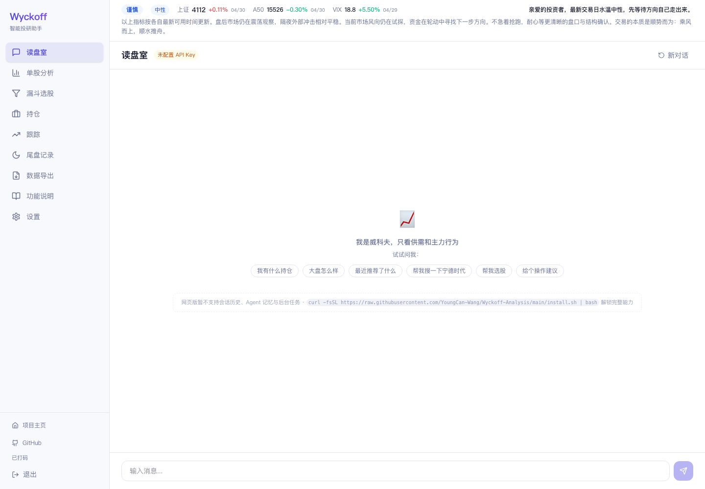 | 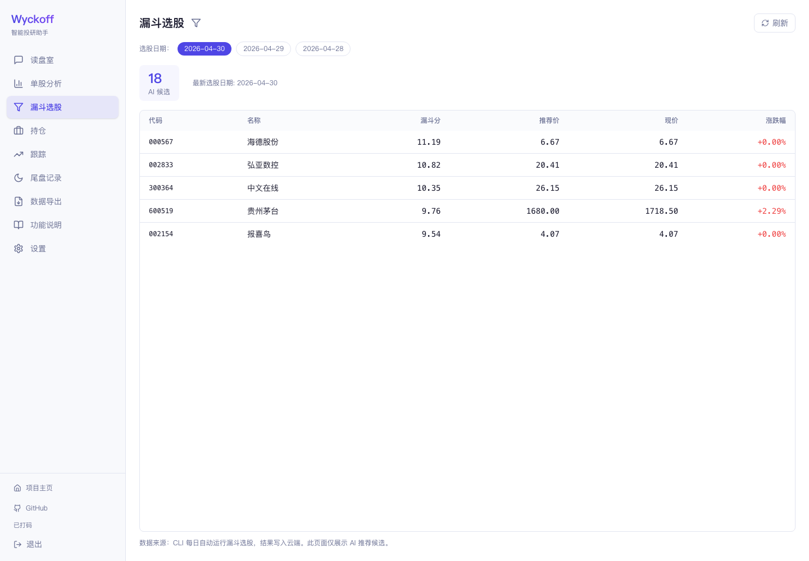 |

| Wyckoff Pattern Replay | Portfolio |
|:---:|:---:|
| 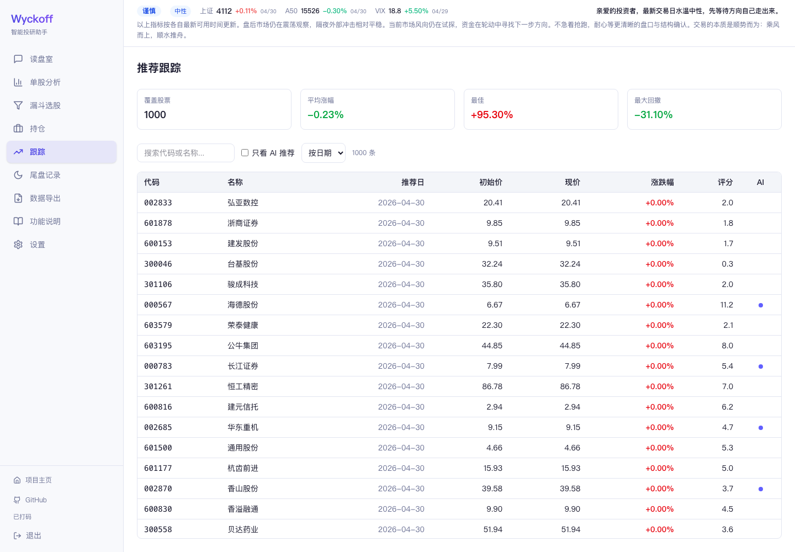 | 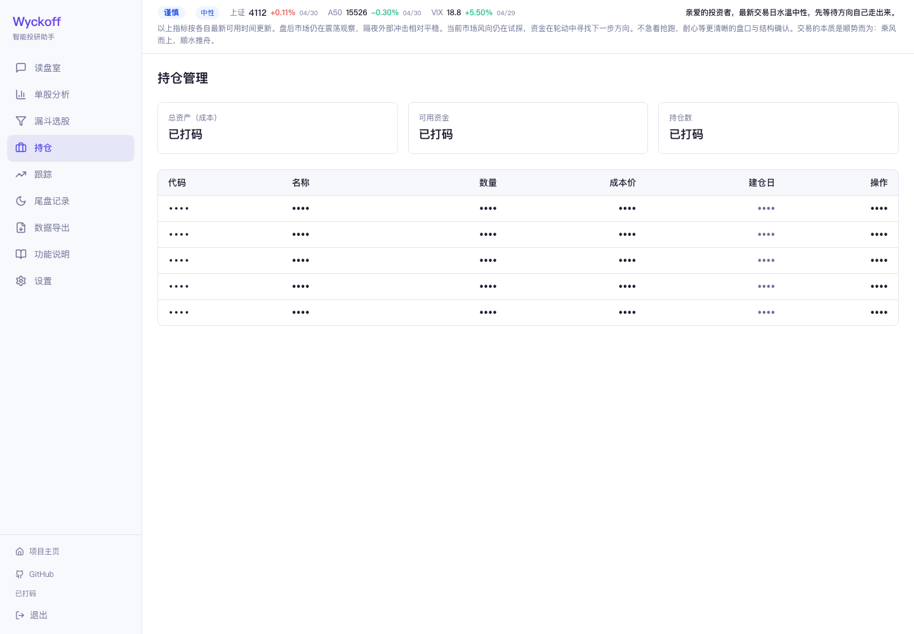 |

The pattern-review page reads the latest 30 review dates present in the database. The record count preserves source rows, the total-selection count uses unique symbol-date occurrences, and covered-stock and return summaries are deduplicated by symbol.

### Desktop

The Electron desktop workspace brings Agent chat, portfolio, schedules, tracking, attribution, reports, and K-line charts into one local application. Write operations are confirmed inline in the conversation and executed in the same turn — no separate approval page to navigate to; a read-only record of past decisions lives under Records. Public downloads belong on [GitHub Releases](https://github.com/YoungCan-Wang/WyckoffTradingAgent/releases); Settings → General → Software updates shows the installed version and links a newer `desktop-v*` release when available. Routine PR/main CI runs cross-platform Electron tests without building installers. Windows x64 and macOS Intel/Apple Silicon packages with the bundled Python runtime are built only for an explicitly requested one-day candidate or a `desktop-release` Skill invocation. Public packages deliberately use the zero-cost unsigned Windows / ad-hoc-signed macOS path and disclose the resulting operating-system warnings. See [DESKTOP_RELEASE.md](DESKTOP_RELEASE.md) for on-demand publishing, storage cleanup, and release requirements.

**Streamlit MVP retired**: Streamlit is no longer maintained on `main`. The historical runtime code is preserved on the `release/streamlit` branch, and the MVP product architecture/screenshots are archived in [STREAMLIT_MVP_ARCHITECTURE.md](STREAMLIT_MVP_ARCHITECTURE.md).

## Features

| Capability | Description |
|---|---|
| Conversational Agent | Trigger diagnosis, screening, and reports in plain language; the LLM orchestrates tools autonomously; also reads/writes files, executes commands, and fetches web pages |
| Skills | Built-in slash commands (`/screen`, `/checkup`, `/report`, `/strategy`, `/backtest`) for one-tap complex workflows; user-extensible via `~/.wyckoff/skills/*.md` |
| Mainline Funnel | A-share full-market scan; mainline-first on NEUTRAL; RISK_ON blocks new buys; HK/US independent universes |
| AI Three-Camp Report | Logic Bankrupt / Reserve Camp / Springboard — LLM renders an independent verdict |
| Portfolio Diagnosis | Batch health check: MA structure, accumulation phase, trigger signals, stop-loss status |
| Private Rebalance | EXIT / TRIM / HOLD / PROBE / ATTACK; ~5-day swing time management; ~-12% disaster floor |
| Signal Confirmation Pool | L4 trigger signals must pass 1-3 day price confirmation; only `confirmed` signals whose next-day open falls inside the single OMS entry range are actionable |
| Wyckoff Pattern Replay | Historical picks auto-sync closing prices and compute cumulative returns |
| Daily-Bar Backtest | Replays post-funnel N-day returns; reports win rate / Sharpe / max drawdown |
| Pre-Market Risk | A50 futures + VIX monitoring with four alert levels |
| Local Dashboard | `wyckoff dashboard` — recommendations, signals, portfolio, agent memory, chat logs; dark/light theme, bilingual CN/EN |
| Agent Memory | Cross-session memory: auto-extracts session conclusions, injects relevant context on next query |
| Context Compaction | Remaining-window budget auto-compresses long conversations, smart tool result summarization preserves key data |
| Tool Confirmation | `exec_command`, `write_file`, `update_portfolio` require user approval before execution |
| General Agent Capabilities | Execute commands, read/write files, fetch web pages — send a CSV path and it will analyze it |
| MCP Server | 10 tools exposed via MCP protocol — plug into Claude Code / Cursor / any MCP client |
| Multi-Channel Notifications | Feishu / WeCom / DingTalk / Telegram |

## Data Sources

Daily bar auto-fallback chain:

```
tickflow → tushare → akshare → baostock → efinance
```

When any source is unavailable the system silently falls back to the next — zero intervention required.

> **Recommended: connect TickFlow for stronger A-share / US stock / Hong Kong stock real-time and intraday capabilities**
> Register: [TickFlow Registration](https://tickflow.org/auth/register?ref=5N4NKTCPL4)

## Local Usage

### CLI — Recommended

Native terminal workflow with the most complete feature set. Supports background tasks, memory, Skills, MCP Server, and local SQLite storage.

### One-line Install (recommended)

```bash
curl -fsSL https://raw.githubusercontent.com/YoungCan-Wang/WyckoffTradingAgent/main/install.sh | bash
```

Detects Python, installs uv, creates an isolated environment. Run `wyckoff` when done.

### Homebrew

```bash
brew tap YoungCan-Wang/wyckoff
brew install wyckoff
```

### pip

```bash
uv venv && source .venv/bin/activate
uv pip install youngcan-wyckoff-analysis
wyckoff
```

### Start Using — One-Click Agent Setup

Just two steps after launch:
1. `/model` — choose a model (Gemini / Claude / OpenAI) and enter your API key
2. Start asking questions — no registration needed, portfolio data stored locally

```
> Compare 000001 and 600519 — which one is the better buy?
> Judge my portfolio
> What's the market temperature right now?
```

> Optional: `/login` to sync portfolio to cloud for multi-device access. All features work without login.

Upgrade: `wyckoff update` (includes `[browser]` + Playwright Chromium for CLI `browser_research`)

| Launch Screen | Portfolio Query |
|:---:|:---:|
| 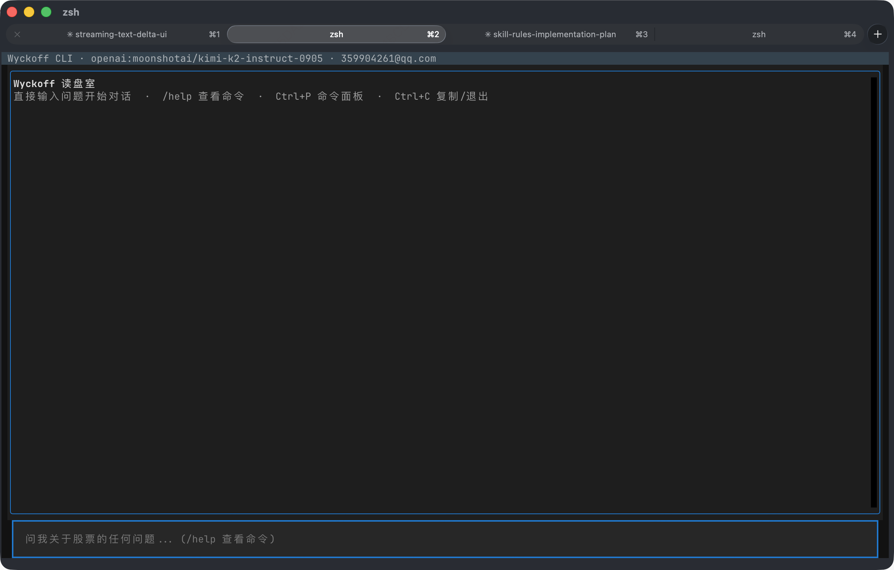 | 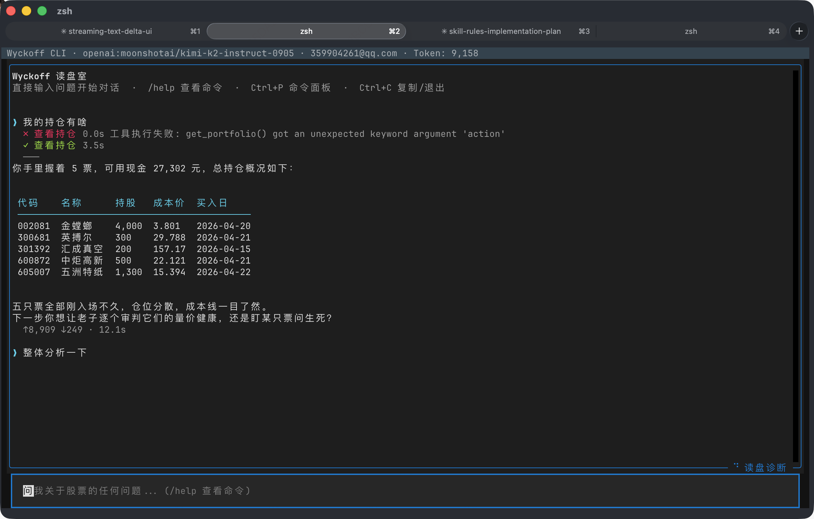 |

| Diagnosis Report | Action Instructions |
|:---:|:---:|
| 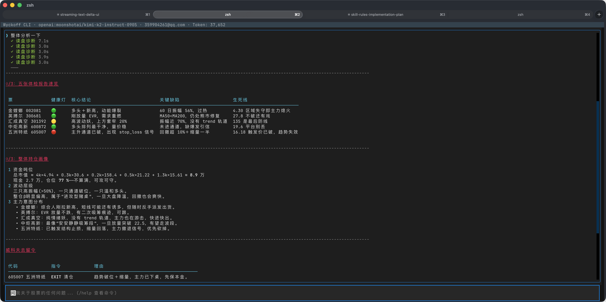 | 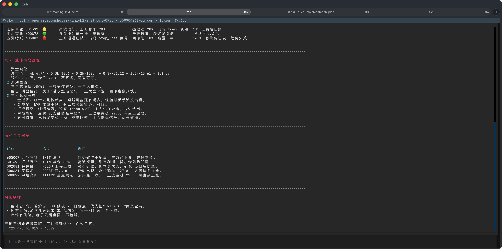 |

### Local Dashboard

```bash
wyckoff dashboard
```

Starts a local HTTP dashboard (default port 8765) and opens the browser automatically. All data stays in local SQLite.

Pages include recommendations, signals, portfolio, agent memory, configuration, chat logs, agent logs, and sync status. Dark/light theme and CN/EN bilingual UI are supported.

| Overview | Chat Logs | Trace Detail |
|:---:|:---:|:---:|
| 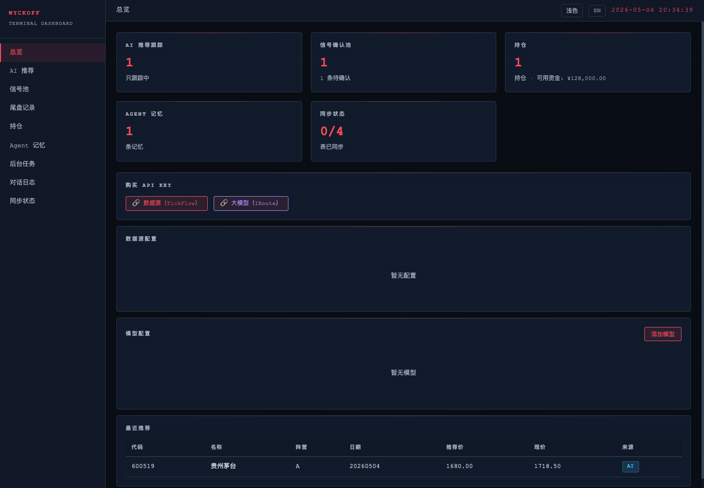 | 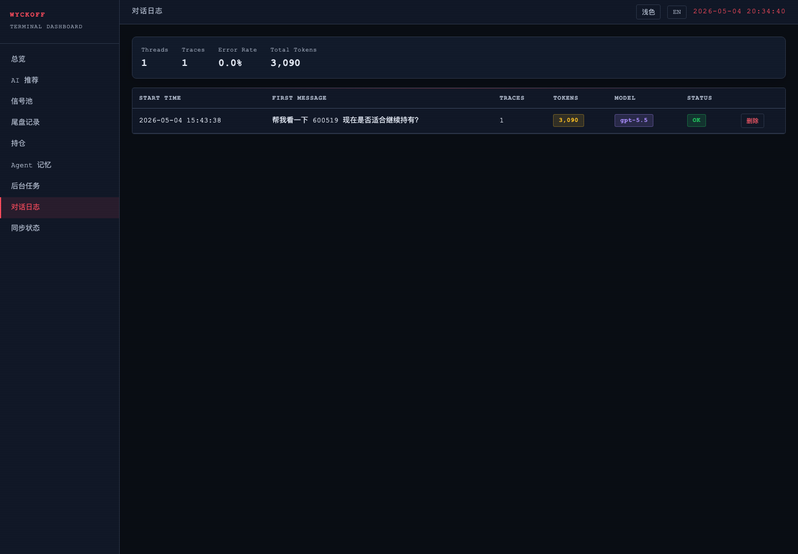 | 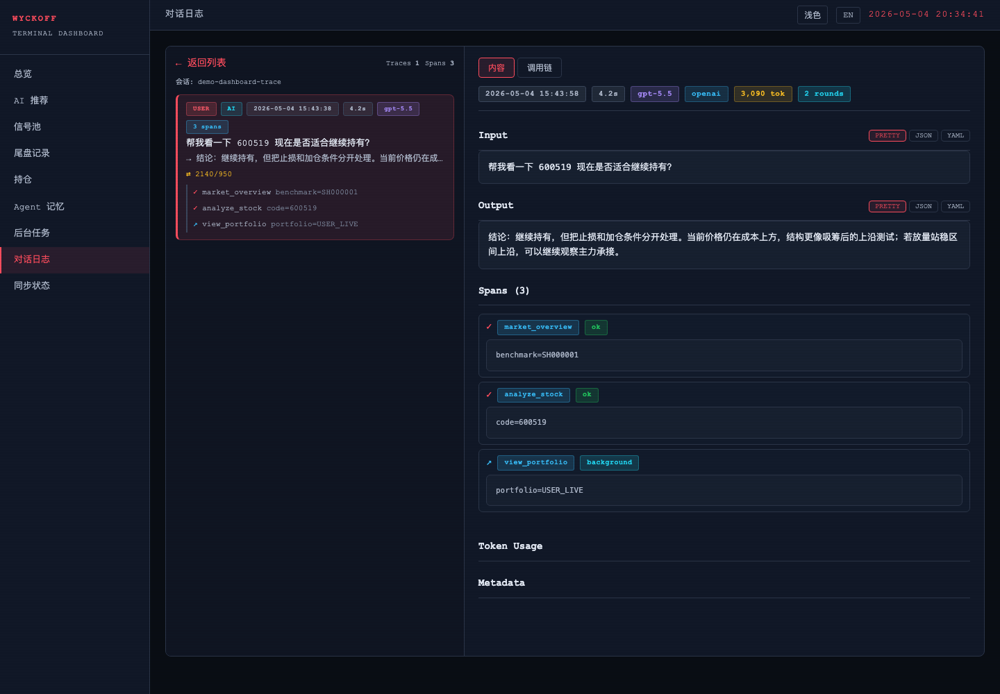 |

### Backtest Grid

8 focused parameter combos per period, outputs optimal parameters, Sharpe matrix, and strategy health check:

| Optimal Params & Ranking | Parameter Matrix |
|:---:|:---:|
| 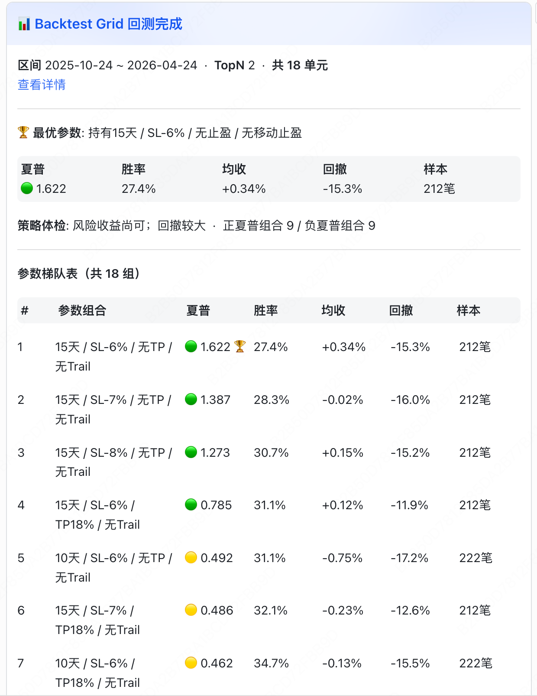 | 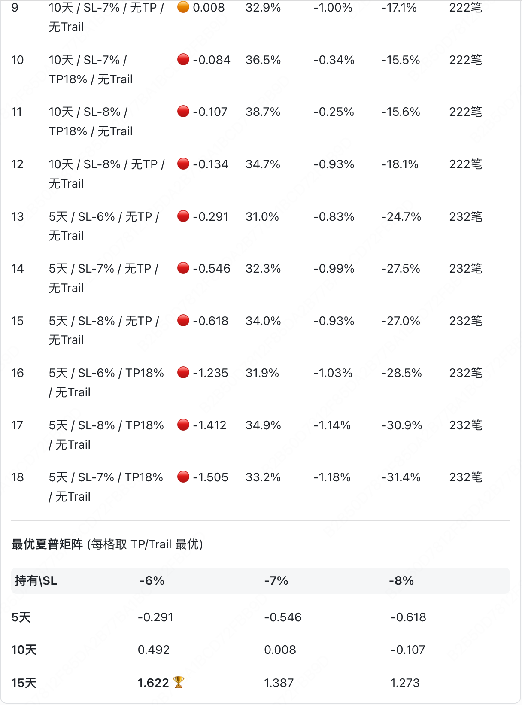 |

### Local Web

React SPA local deployment, sharing the same local SQLite data with the CLI:

```bash
cd web/apps/web
pnpm install
pnpm dev
```

Web App: **[wyckoff-analysis.pages.dev](https://wyckoff-analysis.pages.dev/)**

## Tools

The agent's arsenal — 10 quant tools + 5 general capabilities:

| Tool | Capability |
|---|---|
| `search_stock_by_name` | Fuzzy search by name, ticker, or pinyin |
| `analyze_stock` | Wyckoff diagnosis / recent OHLCV quotes / fundamental quality overlay (mode switch) |
| `portfolio` | View holdings / batch portfolio health scan (mode switch) |
| `update_portfolio` | Add / modify / delete holdings (use `items` for multi-symbol batches), set available cash, delete tracking records |
| `record_trade_fill` | Back-fill an executed trade: averages cost basis, deducts fees, reports realised P&L |
| `get_market_overview` | Broad market temperature overview |
| `screen_stocks` | Mainline funnel full-market screening (⚡background) |
| `generate_ai_report` | Three-camp AI deep research report (⚡background) |
| `generate_strategy_decision` | Hold/exit existing positions + new buy decisions (⚡background) |
| `query_history` | Historical recommendations / signal pool / strategy attribution records |
| `run_backtest` | Funnel strategy historical backtest (⚡background) |
| `check_background_tasks` | Background task progress query |
| `exec_command` | Execute local shell commands |
| `read_file` | Read local files (CSV/Excel auto-parsed) |
| `write_file` | Write files (export reports/data) |
| `browser_research` | Search via local Chrome CDP and extract cited pages (CLI only); TUI prompts once to auto-launch a dedicated debug Chrome |

Tool call order and frequency are decided by the LLM at runtime — no pre-choreography needed. Send a CSV path and it reads it; say "install a package" and it executes.

## Mainline Funnel

| Layer | Name | What It Does |
|---|---|---|
| L1 | Garbage Filter | Remove ST; include Main Board, ChiNext, STAR Market, and BSE by default. Price >= CNY 2, market cap normally >= CNY 2.5 B, and 20-day average turnover >= CNY 40 M; CNY 1-2.5 B names require average turnover >= CNY 80 M |
| L2 | Eight-Channel Strength | Rally / Ignition / Stealth / Accumulation / Dry Volume / Support / Trend Continuation / Breakout Acceleration |
| Mainline | Theme Engine | Dynamic concept heat, theme radar, financial quality, and timing gates identify tradable mainline candidates |
| L3 | Sector & Concept Resonance | Filter weak sectors while allowing strong individual stocks and verified themes to bypass fixed Top-N sector limits |
| L4 | Micro Triggers | Spring / LPS / SOS / EVR / Compression / Trend Pullback |
| L5 | AI + OMS Verdict | LLM review, cross-day signal confirmation, and OMS risk gates before action |

**How to trade:** Daily funnel = candidates + market gate; only **confirmed** candidates whose next-day open falls inside the single OMS entry range may be bought.
NEUTRAL is the main battleground. Tradable structures compete in a quality-first pool capped at 8 names and 2 per sector; **RISK_ON blocks new buys**. See [OPERATOR_PLAYBOOK.md](OPERATOR_PLAYBOOK.md).

## Daily Automation

Daily automations (GitHub Actions plus Codex Automation):

| Task | Schedule (Beijing Time) | Description |
|---|---|---|
| Funnel + AI Report + Rebalance | Sun–Thu 17:17 | Fully automated; results pushed to Feishu / Telegram |
| Holding Diagnosis | Manual trigger (`workflow_dispatch`) | Daily-bar based portfolio health check; RISK_ON/weak regimes block new entries; holding time management |
| Pre-Market Risk | Mon–Fri 08:20 | Codex Automation dispatches the GitHub workflow; A50 + VIX alert |
| Strong-Move Review | Mon–Fri 19:25 | Discover >7% / prior <3% movers from two Tushare cross-sections and attribute them against the previous production funnel's compact as-run artifact |
| Recommendation Reprice | Mon–Fri 23:00 | Sync closing prices |
| Backtest Grid | 1st & 15th monthly 04:00 | 8 focused parameter combos → aggregated report |
| DB Maintenance | Tue–Sat 06:20 | Purge stale quotes, orders, signals, market signals, and other rolling-window data |

## Model Support

**CLI**: Gemini / Claude / OpenAI-compatible endpoints plus a dedicated official DeepSeek V4 adapter. DeepSeek Flash/Pro support `off/low/high/max` reasoning effort and a 1M context window. Retired official aliases are migrated with their prior reasoning semantics, while custom proxy endpoints keep generic OpenAI-compatible request fields.

**Web / Pipeline**: 1Route / Gemini / OpenAI / Zhipu / Minimax / DeepSeek / Qwen / Volcengine. Kimi and other OpenAI-compatible providers can be configured via custom `base_url` / `custom_providers`.

## Configuration

**Zero config to get started** — just launch and `/model add` any LLM API key. Portfolio data is stored locally by default.

Advanced configuration (`.env` file or GitHub Actions Secrets):

| Variable | Purpose | Required? |
|---|---|---|
| LLM API Key | Configure via `/model add` interactively | Yes |
| `TUSHARE_TOKEN` | Stock market data (`/config set tushare_token`) | Yes |
| `SUPABASE_URL` / `SUPABASE_KEY` | Cloud portfolio sync (multi-device) | Optional |
| `TICKFLOW_API_KEY` | TickFlow real-time / intraday data | Optional |
| `PORTFOLIO_HKD_CNY_RATE` / `PORTFOLIO_USD_CNY_RATE` | Optional broker FX overrides for CNY portfolio valuation; ECB reference rates are used otherwise | Optional |
| `FEISHU_WEBHOOK_URL` | Feishu push notifications | Optional |
| `TG_BOT_TOKEN` + `TG_CHAT_ID` | Telegram push notifications | Optional |
| `CHAT_TOOL_APPROVAL_SECRET` | Dedicated Web tool-approval signing secret, at least 32 characters; never reuse or derive it from the Supabase service-role key | Required for production Web chat |

> Data source: [TickFlow →](https://tickflow.org/auth/register?ref=5N4NKTCPL4) | LLM API: [1Route →](https://www.1route.dev/register?aff=359904261)

See the [Architecture doc](ARCHITECTURE.md) for the full config reference and GitHub Actions Secrets setup.

### Persistent local schedules and approvals

On macOS, `scripts/daemon_install.sh` installs the user-level launchd daemon so schedules continue after the TUI closes. `wyckoff daemon --status` reports its state. Unattended runs restore the saved CLI login before tools run, then auto-apply only the narrow `set_stop_loss` tool; every other write is queued and bound to that account. Review exact redacted arguments with `wyckoff approve list`, then run `wyckoff approve ok <id>` to approve and execute or `wyckoff approve no <id>` to reject — only the same logged-in account may decide an item. Pending operations expire after 12 hours and failed executions are not retried automatically.

### External MCP servers

Install `.[mcp]`, add a disabled-by-default server with `wyckoff mcp-add`, test it with `wyckoff mcp-test`, then explicitly enable it. Pass secret environment names as `--env GITHUB_TOKEN` so values are read from the current environment rather than shell arguments; the saved config is mode 0600. External tools use the `mcp__<server>__<tool>` prefix; unknown or write-capable tools always require approval and are never auto-executed by the daemon.

## MCP Server

Expose Wyckoff analysis capabilities via the [MCP protocol](https://modelcontextprotocol.io/), enabling Claude Code / Cursor / any MCP client to call 10 tools directly.

```bash
# Install MCP dependency
uv pip install youngcan-wyckoff-analysis[mcp]

# Register with Claude Code
claude mcp add wyckoff -- wyckoff-mcp
```

Or add manually in your MCP client config:

```json
{
  "mcpServers": {
    "wyckoff": {
      "command": "wyckoff-mcp",
      "env": {
        "TUSHARE_TOKEN": "your_token",
        "TICKFLOW_API_KEY": "your_key"
      }
    }
  }
}
```

Once registered, just ask "diagnose 000001" in Claude Code / Cursor to invoke Wyckoff tools.

## Wyckoff Skills

Lightweight reuse of the Wyckoff analysis capability: [`YoungCan-Wang/wyckoff_skill`](https://github.com/YoungCan-Wang/wyckoff_skill.git)

Ideal for giving any AI assistant a quick "Wyckoff lens."

## Community

| Feishu Group 1 | Feishu Group 2 | QQ Group | Feishu Contact |
|:---:|:---:|:---:|:---:|
| 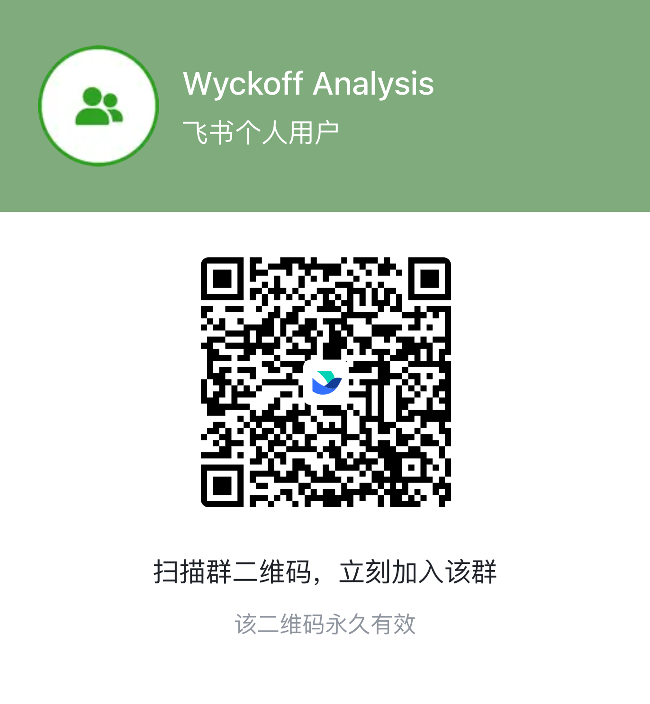 | 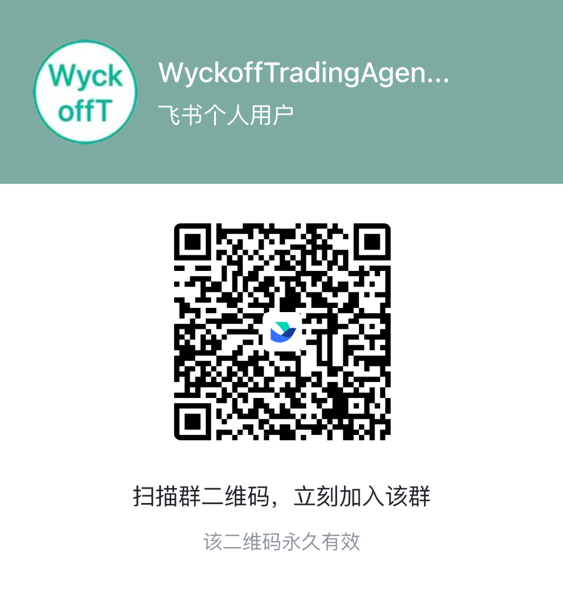 | 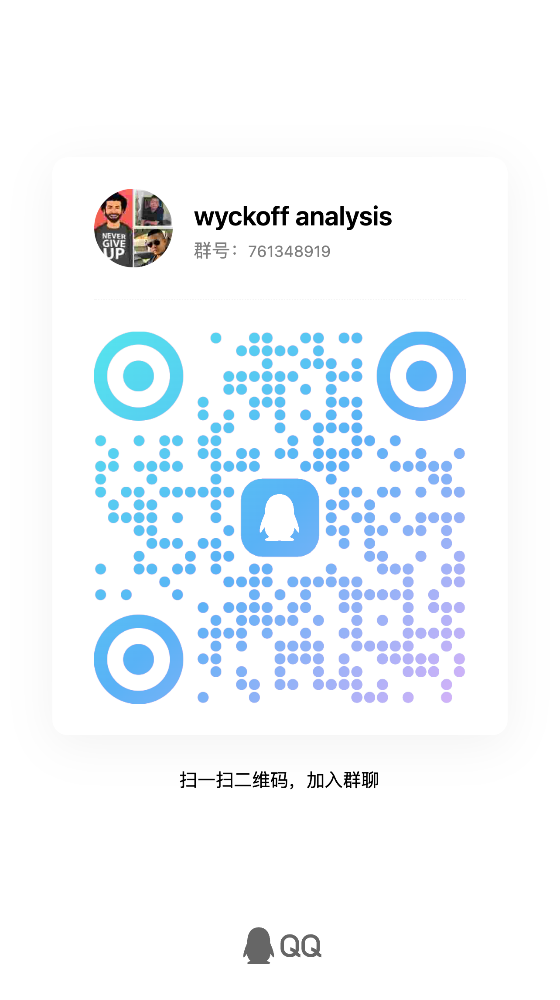<br/>Group: 761348919 |  |

## Sponsor

If this project helps, a GitHub Star is appreciated. If it helps you make money, buy the author a burger.

| Alipay | WeChat |
|:---:|:---:|
|  |  |

## Disclaimer

> **This tool identifies potential based on historical volume-price patterns. Past performance does not guarantee future results. All screening, recommendation, and backtest outputs do not constitute investment advice. Invest at your own risk.**

## License

[AGPL-3.0](../LICENSE) &copy; 2024-2026 youngcan

---

<!-- star-history:start -->
<!-- star-history:end -->
