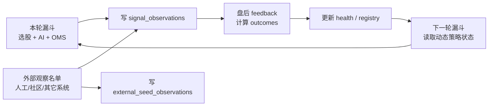
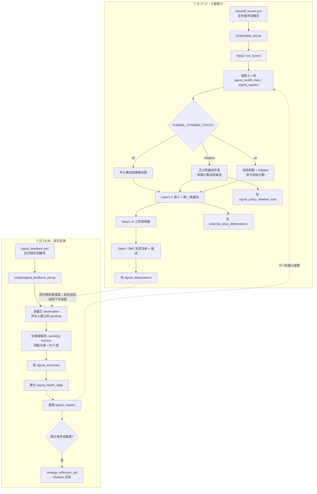
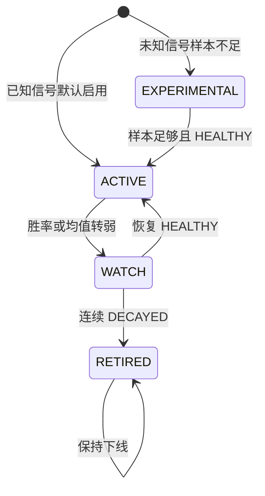
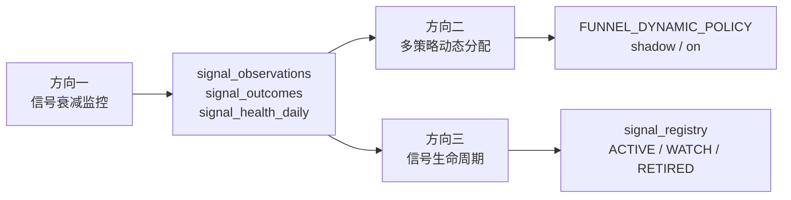

# 信号反馈与动态策略闭环

[← 返回架构文档](ARCHITECTURE.md)

这份文档说明 A 股定时漏斗、信号反馈任务、动态配额和 shadow run 的真实执行关系。它也可以作为 GitHub Wiki 的技术架构页素材。

> 实盘操作（日漏斗 × 跨日 confirmed × 次日开盘执行）见 [`OPERATOR_PLAYBOOK.md`](OPERATOR_PLAYBOOK.md)。
> 生产默认按质量池统一竞争，最终最多 8 只且单行业最多 2 只；Trend/Accum 配额只用于 dynamic `shadow` 对照。RISK_ON 仍由市场闸门禁止正式推荐和新开仓。

## 一句话

漏斗负责**发现机会并生产信号样本**，feedback 负责**盘后验收信号表现并更新策略状态**，动态策略在**下一轮漏斗**读取这些状态。外部观察名单只进入同一套观察闭环，不作为正式候选来源。默认不是强同步链路，而是错峰运行的反馈闭环。



## 定时流程



## 顺序语义

| 场景 | 结果 |
|------|------|
| 漏斗先完成，feedback 后完成 | 当前推荐路径。feedback 处理本轮写出的 observations，更新下一轮可用的 health / registry。 |
| feedback 先完成，漏斗后完成 | 漏斗会读取已经存在的最新策略状态；漏斗新写的 observations 等下一次 feedback 处理。 |
| 两个任务因手动触发发生重叠 | 不会互相等待，也不会破坏数据；feedback 只处理当时已经落库的 observations，漏掉的样本下一轮补上。 |
| 需要强制串行 | 可以改成 `workflow_run` 或把 feedback 作为漏斗 workflow 的后置 job，但会牺牲独立性。 |

## 动态策略模式

`FUNNEL_DYNAMIC_POLICY` 控制动态策略是否介入漏斗。

| 模式 | 主流程候选 | 额外落库 | 适用阶段 |
|------|------------|----------|----------|
| `off` | `tradeable_l4` 统一质量池 | 无 | 不运行动态策略对照 |
| `shadow` | `tradeable_l4` 统一质量池 | `signal_policy_shadow_runs` 记录动态配额会选哪些、会换掉哪些 | 当前生产模式；观察新策略是否稳定，不影响正式输出 |
| `on` | 动态策略参与初始分配，随后仍执行质量池损失护栏、总量和行业上限 | observations / outcomes 正常记录 | 实验模式，需在 shadow 验证稳定后再启用 |

GitHub Actions 中建议用 Repository Variables 配置：

| 配置项 | 推荐值 | 说明 |
|--------|--------|------|
| `FUNNEL_DYNAMIC_POLICY` | `shadow` | 非敏感配置，优先放 GitHub Variables；也兼容 Secrets。 |
| `FUNNEL_EXTERNAL_SEED_SYMBOLS` / `FUNNEL_EXTRA_SYMBOLS` | 空 | 临时追加外部观察名单；存在时自动启用 external seed shadow。 |
| `WYCKOFF_WRITE_CONTEXT` | `server_job` | 只有 Actions / server job 可写共享信号、推荐、策略表；CLI 默认只读云端。 |
| `WYCKOFF_STRATEGY_REFLECTION` | `shadow` | 开启策略反思 shadow 写入，不自动晋级生产策略。 |
| `SUPABASE_SERVICE_ROLE_KEY` | service role key | 定时任务写反馈表需要绕过 RLS。 |

本地临时验证：

```bash
FUNNEL_DYNAMIC_POLICY=shadow uv run python scripts/daily_job.py
uv run python scripts/signal_feedback_job.py
```

Feedback 不再逐日重算已经完成的 horizon。每次先读取现有 outcome 状态，只处理缺失或仍为
`pending` 的部分；同一股票即使跨多个观察日，也只拉一次覆盖最早观察日的 K 线。周五在同一
workflow 的归因报告之后运行策略反思，手动触发则允许立即补跑，不再单独占用一套 Actions runner。

## 核心数据表

| 表 | 写入方 | 读取方 | 作用 |
|----|--------|--------|------|
| `signal_observations` | 漏斗 `daily_job.py` | feedback job | 记录某日某股票触发了什么 L4 信号，是否进入 AI，是否被 AI 推荐，以及当日 price-action footprint。 |
| `signal_outcomes` | feedback job | feedback job | 记录每个 observation 在 1/3/5/10/20 日后的收益、回撤和完成状态。 |
| `signal_health_daily` | feedback job | 漏斗 | 按 signal / regime / horizon 聚合胜率、平均收益、样本数和权重。 |
| `signal_registry` | feedback job | 漏斗 | 管理信号生命周期：`ACTIVE`、`WATCH`、`EXPERIMENTAL`、`RETIRED`。 |
| `signal_policy_shadow_runs` | 漏斗 shadow 模式 | 人工复盘 | 比较静态策略和动态策略的候选差异。 |
| `external_seed_observations` | 漏斗 | 人工复盘 / maintenance | 记录外部观察名单是否通过 L1/L2/L4、watch 状态和过期时间。 |
| `strategy_reflections` | strategy reflection job | 人工复盘 | 保存基于 outcomes / shadow 的策略反思快照。 |
| `strategy_policy_candidates` | strategy reflection job | 人工复盘 | 保存 `READY_FOR_REVIEW` 候选策略，不自动切生产。 |

## 外部观察 Shadow

`external_seed_observations` 解决的是“我额外关注的股票，为什么没被漏斗选中”的复盘问题。它记录外部观察名单在当天主漏斗里的真实位置：

- `REJECTED_L1`：基础流动性、ST、财务或股票池过滤未通过。
- `PASSED_L2`：已经进入八通道强度主路径。
- `L4_CONFIRMED`：没进 L2，但在外部观察旁路里出现 L4 触发。
- `WATCH`：通过 L1 但暂时没有 L2/L4 结构。

主线引擎不复用 `external_seed_observations.watch_status` 表示状态；它通过 `candidate_lane=mainline`、`candidate_status=主线买点候选/主线观察/过热不追` 和 `mainline_score` 等字段进入推荐与信号元数据。

为保证报告与收益归因可审计，主线候选还会把 `candidate_theme / candidate_phase / candidate_role` 及 `mainline_score / theme_score / stock_role_score` 显式写入 `recommendation_tracking` 和 `signal_pending`；这些字段由程序生成，模型只解释、不重判。

当外部观察名单触发 L4 且没有进入正式候选时，系统会补写 `signal_observations`，`source=external_seed:<source>`，`selection_mode=external_seed_shadow`。这部分只用于后续 outcome 复盘，不影响真实推荐和 AI 候选池。

## L2 旁路 Shadow

L2 旁路和战略 L2 旁路解决的是“L2 没过，但形态或主线线索值得继续观察”的问题。它们不同于 `mainline` 正式候选：主线候选必须通过独立 timing gate，旁路默认只做 shadow。近期 shadow 归因显示，直接把 L2 旁路送入正式 AI 推荐会显著放大亏损，因此默认只记录样本，不再晋级 AI 候选：

- `source=l2_bypass_shadow` / `selection_mode=l2_bypass_shadow`：普通 L2 拒绝但 L4 有形态的观察样本。
- `source=strategic_l2_bypass_shadow` / `selection_mode=strategic_l2_bypass_shadow`：主题线索或 60m 救援结构触发的战略观察样本。
- `source=mainline` / `selection_mode=mainline`：主线引擎输出的正式候选，只有 `主线买点候选` 才允许进入 AI 候选池。
- 只有显式打开 `FUNNEL_L2_BYPASS_AI_ENABLED=1` 或 `FUNNEL_STRATEGIC_L2_BYPASS_AI_ENABLED=1` 时，旁路才允许进入 AI 输入；生产默认关闭。

这部分样本继续写入 `signal_observations` 和后续 `signal_outcomes`，用于验证“哪些 L2 外的 A 股波动结构真的有价值”。在样本不足或收益为负时，不应把旁路改成正式买入入口；真正可买的主线票应走 `mainline_score + timing_score + AI 风险审计 + 跨日 confirmed + OMS` 链路。

## 信号生命周期



registry 只负责控制动态策略是否使用信号；原始 observations 仍会记录，避免因为下线后失去后续观测能力。信号级 `status` 只由全局行（`regime=""` / `ALL`）决定；regime 拆分行只承载精确权重，写入与过滤时必须跟随全局生命周期，避免陈旧的 regime `ACTIVE`/`WATCH` 把已 `RETIRED` 的信号重新放进漏斗。

## Price-Action Footprint

`signal_observations.features_json.price_action_footprint` 记录每个信号日的量价痕迹，用于后续回答“哪一种主力行为痕迹有效”，不作为新的候选来源：

- `absorption_score`：放量但收盘不弱、支撑收回、下影承接等吸收迹象。
- `dry_up_score`：缩量回踩、波动收窄，验证卖压是否枯竭。
- `breakout_quality_score`：突破位、量能、收盘位置和上影压力。
- `supply_pressure_score`：放量弱收、长上影、潜在派发压力。
- `failed_breakout_score`：盘中突破后收不住，标记失败突破风险。
- `reclaim_score`：跌破支撑后快速收回的 Spring / reclaim 质量。

这些字段和 `springboard_*` 一起落库，后续由 `signal_outcomes` 验证，而不是直接把外部或人工名单推入 AI 候选池。

## External Capital Context

`signal_observations.features_json.source_context` 记录正式主漏斗候选的外部资金佐证。当前优先通过 Tushare 按需读取龙虎榜、融资融券、大宗交易、个股资金流和沪深股通观察字段；龙虎榜、融资融券和大宗交易在 Tushare 失败时才降级 AkShare。逐笔大单使用腾讯分笔源作为可选项，默认不打开，避免日常任务被慢速网页源拖住：

- `lhb`：Tushare 龙虎榜统计及席位明细，记录上榜原因、净买额、机构专用和沪深股通专用席位净额。
- `margin`：Tushare 融资融券明细，记录融资余额、融资买入、融资偿还和融券变化；收盘后当日数据未更新时自动使用最近可用交易日并写明 `data_date`。
- `block_trade`：Tushare 大宗交易每日明细，记录成交笔数、成交额和主要买卖席位。
- `stock_moneyflow`：Tushare 个股资金流，记录净流入、大单和特大单净额，单位均明确为万元。
- `northbound_market`：Tushare 发布的沪深股通市场金额上下文。历史字段名虽为 `north_money`，当前值按官方发布金额保存，明确标记 `published_connect_amount_not_net_inflow`，禁止解释为北向净买入。
- `hsgt_top10`：沪深股通十大成交股；当前 `buy/sell/net_amount` 可能为空，仅把成交额和排名作为观察字段。
- `tick_large_order`：腾讯分笔数据汇总的大额成交，仅在 `FUNNEL_EXTERNAL_CAPITAL_TICK_CONTEXT=1` 时启用。
- `source_status`：每个外部源的成功、失败或降级状态，便于复盘时区分“没有资金痕迹”和“源失败”。

这部分只作为外部资金痕迹解释和 outcome 复盘特征，不改变主漏斗候选、AI 候选池、loss guard 或 Step4。
日常任务优先给 `selected_for_ai` / AI 研报代码补这些字段；市场闸门关闭、AI 名单为空时，改为按漏斗分从正式
L4/形态观察样本中最多取 `FUNNEL_EXTERNAL_CAPITAL_MAX_SYMBOLS` 只，避免弱市日整批 observation 丢失资金侧
上下文。外部资金字段仍不能反向创造候选。

## Candidate Shadow Score

`signal_observations.features_json.candidate_shadow_score` 记录候选影子评分。它把主漏斗优先级、量价痕迹、起跳板质量、外部资金佐证和风险扣分合成 0-100 分，用来复盘“哪些候选更像真机会”：

- `score` / `grade`：总分和 S/A/B/C/D 评级。
- `components.funnel`：主漏斗触发分、候选车道优先级或主线评分。
- `components.price_action`：承接、缩量、突破质量和支撑收回等量价痕迹加分。
- `components.springboard`：起跳板结构质量加分，历史 ABC 仅作为内部特征；`springboard_structure_ready` 不代表跨日确认。
- `components.external_capital`：龙虎榜净买、融资买入、大宗交易和大单净买等资金佐证加分。
- `components.risk_penalty`：派发压力、失败突破、弱收盘等扣分。
- `positive_tags` / `negative_tags`：可解释的正负证据标签。

这部分只做 shadow 复盘，不新增候选表，也不改变正式候选、AI 候选池或 Step4。只有当后续 `signal_outcomes` 证明它能提高胜率或降低回撤时，才考虑把总分升成结构化列或用于真实排序。

候选影子评分版本为 `candidate_shadow_score_v3`。其中 `dynamic` 使用同一信号、同一市场水温、同一持有周期的最新 `signal_health_daily` 对基础影子分做有限校准，并生成可审计的 Step3 晋级清单。观察血缘按 `(code, signal_type)` 绑定，避免同一股票的 LPS、趋势回踩或主线候选互相覆盖元数据。历史规则发生语义变化时，必须先用 `scripts/backfill_recommendation_tracking.py` 做只读 dry-run；替换 observation 会级联删除对应 outcome，随后必须重跑 signal feedback。反馈任务按当前 `as_of_date` 整体替换 health 快照；registry 先 upsert 再删除孤儿行，并把健康窗口未覆盖的既有生命周期行（如 `RETIRED` / `EXPERIMENTAL` 与 regime 降权）合并进快照，避免全量替换把屏蔽信号默认回 `ACTIVE`。

### 动态影子晋级

`FUNNEL_DYNAMIC_SHADOW_PROMOTION` **默认为 `0`（晋级关闭）**：影子分照算、照写 observation，但不占 Step3 席位。原因是晋级判据「信号 health 为 `HEALTHY`」缺少正向前瞻证据——实测 HEALTHY 的前瞻 T+5 为 −12.74%，是四档中最差，同日配对差 −2.82pct、95% CI [−5.22, −0.26]，且 health 历史统计与实际前瞻收益相关系数 −0.116（均值回复）。复算见 `scripts/evaluate_capital_context_alpha.py`，详细口径记在 `docs/ITERATION_STRATEGY.md`。

置为 `1` 后，Step2.75 会在正式漏斗候选之外对当日 `review_triggers` 计算动态影子分，门槛为：基础影子分至少 65、动态分至少 75、对应 regime 的 5 日信号健康样本至少 30 且状态为 `HEALTHY`、起跳板至少满足 2 个条件、没有失败突破/供应压力等硬风险；满足全部条件的候选最多补 1 个 Step3 复核席位。这些数值均为**未经校准的初始值**，不是实测结论——`min_base_score`/`min_dynamic_score` 依赖的 `candidate_shadow_score_v3` 是新增评分、生产无历史分布可比，`min_health_samples=30` 在现有 84 行 HEALTHY 里只拦掉 11.9%。原先叠加的「健康权重至少 0.9」已移除：实测 84 行 HEALTHY 的 `weight_multiplier` 全为 1.0，该条件恒真。

这里的“晋级”只表示获得 Step3 LLM 复核资格，不写正式推荐，不产生 OMS 买单，也不绕过 `SURVIVED → VALIDATED → OMS_APPROVED`。资金数据默认是稀疏加分项；设置 `FUNNEL_DYNAMIC_SHADOW_REQUIRE_STOCK_CAPITAL=1` 后才会成为硬门槛。市场级 `northbound_market` 不算个股外部证据覆盖，避免用同一条市场背景虚增所有候选的数据完整度。

`strategy_attribution_report.py` 会把 `candidate_shadow_score.grade` 聚合进 `score_bucket_stats_json._candidate_shadow_grade`，Web 端策略归因页展示 S/A/B/C/D 各档在不同持有周期下的胜率、平均收益、大涨率、大跌率和平均回撤。`evaluate_recommendation_events.py` 也会只读 join 同日 observation，把候选影子分档输出到 `summary.candidate_shadow_grade`，并在 `summary.top_k_by_strategy.candidate_shadow_then_score` 对照“按候选影子分排序”的 5 日冲刺命中率、MFE 和 MAE；`summary.top_k_lift_vs_score_only.candidate_shadow_then_score` 会直接给出相对原漏斗分排序的差值，`summary.ranking_decision` 进一步用样本量、命中率 lift、MFE lift 和 MAE 恶化门槛判断它是否只是观察项，还是可以进入下一步排序接入候选。2026-08-02 的 90 个推荐日复核中，候选影子 Top1/3/5 均未产生正 lift，因此继续使用 `score_only`，不得把影子分升级为正式排序。

同一 evaluator 还从 observation 带回 `regime`、`signal_type`、`industry` 和 `track`；没有同日 observation
时，使用 recommendation tracking 行内的 `market_regime / signal_types / primary_signal / industry /
signal_track` 补足。读取 observation 必须按 `id` 稳定分页，不能被 PostgREST 1000 行上限静默截断。

`metadata.observation_context` 与 `summary.context_coverage` 输出总覆盖率、成熟样本覆盖率、可观察日期范围、
各字段及交叉切片覆盖率和
`matched_observation / tracking_fallback / not_in_observation_universe / query_failed` 状态计数。
`summary.outcome_context` 除单独水温、信号、行业和轨道外，还包含 `regime_signal` 与
`regime_industry` 交叉切片。10-29 个成熟样本标为 `watch`，至少 30 个才标为 `evaluable`；这只是防止
小样本过度解释，不是自动晋级阈值。同一候选若同时有多个信号，会进入多个归因切片，任何切片都不会直接
生成买入许可。

## Entry Quality

`signal_observations.features_json.entry_quality` 记录 Step3 候选的入场质量评分。它聚合相对强弱、缩量回踩、200 日线偏离和 20 日平均成交额，用于验证“同样进入候选池时，哪些入场位置更值得优先看”：

- `score` / `grade`：0-100 分和 S/A/B/C/D 评级。
- `tag`：进入 Step3 prompt 的中文摘要，例如 `入场质量A(75.0)`。
- `risk_flags`：弱于指数、缩量不足、追高延展、成交额偏低等风险标签。
- `priority_bucket`：按候选优先级粗分桶，用于在相近 priority 下观察入场质量差异。

这部分只写入 `features_json` 做 outcome 复盘，不新增候选表，不直接改变正式候选、AI 候选池或 Step4。当前 Step3 只在相近优先级候选之间把入场质量作为 tie-breaker；默认 `STEP3_ENTRY_QUALITY_TIE_BUCKET=1.0`，即上游优先级落在同一 1 分桶内才允许入场质量改变先后顺序，设为 `0` 可禁用排序影响。后续是否提高权重，需要看 `signal_outcomes` 和归因快照。

`strategy_attribution_report.py` 会把 `entry_quality.grade` 聚合进 `score_bucket_stats_json._entry_quality_grade`，Web 端策略归因页展示 S/A/B/C/D 各档在不同持有周期下的胜率、平均收益、大涨率、大跌率和平均回撤；涨跌幅样本行也会显示当时的入场质量和风险标签。`evaluate_recommendation_events.py` 的 `summary.entry_quality_grade` 用同一套 5 日冲刺事件口径检查不同入场档位是否真的降低回撤或提高命中，`summary.top_k_by_strategy.entry_quality_then_score` 则对照“按入场质量排序”的 Top-K 表现；`summary.top_k_lift_vs_score_only.entry_quality_then_score` 会直接给出相对原漏斗分排序的差值。

## Shadow 复盘怎么看

Shadow 模式不会影响真实推荐。它的价值是回答三个问题：

1. 动态策略比静态策略多选了哪些股票？
2. 动态策略会移除哪些原本会进 AI 的股票？
3. `diff_added` 的后续收益/回撤是否长期好于 `diff_removed`？
4. 这些差异背后的 `signal_weights`、`attribution_signal_weights` 和 `registry_snapshot` 是否合理？

常用查询：

```sql
select
  trade_date,
  regime,
  base_policy,
  shadow_policy,
  diff_added,
  diff_removed,
  signal_weights,
  attribution_signal_weights
from signal_policy_shadow_runs
order by trade_date desc
limit 10;
```

`strategy_attribution_report.py` 会把 shadow 差异和已有 `signal_outcomes` 关联到
`shadow_diff_stats_json.outcome_stats`。只有当 `diff_added` 在多个周期的收益/回撤稳定好于
`diff_removed`，并且 missing outcome 不高时，才考虑把 `FUNNEL_DYNAMIC_POLICY` 从 `shadow`
切到 `on`。

归因报告里的信号级 `downweight` / `upweight` 已经是策略治理输入：漏斗动态策略会读取最新
`strategy_attribution_reports` 或本地只读报告文件，把这些归因权重和
`signal_health_daily` / `signal_registry` 合并进行候选调权。`shadow` 模式下它只影响 shadow 对照候选，`on`
模式下也必须经过 `policy_governor` 的 `formal_dynamic_allowed` 检查，不能只因为 workflow
开了 `FUNNEL_DYNAMIC_POLICY=on` 就把归因调权直接当正式策略。回测读取归因权重也走同一个
formal gate：`FUNNEL_DYNAMIC_POLICY=on` 但治理器没有批准时，回测不会把调权当成正式漏斗输入，
避免“回测已经吃调权、实盘仍被治理器挡住”或反向不一致。`FUNNEL_DYNAMIC_POLICY=shadow`
的回测会读取并展示归因 meta，但不会把 shadow 权重注入正式 replay 排序。

Agent 入口也读取同一份执行态，避免页面、CLI 和 Web 各说一套。CLI 使用
`query_history(source="attribution")`，Web 读盘室使用 `query_attribution`；回答策略归因问题时先看
数据来源。CLI/MCP 会返回 `latest_source` 和 `remote_error`，Web 只读取远端
`strategy_attribution_reports`；CLI/MCP 在远端表与本地 no-write 报告同时存在时按 `report_date`
取最新。随后优先看 `latest_policy_display`、`latest_execution_summary` 和 `latest_operations`：
前两者说明调权当前影响漏斗 shadow 还是正式漏斗，并把下一步动作翻译成人类可读口径；
后者给出最新 shadow 新增/移除样本和 scoped 调权明细，用于每日运营复盘。第一眼先看
`latest_operator_summary` 或
`latest_operations.operator_summary`：它把下一步动作、作用范围、正式 dynamic 是否可晋级、最新
shadow 新增/移除和调权摘要压成同一句话；需要追证据时再看 raw `latest_execution_state`、
raw `next_action` / `promotion_status`、`promotion_checklist`、`latest_operations.latest_shadow`
和 `latest_operations.action_details`。
报告、Agent 和 Web 不应直接把 `formal_dynamic_block_reason` 的 raw code 当结论展示；统一用
`strategy_policy_display` / Web shared 展示语义翻译成“缺少回测确认”“晋级清单缺失”“未启用自动晋级”等
人能直接执行的原因。

生产归因任务默认使用最近 60 天窗口。漏斗读取归因调权时会检查 `report_date`，默认只接受
7 天内的报告；可以通过 `STRATEGY_ATTRIBUTION_MAX_AGE_DAYS` 调整，设为 `0` 表示关闭过期保护。
远端报告过期时会回退本地 `STRATEGY_ATTRIBUTION_REPORT_JSON` / `TAIL_BUY_ATTRIBUTION_REPORT_JSON`
或 `/private/tmp/wyckoff-strategy-attribution/latest/report.json`，本地也过期则不调权。若显式设置了
`STRATEGY_ATTRIBUTION_REPORT_JSON` 或 `TAIL_BUY_ATTRIBUTION_REPORT_JSON`，本地报告会和远端报告按
`report_date` 比较，较新的报告参与实际调权；同一天仍优先远端表。

### 策略治理器

`strategy_attribution_report.py` 还会生成 `shadow_diff_stats_json.policy_governor`，把
shadow 差异和信号表现收敛成统一的治理结论：

- `status`：`candidate` 表示 dynamic policy 可以进入人工晋级评审；`watch` 表示继续观察；
  `reject` 表示 shadow 新增组没有跑赢移除组；`insufficient_sample` 表示样本不足。
- `mode_recommendation`：只给出 `review_promote_dynamic_policy`、`keep_shadow` 或
  `keep_static_policy`，不自动修改生产配置。
- `next_action` / `next_action_summary`：给 Agent、Web 和 CLI 读取的机器可读下一步动作与人类说明。
  例如 `run_backtest_confirmation` 表示缺最新回测确认，`manual_review_dynamic_on` 只表示进入人工复核；
  二者都不等于自动切 `on`，也不会让正式漏斗直接读取归因权重。
- `promotion_status`：把生产晋级状态说清楚。`manual_review_required` 表示 shadow 已过主要量化门槛，
  但仍要人工检查多期报告和回测；`do_not_promote` 表示当前不应切 `on`；`collect_more_samples`
  表示样本不足；`keep_shadow` 表示继续观察。
- `promotion_checklist`：固定检查 shadow 样本量、shadow 新增组表现、scoped 信号调权、回测确认。
  这不是展示文案，而是 Agent/Web 判断“能不能切 dynamic=on”的证据结构。
- `signal_actions`：把信号表现转成 `downweight` / `upweight` / `hold`，并附带 count、平均收益、
  胜率、大亏率和平均回撤。

`backtest_confirmation` 不是纯文案。只读归因任务可以通过 `--backtest-confirmation-json` 读取一个
JSON 对象，例如 `{"status":"pass","summary":"三周期回测确认正收益"}`。没有该输入时，
candidate 只会得到 `backtest_confirmation: review`，正式 dynamic 的阻断原因为
`backtest_confirmation_required`；如果输入为 `fail`，阻断原因为 `backtest_confirmation_failed`。
Backtest Grid 会通过 `scripts/update_backtest_market_report.py --confirmation-output backtest_confirmation.json`
生成同一口径的结构化确认文件，并随 `backtest-market-report-*` artifact 上传；`Signal Feedback`
会优先下载最近一次成功 Backtest Grid 的确认文件，下载不到时继续按缺回测确认处理。

报告还会生成 `shadow_diff_stats_json.policy_operations_brief`，其中 `operator_summary` 是给人读的
运营摘要，和 Agent 的 `latest_operator_summary`、Web 归因页“运营复盘”第一行保持同一口径。它不是新的
交易信号，也不会改变候选；只是把治理器、执行态、shadow 差异和调权明细汇总成统一操作语言。
日常排查优先看 `policy_operations_brief.backtest_confirmation_text`、
`policy_operations_brief.promotion_checklist_summary` 和 `policy_operations_brief.promotion_blockers`；
它们是 `promotion_checklist` 的稳定摘要，避免 Agent/Web/CLI 各自解析 raw checklist 后说法不一致。

治理器默认不会自动把 `FUNNEL_DYNAMIC_POLICY` 从 `shadow` 晋级到 `on`。报告会显式写出
`formal_dynamic_allowed=false` 和 `formal_dynamic_block_reason`。`backtest_confirmation_required`
表示还缺结构化回测确认；`manual_review_required` 表示回测确认后已进入人工复核，但还不是正式执行许可。
信号级调权可以进入动态策略输入；正式漏斗生效必须满足更硬的 gate：
报告中显式写入 `formal_dynamic_allowed=true`，或未来治理器支持 `auto_apply=true` 且
`promotion_checklist` 全部通过。

## 和迭代策略的对应关系



当前一期已经覆盖方向一、方向二的 shadow/on 框架，以及方向三的 registry 骨架。后续主要工作是积累样本、复盘 shadow 差异，并把阈值从经验值迭代成回测验证后的参数。
